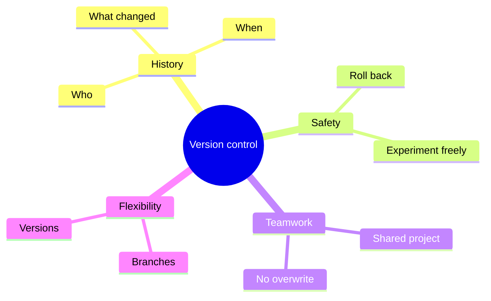
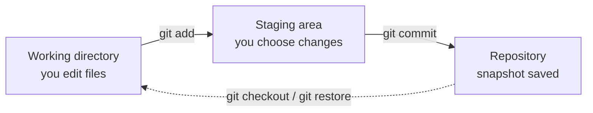

## Introduction to Git. Version control basics

> This is the first lesson of the course. Today we lay the foundation without which no real project can be built: we'll find out what "version control" is, why every developer uses it, and install and configure Git on your computer.

---

## What You Will Learn by the End of the Lesson

- Explain what version control is and why it is needed.
- Understand the difference between Git and GitHub.
- Install Git and check it works.
- Set a name and email for your Git identity once.
- Understand the three states of a file in Git: working directory, staging area, and repository.
- Create your first repository with `git init`.

---

## Lesson Timeline

| Block | Content |
| --- | --- |
| 1. What version control is and why it's needed | The "time machine for folders" analogy, problems it solves |
| 2. How Git stores versions | Snapshots, the three states of a file |
| 3. Git and GitHub: what's the difference | Git is a tool, GitHub is a platform |
| 4. Installing Git and first configuration | `git --version`, `git config --global` |
| 5. Mini-task | Configure Git yourself |
| 6. First repository | `git init`, `git status`, the `.git` folder |
| 7. Summary and practice | Reinforcement |

---

## Block 1. What Version Control Is and Why It's Needed

**In simple terms:** imagine you're writing your thesis, a book, or just a big essay. Every day you create new versions: `text_1.docx`, `text_2.docx`, `text_FINAL.docx`, `text_FINAL2.docx`. After a month you have forty files, you no longer remember which one is the latest, and what changed between `_FINAL` and `_FINAL2` is a complete mystery.

This is exactly the problem that **version control systems** (VCS) solve — Git is the most popular of them.

**Version control is a system that saves the history of all changes in a project.** At any moment you can:

- see **what** changed and **when**;
- see **who** made each change;
- return to **any** previous state — even one from a year ago;
- experiment without fear — you can always roll back;
- work on the same project with other people without overwriting each other's work.

**Analogy:** think of a video game with save points. Before a big battle you can make a save, and if something goes wrong, simply load the previous save. Git is an automatic "save-point system" for your code in a project folder.



---

### Common Beginner Mistakes

| Error | How to Fix |
| --- | --- |
| Thinking version control is the same as cloud storage (Google Drive, Dropbox) | Cloud storage keeps the *latest* copy; Git keeps the *entire history* of copies |
| Delaying version control "until the project gets serious" | Start from the very first file — retroactively putting a messy folder under version control is hard |
| Assuming Git is only needed in a team | Even alone, you get a free "save points" system, undo, and history |
| Expecting Git to be a program with a magic button | Git is a console tool; you'll learn the ~10 main commands in this course, that's enough for real work |

---

## Block 2. How Git Stores Versions: The Three States

The key idea to understand from the very beginning is that Git does **not** just keep copies of files. Git stores **snapshots** — a full picture of all files at a certain moment. Each such snapshot is a **commit** (we'll study commits in detail in lesson 2).

For this to work conveniently, every file in a Git project passes through **three states**:

1. **Working directory** (`workspace`) — here you simply edit files with your usual tools. Git stays out of the way while you work.
2. **Staging area** (`index`, "staging") — an intermediate zone where you *prepare* which changes should go into the next snapshot. It's like picking dishes for a dinner: not all groceries from the fridge, but exactly what is on the menu tonight.
3. **Repository** (`.git`) — the place where changes are *permanently* saved as a commit — the snapshot itself.

**Analogy for the three states:** you're preparing a parcel. First you put things in a box on the table (that's the *staging area* — you decide what goes), then you seal and send the box (that's the *repository* — the snapshot is saved).



The commands you run form a clear chain:

- `git add` — move changes from the working directory to the staging area.
- `git commit` — take everything prepared in the staging area and save it as a permanent snapshot.

We'll execute this chain for real in lessons 2, and today we'll just set up the environment.

---

## Block 3. Git and GitHub: What's the Difference

One of the most common confusions for beginners is mixing up Git and GitHub. They are two different things.

### Git

**Git** is a **program**, a tool that runs on your computer and manages version control locally: it creates commits, tracks branches, and stores history right in your project folder (in the hidden `.git` subfolder).

- Created by Linus Torvalds in 2005 (yes, the creator of Linux).
- Free and open source.
- Works completely offline — history is stored on your machine.

### GitHub

**GitHub** is an **online platform** for storing and sharing Git repositories. Think of it as "Git cloud with a social network":

- you can upload your local repository to the site (`git push`);
- other developers can view it, copy it, or propose their changes;
- it's also a portfolio: your GitHub profile is where employers look first.

**Analogy:** Git is the engine, GitHub is the garage where you park the car and show it to neighbours. One without the other can exist: you can use Git locally and never open GitHub. But in real work they almost always go hand in hand.

There are alternatives to GitHub — GitLab, Bitbucket, Gitea. We will study GitHub in detail starting from lesson 5.

---

### Common Beginner Mistakes

| Error | How to Fix |
| --- | --- |
| Calling GitHub "Git" and vice versa | Git — the tool on your computer; GitHub — the website for hosting repositories |
| Thinking you need GitHub for Git to work | Git works fully offline; GitHub is about sharing and teamwork |
| Expecting GitHub to appear "by itself" after installing Git | These are separate things; we'll create a GitHub account in lesson 5 |
| Skipping Git config "for later" | Commits without a configured name turn into "silent" commits — you'll lose authorship attribution |

---

## Block 4. Installing Git and First Configuration

### Step 1. Install Git

- **Windows:** download the installer from [git-scm.com](https://git-scm.com) and run it; the default settings work fine.
- **macOS:** the easiest way is to install the Command Line Tools — run `git --version` in the terminal and follow the system prompt, or install via Homebrew: `brew install git`.
- **Linux:** typically `sudo apt install git` (Debian/Ubuntu) or `sudo dnf install git` (Fedora).

Check that everything worked:

```bash
git --version
```

The result should look like `git version 2.4x.x`. If the version is displayed — Git is installed.

### Step 2. Introduce yourself to Git

Git needs to know *who* made each change — otherwise it can't properly attribute commits. Introduce yourself once, and Git will remember it for all projects:

```bash
git config --global user.name "Your Name"
git config --global user.email "your.email@example.com"
```

**How it works:** the `--global` flag means "apply for the current user, in all projects." The settings are saved in a special config file. You can view them at any time:

```bash
git config --global --list
```

**Important:** the email here doesn't have to match your GitHub email (though it's convenient if it does). What matters is that it's **your** email — it will be written into every commit you make.

### Step 3. Check the result

```bash
git config --global user.name
git config --global user.email
```

Each command should output what you entered.

---

## Block 5. Mini-Task

Complete the configuration yourself, without peeking:

1. Check the Git version.
2. Set `user.name` and `user.email` for yourself.
3. Display the list of global settings and make sure both values are there.

**Solution:**

```bash
git --version
git config --global user.name "Ali"
git config --global user.email "ali@example.com"
git config --global --list
```

---

## Block 6. Your First Repository

Now let's put Git to work for the first time — create a repository.

**What is a repo?** A **repository** (repo) is a folder that Git is "in charge of": it contains your project files plus the hidden `.git` folder where the entire history is stored.

> The folder `/Users/javlonbeksaydullaev/Git` you are working in right now is already a Git repository — it was created with the same command we'll use now. Explore its `.git` folder with your file manager if you're curious.

**Step 1.** Create a folder for experiments and open the terminal in it:

```bash
mkdir my-first-repo
cd my-first-repo
```

**Step 2.** Turn the folder into a Git repository:

```bash
git init
```

Git will answer: `Initialized empty Git repository in .../.git/` — and create the hidden `.git` folder inside.

**Step 3.** Create the first file and ask Git what's going on:

```bash
echo "Hello, Git!" > hello.txt
git status
```

`git status` shows the state of the repository:

```text
On branch master

No commits yet

Untracked files:
  (use "git add <file>..." to include in what will be committed)
        hello.txt
```

**Read this answer carefully.** Git is telling you:

- the repository is on branch `master` (we'll study branches in lesson 3);
- there are no commits yet;
- there is a file `hello.txt` **not yet tracked** — Git sees it but doesn't manage it yet.

**`git status`** will be your main assistant throughout the entire course. If you forget a command or doubt what's happening, run `git status` and Git itself will tell you what to do next.

In the next lesson we'll take the first snapshot — create the first commit.

---

## Lesson Summary

Today you learned:

- **Version control** is the "save-point system" for a project: full history, rollback, and teamwork.
- **Git** is a local tool that stores the entire history in the `.git` folder; **GitHub** is an online platform for storing and sharing repositories.
- A file in Git passes through **three states**: working directory → staging area → repository.
- Git must be **configured once**: `user.name` and `user.email`.
- `git init` turns a folder into a repository, and `git status` shows its state.

---

## Practice

1. Install Git if it isn't installed yet, and check with `git --version`.
2. Run `git config --global user.name` and `git config --global user.email` — set your real name and email.
3. Create a folder `my-first-repo`, run `git init` inside it.
4. Create a file `hello.txt` with any text, run `git status`, and read the message from Git carefully.
5. Open the folder in the file manager and find the hidden `.git` folder — understand that everything Git knows about the project lives there.

To speed up your work, run the practice script `practice-1.sh` — it will walk you through all the steps:

---

[Next lesson: Repository and Commits →](../../Lesson-2/en/Repository%20and%20Commits.md)