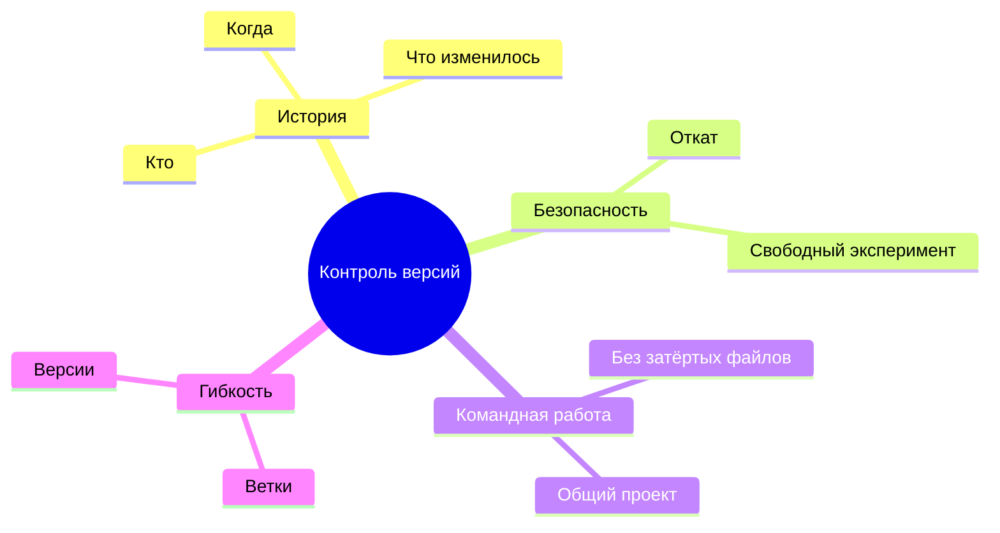
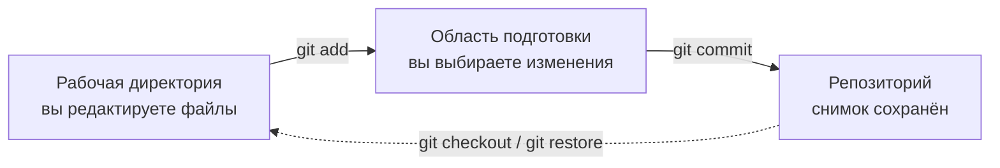

## Введение в Git. Основы контроля версий

> это первый урок курса - сегодня мы закладываем фундамент, без которого не обходится ни один реальный проект: узнаем, что такое «контроль версий», зачем он нужен каждому разработчику, и установим с Git на ваш компьютер.

---

## Чему вы научитесь к концу урока

- Объяснять, что такое контроль версий и зачем он нужен.
- Понимать разницу между Git и GitHub.
- Устанавливать Git и проверять, что он работает.
- Один раз настроить имя и почту для своей «личности» в Git.
- Понимать три состояния файла в Git: рабочая директория, область подготовки и репозиторий.
- Создавать свой первый репозиторий командой `git init`.

---

## Хронометраж урока

| Блок | Содержание |
| --- | --- |
| 1. Что такое контроль версий и зачем он нужен | Аналогия с «машиной времени для папок», решаемые проблемы |
| 2. Как Git хранит версии | Снимки, три состояния файла |
| 3. Git и GitHub: в чём разница | Git - инструмент, GitHub - платформа |
| 4. Установка Git и первая настройка | `git --version`, `git config --global` |
| 5. Мини-задание | Настроить Git самостоятельно |
| 6. Первый репозиторий | `git init`, `git status`, папка `.git` |
| 7. Итоги и практическое задание | Закрепление |

---

## Блок 1. Что такое контроль версий и зачем он нужен

**Простыми словами:** представьте, что вы пишете диплом, книгу или просто большой реферат. Каждый день вы создаёте новые версии: `text_1.docx`, `text_2.docx`, `text_FINAL.docx`, `text_FINAL2.docx`. Через месяц у вас сорок файлов, вы уже не помните, какой из них актуальный, а что изменилось между `_FINAL` и `_FINAL2` — вообще загадка.

Ровно эту проблему решают **системы контроля версий** (Version Control System, VCS) — а Git самая популярная из них.

**Контроль версий — это система, которая сохраняет историю всех изменений в проекте.** В любой момент вы можете:

- увидеть, **что** изменилось и **когда**;
- увидеть, **кто** внёс каждое изменение;
- вернуться к **любому** прошлому состоянию — хоть годичной давности;
- экспериментировать без страха — всегда можно откатиться назад;
- работать над одним проектом с другими людьми, не затирая чужую работу.

**Аналогия:** вспомните видеоигру с точками сохранения. Перед большой битвой вы делаете сейв, а если что-то пошло не так — просто загружаете прошлое сохранение. Git — это автоматическая «система сохранений» для вашего кода в папке проекта.



---

### Частые ошибки новичков

| Ошибка | Как исправить |
| --- | --- |
| Думать, что контроль версий - это то же самое, что облачное хранилище (Google Drive, Dropbox) | Облако хранит *последнюю* копию, Git хранит *всю историю* копий |
| Откладывать контроль версий «пока проект не станет серьёзным» | Начинайте с самого первого файла - привести запутанную папку под контроль задним числом сложно |
| Считать, что Git нужен только в команде | Даже в одиночку вы получаете бесплатную «систему сохранений», отмену и историю |
| Ждать, что Git - это программа с волшебной кнопкой | Git - консольный инструмент; ~10 основных команд этого курса достаточно для реальной работы |

---

## Блок 2. Как Git хранит версии: три состояния файла

Ключевая идея, которую нужно понять с самого начала: Git хранит не просто копии файлов. Git хранит **снимки** — полную картину всех файлов в определённый момент. Каждый такой снимок называется **коммитом** (commit) — подробно мы изучим коммиты в уроке 2.

Чтобы это было удобно, каждый файл в Git-проекте проходит через **три состояния**:

1. **Рабочая директория** (`workspace`) — здесь вы просто редактируете файлы привычными инструментами. Git не вмешивается, пока вы работаете.
2. **Область подготовки** (`index`, «staging») — промежуточная зона, где вы *подготавливаете*, какие изменения должны попасть в следующий снимок. Это как выбирать блюда на ужин: не все продукты из холодильника, а ровно то, что сегодня в меню.
3. **Репозиторий** (`.git`) — место, где изменения *навсегда* сохраняются в виде коммита — самого снимка.

**Аналогия для трёх состояний:** вы собираете посылку. Сначала складываете вещи в коробку на столе (это *область подготовки* — вы решаете, что войдёт), затем запаковываете и отправляете коробку (это *репозиторий* — снимок сохранён).



Команды, которые вы будете выполнять, образуют чёткую цепочку:

- `git add` — перенести изменения из рабочей директории в область подготовки.
- `git commit` — взять всё подготовленное в области подготовки и сохранить как постоянный снимок.

По-настоящему эту цепочку мы прогоним в уроке 2, а сегодня просто настроим окружение.

---

## Блок 3. Git и GitHub: в чём разница

Одно из самых частых заблуждений новичков — смешивать Git и GitHub. Это две разные вещи.

### Git

**Git** — это **программа**, инструмент, который работает на вашем компьютере и сам управляет контролем версий: создаёт коммиты, следит за ветками и хранит историю прямо в папке проекта (в скрытой подпапке `.git`).

- Создан Линусом Торвальдсом в 2005 году (да, тем самым создателем Linux).
- Бесплатный и с открытым исходным кодом.
- Работает полностью офлайн — история хранится на вашей машине.

### GitHub

**GitHub** — это **интернет-платформа** для хранения и обмена Git-репозиториями. Такой «Git в облаке с соцсетью»:

- вы можете выложить локальный репозиторий на сайт (`git push`);
- другие разработчики могут посмотреть его, скопировать или предложить свои правки;
- это ещё и портфолио: на ваш профиль на GitHub работодатели смотрят в первую очередь.

**Аналогия:** Git — это двигатель, GitHub — гараж, где вы паркуете машину и показываете её соседям. Одно без другого существовать может: можно пользоваться Git локально и никогда не открывать GitHub. Но в реальной работе они почти всегда идут в паре.

У GitHub есть альтернативы — GitLab, Bitbucket, Gitea. Подробно GitHub мы изучим начиная с урока 5.

---

### Частые ошибки новичков

| Ошибка | Как исправить |
| --- | --- |
| Называть GitHub «Git» и наоборот | Git - инструмент на вашем компьютере, GitHub - сайт для хостинга репозиториев |
| Думать, что для работы Git нужен GitHub | Git работает полностью офлайн, GitHub - про обмен и командную работу |
| Ждать, что GitHub «появится сам» после установки Git | Это отдельные вещи; аккаунт на GitHub создадим в уроке 5 |
| Пропустить настройку Git «на потом» | Коммиты без настроенного имени станут «анонимными» - вы потеряете авторство |

---

## Блок 4. Установка Git и первая настройка

### Шаг 1. Установите Git

- **Windows:** скачайте установщик с [git-scm.com](https://git-scm.com) и запустите его; настройки по умолчанию подходят.
- **macOS:** проще всего установить Command Line Tools — выполните в терминале `git --version` и действуйте по подсказке системы, либо установите через Homebrew: `brew install git`.
- **Linux:** обычно `sudo apt install git` (Debian/Ubuntu) или `sudo dnf install git` (Fedora).

Проверьте, что всё получилось:

```bash
git --version
```

В ответ должно появиться что-то вроде `git version 2.4x.x`. Если версия вывелась — Git установлен.

### Шаг 2. Представьтесь Git

Git должен знать, **кто** вносит каждое изменение — иначе он не сможет правильно подписывать коммиты. Представьтесь один раз, и Git запомнит это для всех проектов:

```bash
git config --global user.name "Ваше Имя"
git config --global user.email "vash.email@example.com"
```

**Как это работает:** флаг `--global` означает «применить для текущего пользователя, во всех проектах». Настройки сохраняются в специальный файл конфигурации. Посмотреть их можно в любой момент:

```bash
git config --global --list
```

**Важно:** почта здесь не обязана совпадать с почтой GitHub (хотя это удобно). Важно, чтобы она была **вашей** — именно она будет вписана в каждый ваш коммит.

### Шаг 3. Проверьте результат

```bash
git config --global user.name
git config --global user.email
```

Каждая команда должна вывести то, что вы ввели.

---

## Мини-задание

Выполните настройку самостоятельно, не подглядывая:

1. Проверьте версию Git.
2. Задайте себе `user.name` и `user.email`.
3. Выведите список глобальных настроек и убедитесь, что оба значения на месте.

**Решение:**

```bash
git --version
git config --global user.name "Али"
git config --global user.email "ali@example.com"
git config --global --list
```

---

## Блок 6. Ваш первый репозиторий

Теперь впервые заставим Git поработать — создадим репозиторий.

**Что такое репозиторий?** **Репозиторий** («репа») — это папка, «за которой следит» Git: в ней лежат файлы вашего проекта и скрытая папка `.git`, где хранится вся история.

> Папка, в которой вы сейчас работаете, — уже является Git-репозиторием: она была создана той же командой, что мы сейчас применим. Можете заглянуть в её папку `.git` в файловом менеджере, если любопытно.

**Шаг 1.** Создайте папку для экспериментов и откройте в ней терминал:

```bash
mkdir my-first-repo
cd my-first-repo
```

**Шаг 2.** Превратите папку в Git-репозиторий:

```bash
git init
```

Git ответит: `Initialized empty Git repository in .../.git/` — и создаст внутри скрытую папку `.git`.

**Шаг 3.** Создайте первый файл и спросите Git, что происходит:

```bash
echo "Hello, Git!" > hello.txt
git status
```

`git status` показывает состояние репозитория:

```text
On branch master

No commits yet

Untracked files:
  (use "git add <file>..." to include in what will be committed)
        hello.txt
```

**Прочитайте этот ответ внимательно.** Git сообщает вам:

- репозиторий находится на ветке `master` (ветки изучим в уроке 3);
- коммитов пока нет;
- есть файл `hello.txt` **без версионного контроля** — Git его видит, но пока не управляет им.

**`git status`** — ваш главный помощник на весь курс. Забыли команду или сомневаетесь, что происходит? Выполните `git status` — и Git сам подскажет, что делать дальше.

В следующем уроке мы сделаем первый снимок — создадим первый коммит.

---

## Итоги урока

Сегодня вы узнали:

- **Контроль версий** — это «система сохранений» для проекта: полная история, откат и командная работа.
- **Git** — локальный инструмент, хранящий всю историю в папке `.git`; **GitHub** — интернет-платформа для хранения и обмена репозиториями.
- Файл в Git проходит через **три состояния**: рабочая директория → область подготовки → репозиторий.
- Git нужно **настроить один раз**: `user.name` и `user.email`.
- `git init` превращает папку в репозиторий, а `git status` показывает его состояние.

---

## Практика

1. Установите Git, если ещё не установлен, и проверьте командой `git --version`.
2. Выполните `git config --global user.name` и `git config --global user.email` — укажите реальные имя и почту.
3. Создайте папку `my-first-repo` и внутри неё выполните `git init`.
4. Создайте файл `hello.txt` с любым текстом, выполните `git status` и внимательно прочитайте сообщение Git.
5. Откройте папку в файловом менеджере и найдите скрытую папку `.git` — поймите, что все знания Git о проекте живут именно там.

Чтобы ускорить работу, запустите практический скрипт `practice-1.sh` — он проведёт вас по всем шагам:

---

[Следующий урок: Репозиторий и коммиты →](../../Lesson-2/ru/Репозиторий%20и%20коммиты.md)