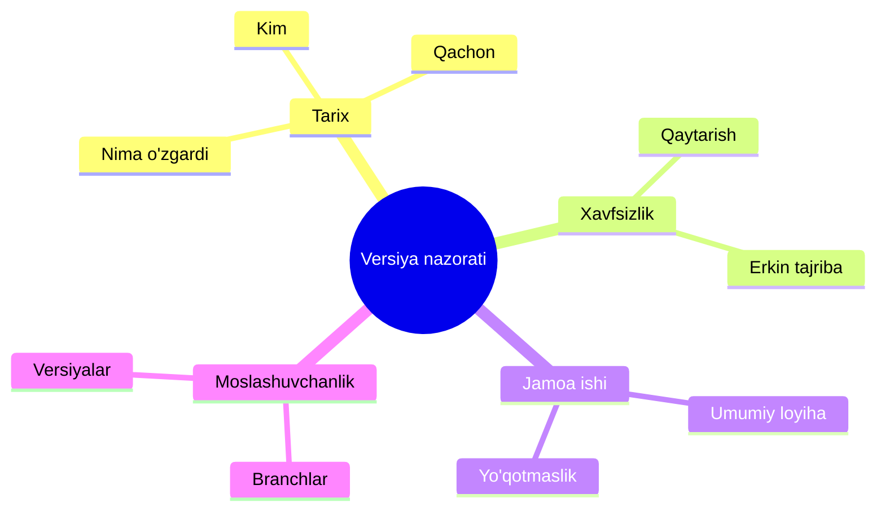
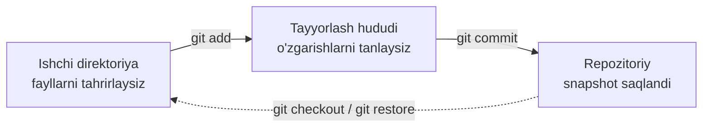

## Git ga kirish. Versiya nazorati asoslari

> bu kursning birinchi darsi - bugun biz poydevor qo'yamiz, busiz hech bir real loyiha qurilmaydi: «versiya nazorati» nima ekanini, u har bir dasturchiga nima uchun kerakligini bilib olamiz va Gitni kompyuteringizga o'rnatib sozlaymiz.

---

## Dars oxirida nimani o'rganasiz

- Versiya nazorati nima ekanini va nima uchun kerakligini tushuntirish.
- Git va GitHub orasidagi farqni tushunish.
- Gitni o'rnatish va ishlayotganini tekshirish.
- Gitdagi "shaxsingiz" uchun nom va pochtani bir marta sozlash.
- Faylning Gitdagi uch holatini tushunish: ishchi direktoriya, tayyorlash hududi va repozitoriy.
- `git init` buyrug'i bilan birinchi repozitoriyani yaratish.

---

## Dars vaqti

| Blok | Mazmun |
| --- | --- |
| 1. Versiya nazorati nima va nima uchun kerak | «Papkalar uchun vaqt mashinasi» taqqoslash, hal qilinadigan muammolar |
| 2. Git versiyalarni qanday saqlaydi | Snapshotlar, faylning uch holati |
| 3. Git va GitHub: farqi nima | Git - vosita, GitHub - platforma |
| 4. Gitni o'rnatish va birinchi sozlash | `git --version`, `git config --global` |
| 5. Mini-vazifa | Gitni mustaqil sozlash |
| 6. Birinchi repozitoriy | `git init`, `git status`, `.git` papkasi |
| 7. Xulosalar va amaliy vazifa | Mustahkamlash |

---

## 1-blok. Versiya nazorati nima va nima uchun kerak

**Oddiy qilib aytganda:** tasavvur qiling, siz diplom, kitob yoki shunchaki katta insho yozyapsiz. Har kuni yangi versiyalar yaratasiz: `matn_1.docx`, `matn_2.docx`, `matn_FINAL.docx`, `matn_FINAL2.docx`. Bir oydan keyin qirqta fayl bo'ladi, qaysi biri dolzarb ekanini endi eslolmaysiz, `_FINAL` va `_FINAL2` orasida nima o'zgargani esa — sir.

Aynan shu muammoni **versiya nazorat tizimlari** (VCS) hal qiladi — Git esa ularning eng ommabopi.

**Versiya nazorati — bu loyihadagi barcha o'zgarishlar tarixini saqlaydigan tizim.** Istalgan daqiqada siz:

- **nima** o'zgarganini va **qachon** o'zgarganini ko'rasiz;
- har bir o'zgarishni **kim** qilganini ko'rasiz;
- **istalgan** oldingi holatga qaytishingiz mumkin — hatto bir yil avvalgisiga;
- qo'rqmasdan tajriba qilasiz — har doim orqaga qaytish mumkin;
- boshqa odamlar bilan bir loyiha ustida ishlab, bir-biringizning ishini yo'qotmaysiz.

**Taqqoslash:** saqlash nuqtalari bor kompyuter o'yinini eslang. Katta jangdan oldin sayf qilasiz, xato ketsa — avvalgi saqlashni yuklaysiz. Git — bu loyiha papkasidagi kod uchun avtomatik «saqlash nuqtalari tizimi».



---

### Yangi boshlovchilarning ko'p uchraydigan xatolari

| Xato | Qanday tuzatish |
| --- | --- |
| Versiya nazoratini bulutli xotira (Google Drive, Dropbox) bilan aralashtirish | Bulut *oxirgi* nusxani saqlaydi, Git *barcha tarixni* saqlaydi |
| Versiya nazoratini «loyiha jiddiylashguncha» keyinga qoldirish | Eng birinchi fayldan boshlang - chalkash papkani keyinroq nazoratga olish qiyin |
| Git faqat jamoada kerak deb o'ylash | Yolg'iz ham «saqlash nuqtalari», bekor qilish va tarix olasiz |
| Gitni «sehrli tugmasi bor dastur» deb kutish | Git - konsol vositasi; kursning ~10 ta asosiy buyrug'i real ish uchun yetarli |

---

## 2-blok. Git versiyalarni qanday saqlaydi: faylning uch holati

Boshidanoq tushunish kerak bo'lgan asosiy g'oya: Git shunchaki fayl nusxalarini saqlamaydi. Git **snapshotlarni** saqlaydi — barcha fayllarning ma'lum momentdagi to'liq ko'rinishini. Har bir bunday snapshot **commit** deb ataladi (batafsil 2-darsda o'rganamiz).

Buni qulay qilish uchun Git-loyihadagi har bir fayl **uch holatdan** o'tadi:

1. **Ishchi direktoriya** (`workspace`) — bu yerda siz fayllarni odatiy vositalar bilan tahrirlaysiz. Siz ishlayotganda Git aralashmaydi.
2. **Tayyorlash hududi** (`index`, «staging») — keyingi snapshotga qaysi o'zgarishlar kirishini *tayyorlaydigan* oraliq zona. Bu kechki ovqatga taom tanlashga o'xshaydi: muzlatgichdagi hamma mahsulot emas, balki aynan bugungi menyuga kiritilganlar.
3. **Repozitoriy** (`.git`) — o'zgarishlar commit — snapshot ko'rinishida *abadiy* saqlanadigan joy.

**Uch holat uchun taqqoslash:** siz posilka yig'ayapsiz. Avval narsalarni stoldagi qutiga solasiz (bu *tayyorlash hududi* — nimani qo'shishni siz hal qilasiz), keyin qutini yopib jo'natasiz (bu *repozitoriy* — snapshot saqlandi).



Bajariladigan buyruqlar aniq zanjir hosil qiladi:

- `git add` — o'zgarishlarni ishchi direktoriyadan tayyorlash hududiga o'tkazadi.
- `git commit` — tayyorlash hududidagi hammasini olib, doimiy snapshot qilib saqlaydi.

Bu zanjirni 2-darsda haqiqatda bajarib ko'ramiz, bugun esa muhitni sozlaymiz.

---

## 3-blok. Git va GitHub: farqi nima

Yangi boshlovchilarning eng keng tarqalgan xatolaridan biri — Git va GitHubni aralashtirish. Bular ikki xil narsa.

### Git

**Git** — bu **dastur**, kompyuteringizda ishlaydigan vosita: commitlar yaratadi, branchlarni kuzatadi va tarixni loyiha papkasining ichida (yashirin `.git` papkasida) saqlaydi.

- 2005-yilda Linus Torvalds tomonidan yaratilgan (ha, Linuxni yaratgan o'sha odam).
- Bepul va ochiq kodli.
- To'liq oflayn ishlaydi — tarix sizning mashinangizda saqlanadi.

### GitHub

**GitHub** — Git-repozitoriyalarni saqlash va almashish uchun **internet-platforma**. «Bulutdagi Git, ijtimoiy tarmoq bilan»:

- mahalliy repozitoriyani saytga joylash mumkin (`git push`);
- boshqa dasturchilar uni ko'rishi, nusxalashi yoki o'z tuzatishlarini taklif qilishi mumkin;
- bu ham portfoliodir: ish beruvchilar birinchi navbatda sizning GitHub profilingizga qarashadi.

**Taqqoslash:** Git — dvigatel, GitHub — mashinani qo'yib, qo'shnilarga ko'rsatadigan garaj. Biri ikkinchisiz yashashi mumkin: Gitdan faqat lokal foydalanish va GitHubni hech ochmaslik mumkin. Lekin real ishda ular deyarli doim birga.

GitHubning alternativlari bor — GitLab, Bitbucket, Gitea. GitHubni 5-darsdan boshlab batafsil o'rganamiz.

---

### Yangi boshlovchilarning ko'p uchraydigan xatolari

| Xato | Qanday tuzatish |
| --- | --- |
| GitHubni «Git» deb atash va aksincha | Git - kompyuterdagi vosita, GitHub - repozitoriyalarni joylashtiruvchi sayt |
| Git ishlashi uchun GitHub kerak deb o'ylash | Git to'liq oflayn ishlaydi, GitHub - almashish va jamoa ishi |
| Gitni o'rnatgandan keyin GitHub «o'z-o'zidan paydo bo'ladi» deb kutish | Bular alohida narsalar; GitHub akkauntini 5-darsda yaratamiz |
| Git sozlamasini «keyinroqqa» qoldirish | Sozlanmagan nomli commitlar «anonim» bo'ladi - mualliflik yo'qoladi |

---

## 4-blok. Gitni o'rnatish va birinchi sozlash

### 1-qadam. Gitni o'rnating

- **Windows:** [git-scm.com](https://git-scm.com) dan o'rnatuvchini yuklab, ishga tushiring; standart sozlamalar mos keladi.
- **macOS:** eng osoni — Command Line Tools o'rnatish: terminalda `git --version` bajaring va tizim ko'rsatmasiga amal qiling, yoki Homebrew orqali: `brew install git`.
- **Linux:** odatda `sudo apt install git` (Debian/Ubuntu) yoki `sudo dnf install git` (Fedora).

Hammasi joyida ekanini tekshiring:

```bash
git --version
```

Javobda `git version 2.4x.x` ga o'xshash narsa chiqishi kerak. Versiya chiqdi — Git o'rnatilgan.

### 2-qadam. Gitga o'zingizni tanishtiring

Git har bir o'zgarishni **kim** qilishini bilishi kerak — aks holda commitlarni to'g'ri imzolay olmaydi. Bir marta tanishtiring, Git buni barcha loyihalar uchun eslab qoladi:

```bash
git config --global user.name "Sizning Ismingiz"
git config --global user.email "sizning.email@example.com"
```

**Bu qanday ishlaydi:** `--global` bayrog'i «joriy foydalanuvchi uchun, barcha loyihalarda qo'llash» degani. Sozlamalar maxsus konfiguratsiya faylida saqlanadi. Istalgan vaqtda ko'rishingiz mumkin:

```bash
git config --global --list
```

**Muhim:** bu yerda pochta GitHub pochtasiga mos bo'lishi shart emas (garchi qulay bo'lsa ham). Muhimi — u **sizniki**: har bir committingizga aynan u yoziladi.

### 3-qadam. Natijani tekshiring

```bash
git config --global user.name
git config --global user.email
```

Har bir buyruq kiritgan ma'lumotingizni chiqarishi kerak.

---

## Mini-vazifa

Qaramasdan mustaqil sozlashni bajaring:

1. Git versiyasini tekshiring.
2. O'zingizga `user.name` va `user.email` sozlang.
3. Global sozlamalar ro'yxatini chiqaring va ikkala qiymat joyida ekaniga ishonch hosil qiling.

**Yechim:**

```bash
git --version
git config --global user.name "Ali"
git config --global user.email "ali@example.com"
git config --global --list
```

---

## 6-blok. Birinchi repozitoriyangiz

Endi Gitni birinchi marta ishga tushiramiz — repozitoriy yaratamiz.

**Repozitoriy nima?** **Repozitoriy** («repo») — Git «kuzatib turadigan» papka: unda loyiha fayllari va butun tarix saqlanadigan yashirin `.git` papkasi bor.

> Hozir ishlayotgan papkangiz allaqachon Git-repozitoriy: u aynan biz qo'llaydigan buyruq bilan yaratilgan. Xohlasangiz, fayl menejerida uning `.git` papkasiga qarang.

**1-qadam.** Tajribalar uchun papka yarating va ichida terminalni oching:

```bash
mkdir my-first-repo
cd my-first-repo
```

**2-qadam.** Papkani Git-repozitoriysiga aylantiring:

```bash
git init
```

Git javob beradi: `Initialized empty Git repository in .../.git/` — va ichkarida yashirin `.git` papkasini yaratadi.

**3-qadam.** Birinchi faylni yarating va Gitdan nima bo'layotganini so'rang:

```bash
echo "Hello, Git!" > hello.txt
git status
```

`git status` repozitoriy holatini ko'rsatadi:

```text
On branch master

No commits yet

Untracked files:
  (use "git add <file>..." to include in what will be committed)
        hello.txt
```

**Bu javobni diqqat bilan o'qing.** Git sizga shuni aytmoqda:

- repozitoriy `master` branchida (branchlarni 3-darsda o'rganamiz);
- hozircha commitlar yo'q;
- `hello.txt` fayli **versiya nazoratiga olinmagan** — Git uni ko'radi, lekin hali boshqarmaydi.

**`git status`** — butun kurs davomidagi asosiy yordamchingiz. Buyruqni unutdingizmi yoki nima bo'layotganiga shubha qilasizmi? `git status` bajarib — Git o'zi nima qilish kerakligini aytadi.

Keyingi darsda birinchi snapshot qilamiz — birinchi commit yaratamiz.

---

## Dars xulosalari

Bugun siz quyidagilarni o'rgandingiz:

- **Versiya nazorati** — loyiha uchun «saqlash nuqtalari tizimi»: to'liq tarix, qaytarish va jamoa ishi.
- **Git** — lokal vosita, butun tarixni `.git` papkasida saqlaydi; **GitHub** — repozitoriyalarni saqlash va almashish platformasi.
- Fayl Gitda **uch holatdan** o'tadi: ishchi direktoriya → tayyorlash hududi → repozitoriy.
- Gitni **bir marta sozlash** kerak: `user.name` va `user.email`.
- `git init` papkani repozitoriysiga aylantiradi, `git status` esa uning holatini ko'rsatadi.

---

## Amaliy vazifa

1. Gitni hali o'rnatilmagan bo'lsa, o'rnating va `git --version` bilan tekshiring.
2. `git config --global user.name` va `git config --global user.email` bajarib, haqiqiy ism va pochta yozing.
3. `my-first-repo` papkasini yarating va ichida `git init` bajaring.
4. Istalgan matn bilan `hello.txt` faylini yarating, `git status` bajaring va Git xabarini diqqat bilan o'qing.
5. Fayl menejerida papkani ochib, yashirin `.git` papkasini toping — Git loyiha haqidagi barcha bilimlari aynan shu yerda yashashini tushunib oling.

Ishni tezlashtirish uchun `practice-1.sh` amaliyot skriptini ishga tushiring — u sizni barcha qadamlar bo'ylab o'tkazadi:

---

[Keyingi dars: Repozitoriy va commitlar →](../../Lesson-2/uz/Repozitoriy%20va%20commitlar.md)