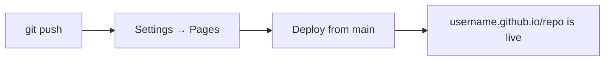

## Final Project — Publishing a Portfolio on GitHub Pages

> **Connection with the previous lesson:** all the tools are in your hands. Now the finale — we combine HTML, CSS (the previous courses), and Git (this course) into one real project: a personal portfolio site, published on the internet via **GitHub Pages**.

---

## Lesson Goal

Complete the course with a full cycle: create a portfolio website locally, bring it under the version control, push it to GitHub, and publish it on the internet so the link works for anyone, anywhere. This is the point where a student becomes a developer with a live project in their portfolio.

## What You Will Learn by the End of the Lesson

- Structure a small website project cleanly: `index.html` + `css/` + `images/`.
- Explain what GitHub Pages is and how the site URL is formed.
- Publish a site with Pages: push and switch it on in Settings.
- Update the live site after changes (Git does the job).
- Understand the full path covered in the course — from `git init` to a live site.

---

## Lesson Timeline

| Block | Content |
| --- | --- |
| 1. The goal | A portfolio that works for you |
| 2. The project locally | README, index.html, css/, images/ |
| 3. GitHub Pages and URLs | `username.github.io` structure |
| 4. Push to GitHub | Repo → `git init` → `push` |
| 5. Switching Pages on | Settings → branch → publish |
| 6. Updates and next steps | Pushing changes, course recap |
| 7. Mini-task | Prepare your own page |
| 8. Summary | The final checklist |

---

## Block 1. The Goal

The final project is **your personal portfolio** — one page with:

- your name and what you do;
- a short intro (hello, who I am, skills);
- sections: projects, skills, contacts;
- a link to the terminal: this site lives on GitHub and is maintained with Git.

Why a portfolio matters:

- a **live link** is something you send to an employer instead of screenshots;
- **version history** shows how the project grew;
- the repository itself is the artifact — recruiters often look at the code;

The project structure we've been preparing for throughout the course is in the `project/` folder of this lesson:

```text
Lesson-10/
└── project/
    ├── README.md      # description of the site
    ├── index.html     # the page
    ├── css/
    │   └── style.css  # styles
    └── images/
        └── .gitkeep   # place for screenshots (learned it in lesson 7)
```

---

## Block 2. The Project Locally

Open `project/index.html` in this lesson — it's a ready minimal portfolio (you can style it to taste using the CSS course). Rules we follow:

1. **Folder names in lowercase**, meaningful: `css/`, `js/`, `images/`.
2. `index.html` in the root — browsers and Pages open it by default.
3. A `README.md` — what the site is and a link to it (lesson 7).
4. **Relative paths** in the HTML: `css/style.css`, not an absolute disk path — so the site works both locally and on GitHub.

```html
<link rel="stylesheet" href="css/style.css">
```

Keep this rule: a site that opens from `file://` also opens from the deployed version.

---

## Block 3. GitHub Pages and URLs

**GitHub Pages** — free hosting right inside GitHub, by default at:

```text
https://<username>.github.io/<repository-name>/
```

A special case: a repository named exactly `<username>.github.io` becomes **the user site**:

```text
https://<username>.github.io/
```

For the portfolio we recommend the user site — one address, no repo name in the link. But for practice, a repository site is fine too — the steps are identical.

| Type | Repository name | Result URL |
| --- | --- | --- |
| Project site | `portfolio` | `username.github.io/portfolio` |
| User/organization site | `username.github.io` | `username.github.io` |

---

## Block 4. Push to GitHub

The full Git cycle we've practiced (lessons 1–8) applied to the final project:

### 1. Create the repository

On GitHub: **New repository** → name (e.g. `<username>.github.io`) → **public** → **don't** initialize with README (we'll push ours) → Create.

### 2. Initialize and connect locally

```bash
cd project
git init
git add .
git status                       # by the way — did .gitignore hide anything?
git commit -m "feat: initial portfolio"
git branch -M main
git remote add origin https://github.com/<username>/<repo>.git
git push -u origin main
```

Note the commands from lesson 1 (`init`), lesson 2 (`add`, `commit`), lesson 5 (`remote`, `push`, `-M main`).

---

## Block 5. Switching Pages On

The push delivered the code; now publish it.

1. On the repository page → **Settings**.
2. Left menu → **Pages**.
3. **Build and deployment** → Source: **Deploy from a branch**, branch: `main`, `/ (root)` → **Save**.
4. Wait a minute or two — the status and the link appear at the top of the same page.

Your site is live — share the link!



---

## Block 6. Updates and Next Steps

The site is live, but you'll keep improving it. Updating is exactly lesson 5:

```bash
git add .
git commit -m "feat: add projects section"
git push
```

**Pages redeploys automatically** — after a minute the live site shows the new version. That's the whole loop we trained for: edit → commit → push → published.

### Where to grow next

- custom a **domain** in the same Pages settings;
- add an **automated build** with GitHub Actions;
- make a repository page for every project;
- write tests, add CI — the same principles scale from a portfolio to a product.

You now own a complete development loop: **plan → code → Git → review → release**. That's what a developer's workday looks like.

---

## Block 7. Mini-Task

Make the portfolio `project/index.html` yours:

1. Replace the name and intro with your own.
2. Add your skills (HTML, CSS, Git — you've earned it) and your GitHub link.
3. Add a real photo to `images/` (removing `.gitkeep`).
4. Check it locally: open `index.html` in the browser.

Then proceed to the practice — the deployment.

---

## Lesson Summary

Today you completed the final cycle:

- **GitHub Pages** — free hosting of a static site from a repository.
- URL structure: `username.github.io` — user site, `username.github.io/<repo>` — project site.
- The full path: **`git init` → code → commit → push → Settings → Pages → live site**.
- **Updates** are just `git push` — the site redeploys itself.
- The course is complete: from the first `git config` to a public project maintained with Git.

---

## Practice

Deploy your own portfolio (Steps 1–2 from the mini-task):

1. Open the repository page → **Settings** → **Pages**.
2. Deploy from the `main` branch, root folder, save.
3. Open the resulting link after a minute or two. Check the page and styles.
4. Make a change (e.g., add a project), run `git add . && git commit && git push`.
5. Reload the live site — after the redeploy the update is visible.

The `practice-10.sh` script checks the local project before you push (structure, git state, relative paths):

---

**Congratulations on completing the course!** Your projects http://jlearn.space/courses are the next step.