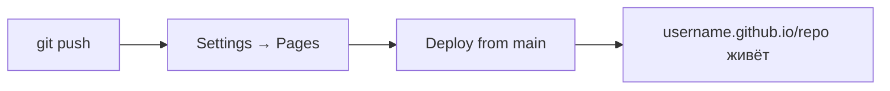

## Итоговый проект — публикация портфолио на GitHub Pages

> **Связь с прошлым уроком:** все инструменты у вас в руках. Теперь финал — соединяем HTML, CSS (прошлые курсы) и Git (этот курс) в один реальный проект: личное портфолио, опубликованное в интернете через **GitHub Pages**.

---

## Цель урока

Завершить курс полным циклом: создать сайт-портфолио локально, взять его под контроль версий, запуштить на GitHub и опубликовать в интернете так, чтобы ссылка работала у любого человека в любой точке мира. Это момент, когда студент становится разработчиком с живым проектом в портфолио.

## Чему вы научитесь к концу урока

- Аккуратно структурировать маленький веб-проект: `index.html` + `css/` + `images/`.
- Объяснять, что такое GitHub Pages и как формируется адрес сайта.
- Публиковать сайт с помощью Pages: запуштить и включить в настройках.
- Обновлять живой сайт после изменений (это делает Git).
- Понимать весь путь курса — от `git init` до живого сайта.

---

## Хронометраж урока

| Блок | Содержание |
| --- | --- |
| 1. Цель | Портфолио, которое работает на вас |
| 2. Проект локально | README, index.html, css/, images/ |
| 3. GitHub Pages и адреса | Структура `username.github.io` |
| 4. Пуш на GitHub | Репозиторий → `git init` → `push` |
| 5. Включение Pages | Settings → ветка → публикация |
| 6. Обновления и дальнейшие шаги | Пуш изменений, итоги курса |
| 7. Мини-задание | Сделать страницу своей |
| 8. Итоги | Финальный чек-лист |

---

## Блок 1. Цель

Итоговый проект — **ваше личное портфолио**: одна страница с:

- вашим именем и тем, чем вы занимаетесь;
- коротким представлением (приветствие, кто я, скиллы);
- разделами: проекты, навыки, контакты;
- интернет-адресом в конце: этот сайт живёт на GitHub и обслуживается Git.

Почему портфолио важно:

- **живая ссылка** — то, что вы отправляете работодателю вместо скриншотов;
- **история версий** показывает, как рос проект;
- сам репозиторий — артефакт: рекрутеры часто смотрят в код;

Структура проекта, к которой мы готовились весь курс, лежит в папке `project/` этого урока:

```text
Lesson-10/
└── project/
    ├── README.md      # описание сайта
    ├── index.html     # сама страница
    ├── css/
    │   └── style.css  # стили
    └── images/
        └── .gitkeep   # место для скриншотов (узнали в уроке 7)
```

---

## Блок 2. Проект локально

Откройте `project/index.html` этого урока — это готовое минимальное портфолио (оформить его по вкусу можно приёмами из курса CSS). Правила, которых придерживаемся:

1. **Имена папок строчными**, осмысленные: `css/`, `js/`, `images/`.
2. `index.html` в корне — браузер и Pages открывают его по умолчанию.
3. `README.md` — что это за сайт и ссылка на него (урок 7).
4. **Относительные пути** в HTML: `css/style.css`, а не абсолютный путь с диска — чтобы сайт работал и локально, и на GitHub.

```html
<link rel="stylesheet" href="css/style.css">
```

Держите это правило: сайт, открывающийся из `file://`, откроется и из развёрнутой версии.

---

## Блок 3. GitHub Pages и адреса

**GitHub Pages** — бесплатный хостинг прямо внутри GitHub, по умолчанию по адресу:

```text
https://<username>.github.io/<название-репозитория>/
```

Особый случай: репозиторий с именем ровно `<username>.github.io` становится **сайтом пользователя**:

```text
https://<username>.github.io/
```

Для портфолио рекомендуем сайт пользователя — один адрес без имени репозитория в ссылке. Но для практики подойдёт и репозиторный сайт — шаги одинаковые.

| Тип | Название репозитория | Итоговая ссылка |
| --- | --- | --- |
| Сайт проекта | `portfolio` | `username.github.io/portfolio` |
| Сайт пользователя/организации | `username.github.io` | `username.github.io` |

---

## Блок 4. Пуш на GitHub

Полный цикл Git, который мы отрабатывали (уроки 1–8), в применении к финальному проекту:

### 1. Создайте репозиторий

На GitHub: **New repository** → имя (например `<username>.github.io`) → **public** → **не** инициализировать README (запушим свой) → Create.

### 2. Инициализируйте и подключите локально

```bash
cd project
git init
git add .
git status                       # кстати — .gitignore что-нибудь скрыл?
git commit -m "feat: initial portfolio"
git branch -M main
git remote add origin https://github.com/<username>/<repo>.git
git push -u origin main
```

Обратите внимание на команды из урока 1 (`init`), урока 2 (`add`, `commit`), урока 5 (`remote`, `push`, `-M main`).

---

## Блок 5. Включение Pages

Пуш доставил код — теперь публикуем.

1. На странице репозитория → **Settings**.
2. В левом меню → **Pages**.
3. **Build and deployment** → Source: **Deploy from a branch**, ветка: `main`, `/ (root)` → **Save**.
4. Подождите минуту-другую — статус и ссылка появятся вверху этой же страницы.

Ваш сайт жив — делитесь ссылкой!



---

## Блок 6. Обновления и дальнейшие шаги

Сайт жив, но вы будете его улучшать. Обновление — ровно урок 5:

```bash
git add .
git commit -m "feat: add projects section"
git push
```

**Pages перевыпускает сайт автоматически** — через минуту на живой ссылке новая версия. Это весь цикл, к которому мы готовились: правка → commit → push → публикация.

### Куда расти дальше

- подключите **свой домен** в тех же настройках Pages;
- добавьте **автоматическую сборку** через GitHub Actions;
- сделайте по странице-репозиторию на каждый проект;
- пишите тесты, подключайте CI — те же принципы масштабируются с портфолио на продукт.

Теперь у вас есть целый контур разработки: **план → код → Git → ревью → релиз**. Так выглядит рабочий день разработчика.

---

## Блок 7. Мини-задание

Сделайте портфолио `project/index.html` своим:

1. Замените имя и приветствие на свои.
2. Добавьте ваши навыки (HTML, CSS, Git — вы это заслужили) и ссылку на ваш GitHub.
3. Добавьте реальное фото в `images/` (удалив `.gitkeep`).
4. Проверьте локально: откройте `index.html` в браузере.

Дальше — практика, публикация.

---

## Итоги урока

Сегодня вы прошли финальный цикл:

- **GitHub Pages** — бесплатный хостинг статического сайта из репозитория.
- Структура адресов: `username.github.io` — сайт пользователя, `username.github.io/<репо>` — сайт проекта.
- Полный путь: **`git init` → код → commit → push → Settings → Pages → живой сайт**.
- **Обновления** — это просто `git push`: сайт переразвёртывается сам.
- Курс пройден: от первого `git config` до публичного поддерживаемого Git-проекта.

---

## Практика

Опубликуйте своё портфолио (шаги 1–2 из мини-задания):

1. На странице репозитория → **Settings** → **Pages**.
2. Деплой с ветки `main`, корневая папка, сохраните.
3. Откройте получившуюся ссылку через минуту-другую. Проверьте страницу и стили.
4. Внесите изменение (например, добавьте проект), выполните `git add . && git commit && git push`.
5. Перезагрузите живой сайт — после перевыпуска обновление на месте.

Скрипт `practice-10.sh` проверит локальный проект до пуша (структуру, состояние git, относительные пути):

---

**Поздравляем с завершением курса!** Ваши проекты http://jlearn.space/courses — следующий шаг.