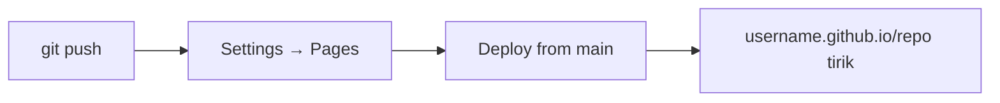

## Yakuniy loyiha — portfolioni GitHub Pages'ga nashr etish

> **O'tgan dars bilan bog'liqlik:** barcha qurollar sizning qo'lingizda. Endi final — HTML, CSS (o'tgan kurslar) va Gitni (bu kurs) bitta real loyihaga birlashtiramiz: **GitHub Pages** orqali internetda nashr qilingan shaxsiy portfolio.

---

## Dars maqsadi

Kursni to'liq sikl bilan yakunlash: portfolio sayti yaratish, uni versiya nazorati ostiga olish, GitHubga push qilish va internetda hamma joyda ishlaydigan havola sifatida nashr etish. Bu — talaba o'z portfelida tirik loyihaga ega dasturchiga aylanadigan nuqta.

## Dars oxirida nimani o'rganasiz

- Kichik veb-loyihani saranjom tuzish: `index.html` + `css/` + `images/`.
- GitHub Pages nima va sayt manzili qanday shakllanishini tushuntirish.
- Pages orqali saytni nashr etish: push va sozlamalarda yoqish.
- O'zgarishlardan keyin tirik saytni yangilash (buni Git bajaradi).
- Kursning butun yo'lini tushunish — `git init`dan tirik saytgacha.

---

## Dars vaqti

| Blok | Mazmun |
| --- | --- |
| 1. Maqsad | Siz uchun ishlaydigan portfolio |
| 2. Loyiha lokaldan | README, index.html, css/, images/ |
| 3. GitHub Pages va manzillar | `username.github.io` tuzilmasi |
| 4. GitHubga push | Repozitoriy → `git init` → `push` |
| 5. Pages'ni yoqish | Settings → branch → nashr |
| 6. Yangilash va keyingi qadamlar | O'zgarishlarni push, kurs xulosasi |
| 7. Mini-vazifa | Sahifani o'zingiznikiga aylantirish |
| 8. Xulosalar | Yakuniy check-list |

---

## 1-blok. Maqsad

Yakuniy loyiha — **sizning shaxsiy portfoliongiz**: bitta sahifada:

- ismingiz va nima bilan shug'ullanishingiz;
- qisqa taqdimot (salomlashish, men kimman, ko'nikmalar);
- bo'limlar: loyihalar, ko'nikmalar, kontaktlar;
- oxirida internet-manzil: bu sayt GitHubda yashaydi va Git orqali boshqariladi.

Nega portfolio muhim:

- **tirik havola** — ish beruvchiga skrinshot o'rniga yuboradigan narsa;
- **versiyalar tarixi** loyiha qanday o'sganini ko'rsatadi;
- repozitoriyning o'zi — artefakt: rekruterlar ko'pincha kodga qaraydi;

Butun kurs davomida tayyorlangan loyiha tuzilmasi shu darsning `project/` papkasida:

```text
Lesson-10/
└── project/
    ├── README.md      # sayt tavsifi
    ├── index.html     # sahifaning o'zi
    ├── css/
    │   └── style.css  # stillar
    └── images/
        └── .gitkeep   # skrinshotlar uchun joy (7-darsda bilgan edik)
```

---

## 2-blok. Loyiha lokaldan

Bu darsning `project/index.html`ini oching — tayyor minimal portfolio (unni CSS kursi usullari bilan o'zingizga moslashing mumkin). Amal qiladigan qoidalar:

1. **Papka nomlari kichik harfda**, ma'nosi aniq: `css/`, `js/`, `images/`.
2. Ildizda `index.html` — brauzer va Pages uni sukut bo'yicha ochadi.
3. `README.md` — bu qanaqa sayt va unga havola (7-dars).
4. HTMLda **nisbiy yo'llar**: `css/style.css`, diskdan absolyut yo'l emas — sayt lokalda ham, GitHubda ham ishlashi uchun.

```html
<link rel="stylesheet" href="css/style.css">
```

Bu qoidaga amal qiling: `file://` dan ochiladigan sayt deploy qilingan versiyadan ham ochiladi.

---

## 3-blok. GitHub Pages va manzillar

**GitHub Pages** — GitHub ichidagi bepul hosting, sukut bo'yicha manzil:

```text
https://<username>.github.io/<repozitoriy-nomi>/
```

Maxsus holat: nomi aynan `<username>.github.io` bo'lgan repozitoriy **foydalanuvchi saytiga** aylanadi:

```text
https://<username>.github.io/
```

Portfolio uchun foydalanuvchi saytini tavsiya qilamiz — havolada repozitoriy nomisiz bitta manzil. Ammo amaliyot uchun repozitoriy sayti ham mos — qadamlar bir xil.

| Tur | Repozitoriy nomi | Yakuniy havola |
| --- | --- | --- |
| Loyiha sayti | `portfolio` | `username.github.io/portfolio` |
| Foydalanuvchi/tashkilot sayti | `username.github.io` | `username.github.io` |

---

## 4-blok. GitHubga push

Mashq qilgan to'liq Git sikli (1–8-darslar) yakuniy loyihada:

### 1. Repozitoriy yarating

GitHubda: **New repository** → nom (masalan `<username>.github.io`) → **public** → README **bilan ishga tushirmang** (o'zimizni push qilamiz) → Create.

### 2. Lokaldan ishga tushiring va ulang

```bash
cd project
git init
git add .
git status                       # aytmoqchi — .gitignore biror narsani yashirdimi?
git commit -m "feat: initial portfolio"
git branch -M main
git remote add origin https://github.com/<username>/<repo>.git
git push -u origin main
```

1-dars (`init`), 2-dars (`add`, `commit`), 5-dars (`remote`, `push`, `-M main`) buyruqlariga e'tibor bering.

---

## 5-blok. Pages'ni yoqish

Push kodni yetkazi — endi nashr qilamiz.

1. Repozitoriy sahifasida → **Settings**.
2. Chap menyuda → **Pages**.
3. **Build and deployment** → Source: **Deploy from a branch**, branch: `main`, `/ (root)` → **Save**.
4. Bir-ikki daqiqa kuting — holat va havola shu sahifaning tepasida paydo bo'ladi.

Saytingiz tirik — havolani ulashing!



---

## 6-blok. Yangilash va keyingi qadamlar

Sayt tirik, lekin siz uni yaxshilashda davom etasiz. Yangilash — aynan 5-dars:

```bash
git add .
git commit -m "feat: add projects section"
git push
```

**Pages saytni avtomatik qayta chiqaradi** — bir daqiqada tirik havolada yangi versiya. Bu biz tayyorgarlik ko'rgan butun sikl: tahrir → commit → push → nashr.

### Qayerga o'sish kerak

- xuddi shu Pages sozlamalarida **o'z domeningizni** ulang;
- GitHub Actions orqali **avtomatik qurish** qo'shing;
- har bir loyihaga bittadan repozitoriy sahifasi qiling;
- testlar yozing, CI ulang — xuddi shu prinsiplar portfoliodan mahsulotgacha kengayadi.

Endi sizda to'liq ishlab chiqish konturi bor: **reja → kod → Git → review → reliz**. Dasturchining ish kuni shunday ko'rinadi.

---

## Mini-vazifa

`project/index.html` portfoliosini o'zingiznikiga aylantiring:

1. Ism va salomlashishni o'zingiznikiga almashtiring.
2. Ko'nikmalaringizni qo'shing (HTML, CSS, Git — bunga loyiqsiz) va GitHub havolangizni.
3. `images/`ga haqiqiy surat qo'shing (`.gitkeep`ni o'chirib).
4. Lokaldan tekshiring: brauzerda `index.html`ni oching.

Keyin — amaliy, nashr qilish.

---

## Dars xulosalari

Bugun siz yakuniy siklga o'tdingiz:

- **GitHub Pages** — repozitoriydan statik sayt uchun bepul hosting.
- Manzillar tuzilishi: `username.github.io` — foydalanuvchi sayti, `username.github.io/<repo>` — loyiha sayti.
- To'liq yo'l: **`git init` → kod → commit → push → Settings → Pages → tirik sayt**.
- **Yangilashlar** — bu shunchaki `git push`: sayt o'zi qayta deploy qilinadi.
- Kurs tugadi: birinchi `git config`dan Git bilan boshqariladigan ommaviy loyihagacha.

---

## Amaliy vazifa

O'z portfoliongizni nashr qiling (mini-vazifadagi 1–2-qadamlar):

1. Repozitoriy sahifasida → **Settings** → **Pages**.
2. `main` branchidan deploy, ildiz papka, saqlang.
3. Bir-ikki daqiqadan keyin chiqqan havolani oching. Sahifa va stillarni tekshiring.
4. O'zgarish kiriting (masalan, loyiha qo'shing), `git add . && git commit && git push` bajaring.
5. Tirik saytni qayta yuklang — qayta deploy'dan keyin yangilanish joyida.

`practice-10.sh` skripti push'dan oldin lokal loyihani tekshiradi (tuzilma, git holati, nisbiy yo'llar):

---

**Kursni tugatganingiz bilan tabriklaymiz!** Navbatdagi qadam — http://jlearn.space/courses loyihalaringiz.