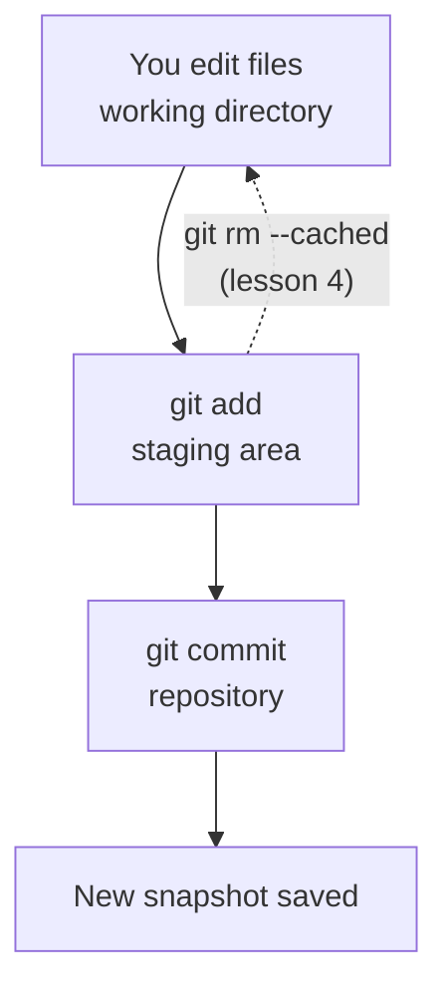

## Repository and Commits

> **Connection with the previous lesson:** last time we set up Git and created the `my-first-repo` repository. Today we finally take the steps every developer performs dozens of times a day: place files under version control and record the first snapshots — **commits**.

---

## Lesson Goal

Learn how to properly add files to the repository and create commits, so that you can record any change in your project and won't lose a single step of work.

## What You Will Learn by the End of the Lesson

- Understand the difference between the staging area and the repository in practice.
- Add files to Git with `git add` (one at a time, several at once, or all at once).
- Create commits with `git commit` and write meaningful commit messages.
- Read the history of the project with `git log`.
- Track a file after changes: modify, delete, and rename it while keeping history.

---

## Lesson Timeline

| Block | Content |
| --- | --- |
| 1. First commit | `git add` + `git commit` — the first snapshot |
| 2. Staging area in practice | `git status` sections: staged / modified / untracked |
| 3. Writing commit messages | Conventions, `feat:`/`fix:`, imperative mood |
| 4. History: `git log` | Reading the log, understanding commits |
| 5. Mini-task | Create two commits yourself |
| 6. Life of a tracked file | `git rm`, `git mv` |
| 7. Summary and practice | Reinforcement |

---

## Block 1. First Commit

Open the folder `my-first-repo` from the previous lesson and make sure you're in the right place:

```bash
cd my-first-repo
git status
```

You should see `hello.txt` in the "Untracked files" section. Git sees the file but doesn't manage it yet. Let's fix that.

### Step 1. Add the file to the staging area

```bash
git add hello.txt
```

**What happened?** The file moved to the **staging area** — the intermediate zone. Run `git status` again:

```text
Changes to be committed:
  (use "git rm --cached <file>..." to unstage)
        new file:   hello.txt
```

Git itself suggests what to do: to unstage the file, use `git rm --cached` (we'll cover undo in lesson 4). Right now the file is "green" — ready to be committed.

### Step 2. Take the snapshot

```bash
git commit -m "feat: add hello.txt"
```

`-m` stands for "message" — the text after it will be written into the commit. Git will tell you:

```text
[master (root-commit) a1b2c3d] feat: add hello.txt
 1 file changed, 1 insertion(+)
```

Let's decode this line:

- `master` — the branch where the commit was made (branches are lesson 3);
- `(root-commit)` — the very first commit of the repository;
- `a1b2c3d` — the commit hash, its unique "serial number";
- `feat: add hello.txt` — the commit message;
- `1 file changed, 1 insertion(+)` — the summary: one file changed, one line added.

**The commit is a snapshot.** From now on, the state of the project with `hello.txt` is saved forever. You can return to it at any moment.

---

## Block 2. The Staging Area in Practice

Now let's understand how the staging area "feels" in real work. This is where beginners most often get confused, so we'll go slowly.

**Step 1.** Edit the file — add a second line:

```bash
echo "I'm learning Git." >> hello.txt
```

**Step 2.** Run `git status` — you'll see a new situation:

```text
On branch master
Changes not staged for commit:
  (use "git add <file>..." to update what will be committed)
        modified:   hello.txt
```

The file is **modiiefed, but not staged** — its changes are only in the working directory. The commit would not include them yet.

**What this means:** the staging area is like the "basket" in a store. You can edit files as much as you want — the basket stays untouched until you put specific changes into it with `git add`.

**Step 3.** Now add it:

```bash
git add hello.txt
git status
```

Now the line is in *staged* state:

```text
Changes to be committed:
        modified:   hello.txt
```

**Step 4.** Commit:

```bash
git commit -m "docs: add a second line"
```

### The Main Rule of This Block

> **A commit never happens "by itself".** To get changes into a commit, they must first pass through `git add`. This is a deliberate design: it allows you to commit *exactly what you want*, and not everything that "happened to be edited".



---

### Common Beginner Mistakes

| Error | How to Fix |
| --- | --- |
| Doing `git add .` and committing everything blindly | The staging area exists so you can select what to commit — group it by meaning |
| Editing a file *after* `git add` and being surprised the change isn't in the commit | Re-run `git add` — the staging area holds a snapshot of the file at the moment of `git add` |
| Forgetting `-m "..."` and getting stuck in a text editor | Either pass `-m`, or remember that `:wq` in vim saves and exits |
| Thinking a commit saves "current time" like a backup | A commit is a *snapshot with a message* — it's also documentation of what you did and why |
| Committing machine-generated files (build, node_modules) | That's the topic of lesson 7 (.gitignore); for now, just don't add them |

---

## Block 3. Writing Commit Messages

A commit message is not a formality. In six months, your future self (and your colleagues) will read these messages instead of opening ten files to understand what changed.

### Three Simple Rules

1. **Brief summary in the first line** (up to ~50 characters), then — optionally — a more detailed body on subsequent lines.
2. **Imperative mood, as if instructing the codebase:** `add`, `fix`, `remove`, `update`, not `added`, `fixed`.
3. **Prefix with a type** — this is the widely-used Conventional Commits format:

| Prefix | Meaning | Example |
| --- | --- | --- |
| `feat:` | New feature | `feat: add contact form` |
| `fix:` | Bug fix | `fix: correct header margin` |
| `docs:` | Docs/comments | `docs: update readme` |
| `refactor:` | Code change without behavior change | `refactor: rename variables` |
| `style:` | Formatting, no logic | `style: add missing spaces` |
| `test:` | Tests | `test: add login tests` |

```bash
# Good
git commit -m "feat: add contact form"

# Better — with a body
git commit -m "feat: add contact form" -m "Add name, email and message fields with required validation."
```

**Anti-examples:** `update file` (which one? what?), `fix stuff`, `asd``. Such messages destroy the value of history — because you already know *what* changed, but the message must explain *why*.

---

## Block 4. History: `git log`

Let's look at what we've recorded:

```bash
git log
```

Output (your hashes and dates will differ):

```text
commit c4d9f2a...
Author: Your Name <your.email@example.com>
Date:   ...

    docs: add a second line

commit a1b2c3d...
Author: Your Name <your.email@example.com>
Date:   ...

    feat: add hello.txt
```

**How to read it:** the log is a vertical story of the project — newest at the top. Each entry shows the commit hash, the author (whom we configured in lesson 1!), the date, and the message.

Useful variants:

```bash
git log --oneline      # one line per commit — compact
git log --stat         # with the list of changed files
git show a1b2c3d       # how a specific commit differs from its predecessor
```

You'll learn more powerful log features in lesson 8.

---

## Block 5. Mini-Task

In the `my-first-repo` repository, without peeking:

1. Create a new file `about.txt` with one line of text.
2. Stage it and commit with message `feat: add about`.
3. Check the log — there should be three commits now.

**Solution:**

```bash
echo "About this project." > about.txt
git add about.txt
git commit -m "feat: add about"
git log --oneline
```

---

## Block 6. The Life of a Tracked File

Git tracks not only additions. When a file is already under version control, the whole lifecycle is available: **modify** (you already know it — `git add` + `git commit`), **delete**, and **rename**.

### Deleting a file

Don't delete the file just with the file manager — Git must "learn" about the deletion through itself:

```bash
git rm hello.txt
git commit -m "remove: hello.txt"
```

**How it works:** `git rm` removes the file from the disk *and* stages the deletion — after the commit, the file will be gone from the history of current state too (the previous commits still keep it).

An alternative — if you already deleted the file manually, `git add hello.txt` (or `git add -u`) will stage the deletion as well.

### Renaming a file

```bash
git mv about.txt README.txt          # rename
git mv README.txt docs/reference.txt # and even move to a subfolder
git commit -m "refactor: rename about to reference"
```

**How it works:** Git detects the rename by content — after a `git mv` and commit, `git log --follow docs/reference.txt` will show the whole history of the file, including its old name.

---

### Common Beginner Mistakes

| Error | How to Fix |
| --- | --- |
| Deleting via the file manager and then being confused by a "deleted" state in `git status` | Then run `git add <file>` (or `git add -u`) to stage the deletion and commit it |
| Manually copying `about.txt` to `about2.txt` instead of `git mv` | `git mv` keeps history; a copy "cuts" it |
| Renaming a file and expecting Git to guess it from a fresh repository | Git detects renames by similar content — the commit after `git mv` is enough |
| Committing the deletion but not the file that replaced it | It's normal to combine several related changes in one commit |

---

## Lesson Summary

Today you learned:

- **`git add`** moves changes from the working directory to the staging area; **`git commit`** saves them as a permanent snapshot.
- The staging area lets you decide *exactly what* gets into each commit.
- Commit messages follow conventions: type + brief imperative summary (`feat:`, `fix:`, `docs:`…).
- **`git log`** shows the history: hash, author, date, message.
- Tracked files can also be deleted (`git rm`) and renamed (`git mv`) while preserving history.

---

## Practice

In the `my-first-repo` repository:

1. Create a file `index.txt` with the text of two lines, stage and commit it (`feat: add index`).
2. Edit it — add one more line, then commit the change (`docs: extend index`).
3. Run `git log --oneline` and read the history aloud.
4. Rename `index.txt` to `main.txt` via `git mv`, commit (`refactor: rename index to main`).
5. Try `git log --oneline --stat` and `git show <hash of the first commit>`.

Run `practice-2.sh` — the script will create a separate training repository and repeat the whole flow:

---

[Next lesson: Branches and Merging →](../../Lesson-3/en/Branches%20and%20Merging.md)