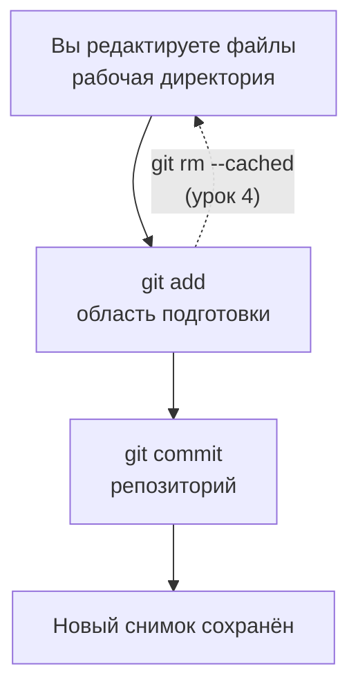

## Репозиторий и коммиты

> **Связь с прошлым уроком:** в прошлый раз мы настроили Git и создали репозиторий `my-first-repo`. Сегодня наконец делаем те действия, которые каждый разработчик выполняет десятки раз в день: ставим файлы под контроль версий и записываем первые снимки — **коммиты**.

---

## Цель урока

Научиться правильно добавлять файлы в репозиторий и создавать коммиты, чтобы вы могли фиксировать любое изменение в своём проекте и не терять ни одного шага работы.

## Чему вы научитесь к концу урока

- Понимать разницу между областью подготовки и репозиторием на практике.
- Добавлять файлы в Git командой `git add` (по одному, несколько, или всё сразу).
- Создавать коммиты командой `git commit` и писать осмысленные сообщения.
- Читать историю проекта командой `git log`.
- Сопровождать файл после добавления: изменять, удалять и переименовывать, сохраняя историю.

---

## Хронометраж урока

| Блок | Содержание |
| --- | --- |
| 1. Первый коммит | `git add` + `git commit` - первый снимок |
| 2. Область подготовки на практике | Секции `git status`: staged / modified / untracked |
| 3. Пишем сообщения коммитов | Конвенции, `feat:`/`fix:`, повелительное наклонение |
| 4. История: `git log` | Читаем лог, понимаем коммиты |
| 5. Мини-задание | Создать два коммита самостоятельно |
| 6. Жизнь отслеживаемого файла | `git rm`, `git mv` |
| 7. Итоги и практическое задание | Закрепление |

---

## Блок 1. Первый коммит

Откройте папку `my-first-repo` из прошлого урока и убедитесь, что вы на месте:

```bash
cd my-first-repo
git status
```

Вы должны увидеть `hello.txt` в секции "Untracked files". Git видит файл, но пока не управляет им. Исправим это.

### Шаг 1. Добавьте файл в область подготовки

```bash
git add hello.txt
```

**Что произошло?** Файл перешёл в **область подготовки** — промежуточную зону. Выполните `git status` снова:

```text
Changes to be committed:
  (use "git rm --cached <file>..." to unstage)
        new file:   hello.txt
```

Git сам подсказывает, что делать: чтобы вернуть файл из области подготовки, используйте `git rm --cached` (подробно про отмену — в уроке 4). Сейчас файл «зелёный» — готов к коммиту.

### Шаг 2. Сделайте снимок

```bash
git commit -m "feat: add hello.txt"
```

`-m` — это message («сообщение»); текст после него попадёт в коммит. Git ответит:

```text
[master (root-commit) a1b2c3d] feat: add hello.txt
 1 file changed, 1 insertion(+)
```

Расшифруем эту строку:

- `master` — ветка, в которой сделан коммит (ветки — урок 3);
- `(root-commit)` — самый первый коммит репозитория;
- `a1b2c3d` — хэш коммита, его уникальный «серийный номер»;
- `feat: add hello.txt` — сообщение коммита;
- `1 file changed, 1 insertion(+)` — сводка: один файл изменён, одна строка добавлена.

**Коммит — это снимок.** С этого момента состояние проекта с `hello.txt` сохранено навсегда. В любой момент к нему можно вернуться.

---

## Блок 2. Область подготовки на практике

Теперь разберёмся, как область подготовки «ощущается» в реальной работе. Здесь новички путаются чаще всего, поэтому идём медленно.

**Шаг 1.** Отредактируйте файл — добавьте вторую строку:

```bash
echo "I'm learning Git." >> hello.txt
```

**Шаг 2.** Выполните `git status` — увидите новую ситуацию:

```text
On branch master
Changes not staged for commit:
  (use "git add <file>..." to update what will be committed)
        modified:   hello.txt
```

Файл **изменён, но не подготовлен** — изменения только в рабочей директории. В коммит они пока не попадут.

**Что это значит:** область подготовки — как «корзинка» в магазине. Можно править файлы сколько угодно — корзинка не меняется, пока вы не положите в неё конкретные изменения командой `git add`.

**Шаг 3.** Теперь добавьте:

```bash
git add hello.txt
git status
```

Строка перешла в состояние *staged*:

```text
Changes to be committed:
        modified:   hello.txt
```

**Шаг 4.** Закоммитьте:

```bash
git commit -m "docs: add a second line"
```

### Главное правило этого блока

> **Коммит «сам по себе» никогда не происходит.** Чтобы изменения попали в коммит, они сначала должны пройти через `git add`. Это сделано намеренно: так вы коммитите *ровно то, что хотите*, а не всё, что «как-то отредактировалось».



---

### Частые ошибки новичков

| Ошибка | Как исправить |
| --- | --- |
| Делать `git add .` и бездумно коммитить всё подряд | Область подготовки существует, чтобы отбирать изменения - группируйте коммиты по смыслу |
| Отредактировать файл *после* `git add` и удивляться, что изменения не попали в коммит | Повторите `git add` - в области подготовки лежит снимок файла на момент `git add` |
| Забыть `-m "..."` и «застрять» в текстовом редакторе | Передавайте `-m`, либо запомните: в vim `:wq` сохраняет и выходит |
| Думать, что коммит — это «бэкап на текущий момент» | Коммит - это *снимок с сообщением*: ещё и документация того, что и зачем вы сделали |
| Коммитить машинные файлы (сборку, node_modules) | Тема урока 7 (.gitignore); пока просто не добавляйте их |

---

## Блок 3. Пишем сообщения коммитов

Сообщение коммита — не формальность. Через полгода ваше будущее «я» (и коллеги) будут читать эти сообщения вместо того, чтобы открывать десять файлов и догадываться, что изменилось.

### Три простых правила

1. **Краткая сводка в первой строке** (до ~50 символов), затем — при желании — подробное тело на следующих строках.
2. **Повелительное наклонение, как приказ кодовой базе:** `add`, `fix`, `remove`, `update`, а не `added`, `fixed`.
3. **Префикс с типом** — широко принятый формат Conventional Commits:

| Префикс | Значение | Пример |
| --- | --- | --- |
| `feat:` | Новая функция | `feat: add contact form` |
| `fix:` | Исправление бага | `fix: correct header margin` |
| `docs:` | Документация/комментарии | `docs: update readme` |
| `refactor:` | Изменение кода без смены поведения | `refactor: rename variables` |
| `style:` | Форматирование, без логики | `style: add missing spaces` |
| `test:` | Тесты | `test: add login tests` |

```bash
# Хорошо
git commit -m "feat: add contact form"

# Лучше — с телом
git commit -m "feat: add contact form" -m "Add name, email and message fields with required validation."
```

**Антипримеры:** `update file` (какой? что?), `fix stuff`, `asd``. Такие сообщения убивают ценность истории — ведь вы и так знаете, *что* изменилось, а сообщение должно объяснять *зачем*.

---

## Блок 4. История: `git log`

Посмотрим, что мы записали:

```bash
git log
```

Вывод (ваши хэши и даты будут другими):

```text
commit c4d9f2a...
Author: Your Name <your.email@example.com>
Date:   ...

    docs: add a second line

commit a1b2c3d...
Author: Your Name <your.email@example.com>
Date:   ...

    feat: add hello.txt
```

**Как читать:** лог — это вертикальная история проекта, свежие коммиты сверху. Каждая запись содержит хэш, автора (того, кого мы настроили в уроке 1!), дату и сообщение.

Полезные варианты:

```bash
git log --oneline      # по одной строке на коммит - компактно
git log --stat         # со списком изменённых файлов
git show a1b2c3d       # чем конкретный коммит отличается от предшественника
```

Более мощные возможности лога — в уроке 8.

---

## Мини-задание

В репозитории `my-first-repo`, не подглядывая:

1. Создайте новый файл `about.txt` с одной строкой текста.
2. Подготовьте его и закоммитьте с сообщением `feat: add about`.
3. Проверьте лог — теперь там должно быть три коммита.

**Решение:**

```bash
echo "About this project." > about.txt
git add about.txt
git commit -m "feat: add about"
git log --oneline
```

---

## Блок 6. Жизнь отслеживаемого файла

Git отслеживает не только добавления. Когда файл уже под контролем версий, доступен весь жизненный цикл: **изменение** (его вы уже знаете — `git add` + `git commit`), **удаление** и **переименование**.

### Удаление файла

Не удаляйте файл просто через файловый менеджер — Git должен «узнать» об удалении через себя:

```bash
git rm hello.txt
git commit -m "remove: hello.txt"
```

**Как это работает:** `git rm` убирает файл с диска *и* подготавливает удаление — после коммита файл исчезнет из истории актуального состояния (прошлые коммиты его по-прежнему хранят).

Альтернатива — если вы уже удалили файл вручную, `git add hello.txt` (или `git add -u`) тоже подготовит удаление.

### Переименование файла

```bash
git mv about.txt README.txt          # переименовать
git mv README.txt docs/reference.txt # и даже перенести в подпапку
git commit -m "refactor: rename about to reference"
```

**Как это работает:** Git распознаёт переименование по содержимому — после `git mv` и коммита `git log --follow docs/reference.txt` покажет всю историю файла, включая старое имя.

---

### Частые ошибки новичков

| Ошибка | Как исправить |
| --- | --- |
| Удалить через файловый менеджер и удивляться состоянию "deleted" в `git status` | Тогда выполните `git add <файл>` (или `git add -u`), чтобы подготовить удаление, и закоммитьте |
| Вручную копировать `about.txt` в `about2.txt` вместо `git mv` | `git mv` сохраняет историю; копирование её «обрезает» |
| Переименовать файл и ждать, что Git угадает это в свежем репозитории | Git определяет переименование по похожести содержимого — коммита после `git mv` достаточно |
| Закоммитить удаление, но не файл, который его заменил | Это нормально - объединять несколько связанных изменений в один коммит |

---

## Итоги урока

Сегодня вы узнали:

- **`git add`** перемещает изменения из рабочей директории в область подготовки; **`git commit`** сохраняет их как постоянный снимок.
- Область подготовки позволяет решать, *что именно* попадёт в каждый коммит.
- Сообщения коммитов следуют конвенциям: тип + краткая сводка в повелительном наклонении (`feat:`, `fix:`, `docs:`...).
- **`git log`** показывает историю: хэш, автор, дата, сообщение.
- Отслеживаемые файлы можно также удалять (`git rm`) и переименовывать (`git mv`), сохраняя историю.

---

## Практика

В репозитории `my-first-repo`:

1. Создайте файл `index.txt` с текстом в две строки, подготовьте и закоммитьте (`feat: add index`).
2. Отредактируйте его — добавьте ещё одну строку, затем закоммитьте изменение (`docs: extend index`).
3. Выполните `git log --oneline` и прочитайте историю вслух.
4. Переименуйте `index.txt` в `main.txt` через `git mv`, закоммитьте (`refactor: rename index to main`).
5. Попробуйте `git log --oneline --stat` и `git show <хэш первого коммита>`.

Запустите `practice-2.sh` — скрипт создаст отдельный учебный репозиторий и повторит весь сценарий:

---

[Следующий урок: Ветки и слияние →](../../Lesson-3/ru/Ветки%20и%20слияние.md)