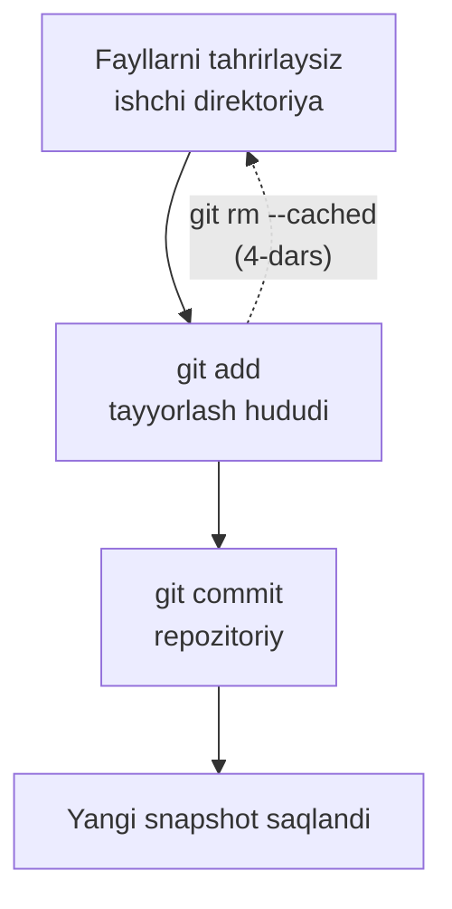

## Repozitoriy va commitlar

> **O'tgan dars bilan bog'liqlik:** o'tgan safar biz Gitni sozlab, `my-first-repo` repozitoriysini yaratdik. Bugun nihoyat har bir dasturchi kuniga o'nlab marta bajaradigan harakatlarni qilamiz: fayllarni versiya nazoratiga olamiz va birinchi snapshotlar — **commitlarni** yozamiz.

---

## Dars maqsadi

Fayllarni repozitoriysiga to'g'ri qo'shish va commitlar yaratishni o'rganish, shunda loyihangizdagi har qanday o'zgarishni qayd etasiz va ishingizning birorta qadamini yo'qotmaysiz.

## Dars oxirida nimani o'rganasiz

- Tayyorlash hududi va repozitoriy farqini amalda tushunish.
- Fayllarni `git add` bilan Gitga qo'shish (bittadan, bir nechtasini yoki hammasini).
- `git commit` bilan commitlar yaratish va mazmunli xabarlar yozish.
- `git log` bilan loyiha tarixini o'qish.
- Faylni qo'shgandan keyin unga hamroh bo'lish: o'zgartirish, o'chirish va nomini almashtirish, tarixni saqlab.

---

## Dars vaqti

| Blok | Mazmun |
| --- | --- |
| 1. Birinchi commit | `git add` + `git commit` - birinchi snapshot |
| 2. Tayyorlash hududi amalda | `git status` bo'limlari: staged / modified / untracked |
| 3. Commit xabarlarini yozish | Konvensiyalar, `feat:`/`fix:`, buyruq mayli |
| 4. Tarix: `git log` | Logini o'qiymiz, commitlarni tushunamiz |
| 5. Mini-vazifa | Ikkita commitni mustaqil yaratish |
| 6. Kuzatilayotgan fayl hayoti | `git rm`, `git mv` |
| 7. Xulosalar va amaliy vazifa | Mustahkamlash |

---

## 1-blok. Birinchi commit

O'tgan darsdagi `my-first-repo` papkasini oching va joyida ekanligingizni tekshiring:

```bash
cd my-first-repo
git status
```

`hello.txt` "Untracked files" bo'limida ko'rinishi kerak. Git faylni ko'radi, lekin hali boshqarmaydi. Buni tuzatamiz.

### 1-qadam. Faylni tayyorlash hududiga qo'shing

```bash
git add hello.txt
```

**Nima bo'ldi?** Fayl **tayyorlash hududiga** — oraliq zonaga o'tdi. Yana `git status` bajarib ko'ring:

```text
Changes to be committed:
  (use "git rm --cached <file>..." to unstage)
        new file:   hello.txt
```

Git o'zi nima qilishni ko'rsatadi: faylni tayyorlash hududidan qaytarish uchun `git rm --cached` ishlating (bekor qilish haqida batafsil 4-darsda). Hozir fayl «yashil» — commitga tayyor.

### 2-qadam. Snapshot qiling

```bash
git commit -m "feat: add hello.txt"
```

`-m` — bu message («xabar»); undan keyingi matn commitga yoziladi. Git javob beradi:

```text
[master (root-commit) a1b2c3d] feat: add hello.txt
 1 file changed, 1 insertion(+)
```

Bu qatorni tahlil qilamiz:

- `master` — commit qilingan branch (branchlar — 3-dars);
- `(root-commit)` — repozitoriyning eng birinchi commiti;
- `a1b2c3d` — commit xeshi, uning noyob «seriya raqami»;
- `feat: add hello.txt` — commit xabari;
- `1 file changed, 1 insertion(+)` — xulosa: bitta fayl o'zgardi, bitta qator qo'shildi.

**Commit — bu snapshot.** Shu lahdan boshlab `hello.txt` bilan loyiha holati abadiy saqlangan. Istalgan daqiqada unga qaytish mumkin.

---

## 2-blok. Tayyorlash hududi amalda

Endi tayyorlash hududi «qanday his qilishini» real ishda tushunamiz. Bu yerda yangi boshlovchilar ko'p adashadi, shuning uchun sekin boramiz.

**1-qadam.** Faylni tahrirlang — ikkinchi qator qo'shing:

```bash
echo "I'm learning Git." >> hello.txt
```

**2-qadam.** `git status` bajaring — yangi holatni ko'rasiz:

```text
On branch master
Changes not staged for commit:
  (use "git add <file>..." to update what will be committed)
        modified:   hello.txt
```

Fayl **o'zgargan, lekin tayyorlanmagan** — o'zgarishlar faqat ishchi direktoriyada. Ular hali commitga kirmaydi.

**Bu nimani anglatadi:** tayyorlash hududi — do'kondagi «savatcha» kabi. Fayllarni xohlagancha tahrirlash mumkin — savatcha o'zgarmaydi, toki unga `git add` bilan aniq o'zgarishlarni solmaysiz.

**3-qadam.** Endi qo'shing:

```bash
git add hello.txt
git status
```

Qator *staged* holatga o'tdi:

```text
Changes to be committed:
        modified:   hello.txt
```

**4-qadam.** Committingiz:

```bash
git commit -m "docs: add a second line"
```

### Ushbu blokning asosiy qoidasi

> **Commit «o'z-o'zidan» hech qachon bo'lmaydi.** O'zgarishlar commitga tushishi uchun avval `git add` orqali o'tishi kerak. Bu ataylab qilingan: siz *aynan xohlaganingizni* committingiz, «tasodifan tahrirlangan» hamma narsani emas.



---

### Yangi boshlovchilarning ko'p uchraydigan xatolari

| Xato | Qanday tuzatish |
| --- | --- |
| `git add .` qilib, hamma narsani ko'r-ko'rona commitingiz | Tayyorlash hududi o'zgarishlarni tanlash uchun bor - commitlarni mazmunga qarab guruhlang |
| `git add` *dan keyin* faylni tahrirlab, o'zgarish commitga kirmayotganiga hayron bo'lish | `git add`ni takrorlang - tayyorlash hududida faylning `git add` vaqtidagi nusxasi turadi |
| `-m "..."` unutib, matn muharririda «qolib ketish» | `-m` uzating yoki yodda tuting: vimda `:wq` saqlab chiqadi |
| Commitni «hozirgi daqiqa zaxirasi» deb o'ylash | Commit - bu *xabari bor snapshot*: nima va nima uchun qilganingizning hujjati |
| Mashina fayllarini (build, node_modules) commitingiz | Bu 7-dars mavzusi (.gitignore); hozircha ularni qo'shmang |

---

## 3-blok. Commit xabarlarini yozish

Commit xabari — rasmiyatchilik emas. Olti oydan keyin sizning kelajakdagi «oingiz» (va hamkasblar) bu xabarlarni o'qiydi — o'nta fayl ochib nima o'zgarganini taxmin qilish o'rniga.

### Uch oddiy qoida

1. **Birinchi qatorda qisqa xulosa** (~50 belgigacha), keyin — xohlasangiz — keyingi qatorlarda batafsil tana.
2. **Buyruq mayli, kod bazasiga buyruq bergandek:** `add`, `fix`, `remove`, `update`, lekin `added`, `fixed` emas.
3. **Tur bilan prefiks** — keng qabul qilingan Conventional Commits formati:

| Prefiks | Ma'nosi | Misol |
| --- | --- | --- |
| `feat:` | Yangi funksiya | `feat: add contact form` |
| `fix:` | Bug'ni tuzatish | `fix: correct header margin` |
| `docs:` | Hujjatlar/izohlar | `docs: update readme` |
| `refactor:` | Kodni xatti-harakat o'zgarmasdan o'zgartirish | `refactor: rename variables` |
| `style:` | Formatlash, mantiqsiz | `style: add missing spaces` |
| `test:` | Testlar | `test: add login tests` |

```bash
# Yaxshi
git commit -m "feat: add contact form"

# Yaxshiroq — tana bilan
git commit -m "feat: add contact form" -m "Add name, email and message fields with required validation."
```

**Yomon misollar:** `update file` (qaysi? nima?), `fix stuff`, `asd`. Bunday xabarlar tarixning qiymatini yo'q qiladi — ya'ni siz *nima* o'zgarganini allaqachon bilasiz, xabar *nima uchun* ekanini tushuntirishi kerak.

---

## 4-blok. Tarix: `git log`

Nima yozganimizni ko'rib chiqamiz:

```bash
git log
```

Natija (xeshlar va sanalar boshqacha bo'ladi):

```text
commit c4d9f2a...
Author: Your Name <your.email@example.com>
Date:   ...

    docs: add a second line

commit a1b2c3d...
Author: Your Name <your.email@example.com>
Date:   ...

    feat: add hello.txt
```

**Qanday o'qish kerak:** log — loyihaning vertikal tarixi, eng yangi commitlar tepada. Har bir yozuvda xesh, muallif (1-darsda sozlagan odam!), sana va xabar bor.

Foydali variantlar:

```bash
git log --oneline      # har commitga bir qator - ixcham
git log --stat         # o'zgargan fayllar ro'yxati bilan
git show a1b2c3d       # ma'lum commit avvalgisidan qanday farq qilishini ko'rsatadi
```

Logning yanada kuchli imkoniyatlari 8-darsda.

---

## Mini-vazifa

`my-first-repo` repozitoriysida, qaramasdan:

1. Bir qatordan iborat `about.txt` faylini yarating.
2. Uni tayyorlab, `feat: add about` xabari bilan commitingiz.
3. Logini tekshiring — endi uchta commit bo'lishi kerak.

**Yechim:**

```bash
echo "About this project." > about.txt
git add about.txt
git commit -m "feat: add about"
git log --oneline
```

---

## 6-blok. Kuzatilayotgan fayl hayoti

Git faqat qo'shilishlarni emas, hammasini kuzatadi. Fayl versiya nazorati ostida bo'lganda, to'liq hayot sikli mavjud: **o'zgartirish** (siz allaqachon bilasiz — `git add` + `git commit`), **o'chirish** va **nom almashtirish**.

### Faylni o'chirish

Faylni shunchaki fayl menejeri orqali o'chirmang — Git o'chirishni o'zi orqali «bilishi» kerak:

```bash
git rm hello.txt
git commit -m "remove: hello.txt"
```

**Qanday ishlaydi:** `git rm` faylni diskdan olib tashlaydi *va* o'chirishni tayyorlaydi — commitdan keyin fayl joriy holat tarixidan yo'qoladi (avvalgi commitlar uni baribir saqlaydi).

Muqobil — faylni qo'lda o'chirgan bo'lsangiz, `git add hello.txt` (yoki `git add -u`) ham o'chirishni tayyorlaydi.

### Fayl nomini almashtirish

```bash
git mv about.txt README.txt          # nomini almashtirish
git mv README.txt docs/reference.txt # hatto pastki papkaga ko'chirish
git commit -m "refactor: rename about to reference"
```

**Qanday ishlaydi:** Git nom almashtirishni mazmunga qarab aniqlaydi — `git mv` va commitdan so'ng `git log --follow docs/reference.txt` faylning butun tarixini, eski nomini ham ko'rsatadi.

---

### Yangi boshlovchilarning ko'p uchraydigan xatolari

| Xato | Qanday tuzatish |
| --- | --- |
| Fayl menejeri orqali o'chirib, `git status`dagi "deleted" holatiga hayron bo'lish | Keyin `git add <fayl>` (yoki `git add -u`) bajarib o'chirishni tayyorlang va commitingiz |
| `git mv` o'rniga `about.txt` ni qo'lda `about2.txt`ga nusxalash | `git mv` tarixni saqlaydi; nusxalash uni «kesadi» |
| Faylni nomini o'zgartirib, yangi repozitoriyda Git buni taxmin qilishini kutish | Git nom almashtirishni mazmun o'xshashligiga qarab topadi — `git mv` dan keyin commit yetarli |
| O'chirishni commitingiz, lekin o'rnini bosgan faylni emas | Bir nechta bog'liq o'zgarishni bitta commitda birlashtirish normal holat |

---

## Dars xulosalari

Bugun siz quyidagilarni o'rgandingiz:

- **`git add`** o'zgarishlarni ishchi direktoriyadan tayyorlash hududiga o'tkazadi; **`git commit`** ularni doimiy snapshot sifatida saqlaydi.
- Tayyorlash hududi har commitga *aynan nima* tushishini hal qilish imkonini beradi.
- Commit xabarlari konvensiyalarga amal qiladi: tur + buyruq maylidagi qisqa xulosa (`feat:`, `fix:`, `docs:`...).
- **`git log`** tarixni ko'rsatadi: xesh, muallif, sana, xabar.
- Kuzatilayotgan fayllarni `git rm` bilan o'chirish va `git mv` bilan nomini almashtirish mumkin — tarix saqlanib qoladi.

---

## Amaliy vazifa

`my-first-repo` repozitoriysida:

1. `index.txt` faylini ikki qatorli matn bilan yarating, tayyorlab commitingiz (`feat: add index`).
2. Uni tahrirlang — yana bir qator qo'shing, keyin o'zgarishni commitingiz (`docs: extend index`).
3. `git log --oneline` bajarib, tarixni ovoz chiqarib o'qing.
4. `index.txt` ni `git mv` orqali `main.txt`ga aylantiring, commitingiz (`refactor: rename index to main`).
5. `git log --oneline --stat` va `git show <birinchi commit xeshi>`ni sinab ko'ring.

`practice-2.sh` ni ishga tushiring — skript alohida o'quv repozitoriysi yaratib, butun ssenariyni takrorlaydi:

---

[Keyingi dars: Branchlar va birlashtirish →](../../Lesson-3/uz/Branchlar%20va%20birlashtirish.md)