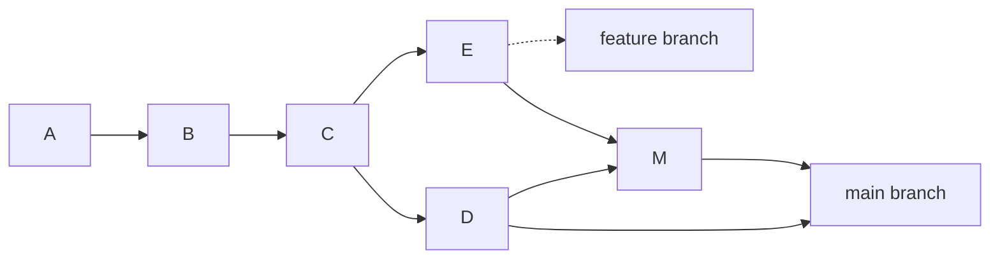
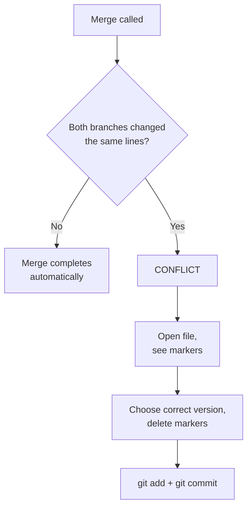

## Branches and Merging

> **Connection with the previous lesson:** you can already record commits and read history. But real work almost never happens on a single line. Today we master the main "superpower" of Git — **branches**: we'll learn to work on several versions of a project in parallel and merge them into one.

---

## Lesson Goal

Understand what a branch is, learn to create and switch branches, merge them, and — most importantly — calmly resolve merge conflicts, which beginners fear the most.

## What You Will Learn by the End of the Lesson

- Explain what a branch is and why it is the main tool of team work.
- Create branches (`git branch`, `git switch -c`) and switch between them.
- Understand where the current state is indicated by `HEAD`.
- Merge branches with `git merge`.
- Recognize, resolve, and avoid merge conflicts.

---

## Lesson Timeline

| Block | Content |
| --- | --- |
| 1. What a branch is | The "parallel universes" analogy |
| 2. Creating and switching branches | `git branch`, `git switch`, `HEAD`, `git merge --ff` |
| 3. Fast-forward vs real merge | When a merge creates a commit and when it doesn't |
| 4. Merge conflicts | What they are, how to read them, how to resolve |
| 5. Mini-task | Create and merge a branch yourself |
| 6. Deleting branches | `git branch -d` |
| 7. Summary and practice | Reinforcement |

---

## Block 1. What a Branch Is

**In simple terms:** when a team works on a project, several tasks usually go on at once — someone adds a contact form, someone fixes a bug in the menu, someone experiments with a new design. If everyone commits into one shared line, changes mix and interfere with each other.

A **branch** is an independent line of development. In terms of the "snapshot" idea from lesson 1: imagine a tree of versions instead of a single chain. The main branch (`master` / `main`) is the trunk; each new task grows its own branch from it — a "twig," which you can later graft back into the trunk.

**Analogy:** you're writing a book. The main text (trunk) stays intact, and you temporarily write each chapter draft on a separate piece of paper (branch). When a chapter is ready and approved, you paste it back into the main text. And if a draft doesn't work out — you just throw it away without touching the main text.



Read it like this: commits `A→B→C` are common to everyone. From `C` two branches diverged: `D` (main) and `E` (feature). Later they merged into `M`.

**Why branches are so important:**

- you can work on several things at once without breaking existing code;
- each branch can be deleted and thrown away if the experiment failed;
- a team can each go on their own branch, then combine results.

---

## Block 2. Creating and Switching Branches

We'll practice in a new training repository (the practice script `practice-3.sh` creates it automatically). Let's create the codebase of a small site:

```bash
mkdir lesson-3 && cd lesson-3
git init
echo "<h1>Home</h1>" > index.html
git add index.html
git commit -m "feat: add home page"
```

### See the existing branches

```bash
git branch
```

Git will show `* master` — the asterisk marks the branch you're on. In older repositories this branch is called `master`, in newer ones — `main` (this is a naming convention, not a fundamental difference).

### Create a branch

Now let's say we need to add a contact page, but not to break the home page:

```bash
git branch feature/contact
```

A new branch was created from the current state. Check: `git branch` — now there are two of them, and the asterisk is still on `master` (creating a branch does **not** switch to it).

### Switch to the new branch

```bash
git switch feature/contact
```

Now `git branch` shows the asterisk next to `feature/contact`. Check which commits are on this branch:

```bash
git log --oneline
```

You'll see the same commit `feat: add home page` — the branch started from where we were.

> For beginners more accustomed to the old command: `git checkout feature/contact` works the same. `switch` is the newer and safer command. In a pinch, create **and** switch at once: `git switch -c feature/contact`.

### Work on the branch

Add the contact page:

```bash
echo "<h1>Contact</h1>" > contact.html
git add contact.html
git commit -m "feat: add contact page"
```

### What is `HEAD`

**`HEAD` is a marker that shows where you're standing right now.** When you run `git status` and see "On branch feature/contact," it's `HEAD` pointing at that branch. Almost all Git commands work relative to `HEAD`: so `HEAD` is your "current position" in history.

```bash
git status   # Output starts with: On branch feature/contact
```

---

### Common Beginner Mistakes

| Error | How to Fix |
| --- | --- |
| Forgetting to switch after creating a branch | `git branch <name>` only creates; `git switch <name>` also moves you to it |
| Working "on a branch" without switching and pouring all commits into `master` | Check `git status` first — the first line shows the current branch |
| Doing new task on the main branch "to be quick" | That's where branches exist — the main branch should only stay the stable version |
| Being afraid to create branches ("too many of them") | Branches are cheap — create one per task, that's the norm |

---

## Block 3. Merging Branches: Fast-Forward and Real Merge

The contact page is ready. Time to bring it back to the main branch.

### Switch back and merge

```bash
git switch master
git merge feature/contact
```

In this scenario Git will show:

```text
Updating a1b2c3d..d4e5f6a
Fast-forward
```

**Fast-forward merge.** The main branch had no new commits while we worked on `feature/contact`, so Git simply "moved" `master` to the tip of the feature branch. Both branches now point at the same commit. No new commit was created — that's the simplest case.

Check: `git log --oneline` — the history is linear, both commits are there.

### Now the real merge

Let's simulate the case where *both* branches moved forward. Continue on `master`:

```bash
echo "<footer>Footer</footer>" >> index.html
git add index.html
git commit -m "feat: add footer to home"
```

Now on `feature/contact` (don't forget to switch):

```bash
git switch feature/contact
echo "<h1>Contact</h1><p>Write to us.</p>" > contact.html
git add contact.html
git commit -m "feat: extend contact page"
```

`master` and `feature/contact` have **diverged** — each has a commit the other doesn't. Merge again:

```bash
git switch master
git merge feature/contact
```

Git will open a text editor to write the *merge commit* message (it's usually enough to save the default). As a result, a new **merge commit** appears:

```text
Merge made by the 'ort' strategy.
```

Read with `git log --oneline --graph`:

```text
*   b7c8d9e (HEAD -> master) Merge branch 'feature/contact'
|\
| * d4e5f6a (feature/contact) feat: extend contact page
* | c3d4e5f feat: add footer to home
|/
* a1b2c3d feat: add home page
```

The `--graph` shows branches visually as lines. You can see: the branches diverged from commit `a1b2c3d`, each went its own way, and then merged.

**How do I know which branch to merge into?** You merge into the branch you want to *receive* the changes — that is, stand on it and call `git merge <other>`.

---

## Block 4. Merge Conflicts

The scary part. Let's create a conflict honestly — then we'll figure out what to do.

Set both branches to different versions of the same line:

```bash
git switch master
echo "<p>Version from master</p>" > page.html
git add page.html
git commit -m "feat: write page on master"

git switch feature/contact
echo "<p>Version from feature</p>" > page.html
git add page.html
git commit -m "feat: write page on feature"
```

Merge — and Git will refuse:

```bash
git switch master
git merge feature/contact
```

```text
Auto-merging page.html
CONFLICT (content): Merge conflict in page.html
Automatic merge failed; fix conflicts and then commit the result.
```

**This is not a tragedy — it's a normal work situation.** Git couldn't decide which version is correct, because both branches changed the same line. It stopped the merge and invited you to decide.

### Read the conflict

Open `page.html` — you'll see the conflict markers:

```text
<<<<<<< HEAD
<p>Version from master</p>
=======
<p>Version from feature</p>
>>>>>>> feature/contact
```

- `<<<<<<< HEAD` — the beginning of the "our" version (the branch we merged *into*);
- `=======` — separator between versions;
- `>>>>>>> feature/contact` — the end of the "their" version (the branch we merged *from*).

### Resolve

**Manually choose the correct version** — delete the markers and leave the text you need. For example, combine both:

```text
<p>Version from master</p>
<p>Version from feature</p>
```

Then tell Git the conflict is resolved and commit:

```bash
git add page.html
git commit -m "merge: resolve conflict in page.html"
```

Done. The conflict is resolved.

### How to avoid conflicts

- Work on your own branches, not on the shared main branch.
- Break changes into small pieces and merge often.
- Before a merge, sync your branch with the main one (we'll do this in lesson 9, `git pull --rebase`).



---

## Block 5. Mini-Task

In the `lesson-3` repository, without peeking:

1. From `master`, create a branch `feature/news` and switch to it.
2. Add a `news.html` file and commit it.
3. Switch to `master` and merge `feature/news`.

**Solution:**

```bash
git switch -c feature/news
echo "<h1>News</h1>" > news.html
git add news.html
git commit -m "feat: add news page"
git switch master
git merge feature/news
```

---

## Block 6. Deleting Branches

After a successful merge, the working branch is usually deleted — history stays in the merge.

```bash
git branch -d feature/news
```

Git will refuse with a warning if there are commits on the branch that were **not** merged (it protects your data). If you're sure you don't need them:

```bash
git branch -D feature/news
```

**Safe vs risky:** `-d` will refuse to delete unmerged work; `-D` deletes anyway. Try `-d` first, always.

Check the current list:

```bash
git branch
```

---

### Common Beginner Mistakes

| Error | How to Fix |
| --- | --- |
| Being scared of `CONFLICT` and restarting the project "to begin clean" | Conflicts are normal; markers literally tell you where to decide |
| Editing the wrong part of the conflict (deleting "their" version without reading) | Read both branches; the truth is usually a combination |
| `-D` out of habit | `-d` protects unmerged work — risky force deletion only when you're sure |
| Leaving conflict markers in a committed file | After resolving, check the file one more time: no lines starting with `<<<<<<<`, `=======`, `>>>>>>>` |
| Merging into the wrong branch | You stand on the *receiving* branch and call `git merge <donor>` |

---

## Lesson Summary

Today you learned:

- **A branch** is an independent development line; the main one is `master`/`main`.
- `git branch <name>` creates, `git switch <name>` switches, `git switch -c <name>` creates and switches.
- **`HEAD`** shows your current position in history.
- `git merge` brings a branch into the current one; with divergent history a **merge commit** is created.
- **Merge conflicts** occur when both branches change the same lines — you resolve them manually and commit.
- Deleting is done with `git branch -d` (safe) and `git branch -D` (force).

---

## Practice

In a training repository, recreate the whole class flow:

1. Create `index.html`, commit it.
2. Create `feature/contact`, switch to it, add `contact.html`, commit.
3. Switch to `master`, merge — observe the fast-forward.
4. Create a conflict: change the same file on both branches, merge, and resolve it manually.
5. Delete the merged branch with `git branch -d`.

The `practice-3.sh` script will recreate this scenario from scratch with colored output:

---

[Next lesson: Undoing Changes →](../../Lesson-4/en/Undoing%20Changes.md)