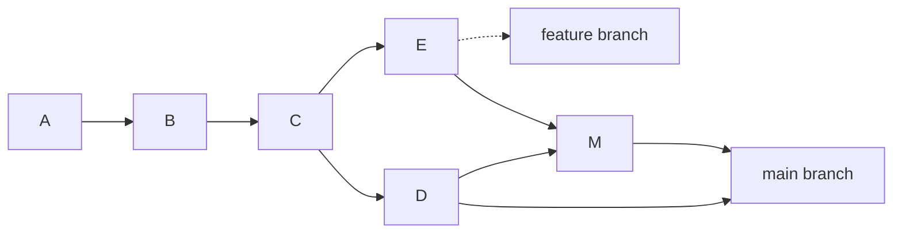
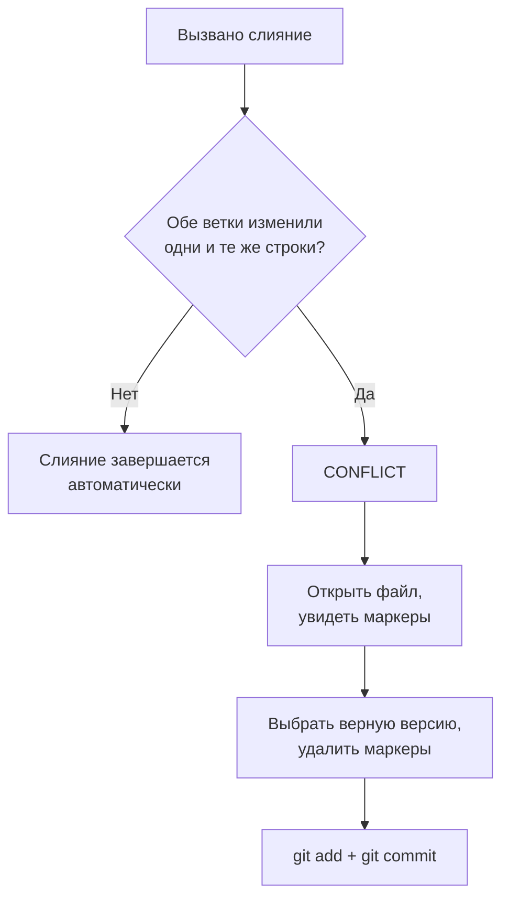

## Ветки и слияние

> **Связь с прошлым уроком:** вы уже умеете записывать коммиты и читать историю. Но реальная работа почти никогда не идёт в одну линию. Сегодня осваиваем главную «суперспособность» Git — **ветки**: учимся вести несколько версий проекта параллельно и сливать их в одну.

---

## Цель урока

Понять, что такое ветка, научиться создавать и переключать ветки, выполнять слияние и — главное — спокойно разрешать конфликты слияния, которых новички боятся больше всего.

## Чему вы научитесь к концу урока

- Объяснять, что такое ветка и почему это главный инструмент командной работы.
- Создавать ветки (`git branch`, `git switch -c`) и переключаться между ними.
- Понимать, где находится текущее состояние — маркер `HEAD`.
- Выполнять слияние веток командой `git merge`.
- Распознавать, разрешать и избегать конфликтов слияния.

---

## Хронометраж урока

| Блок | Содержание |
| --- | --- |
| 1. Что такое ветка | Аналогия с «параллельными вселенными» |
| 2. Создание и переключение веток | `git branch`, `git switch`, `HEAD`, `git merge --ff` |
| 3. Слияние: fast-forward и настоящее | Когда слияние создаёт коммит, а когда нет |
| 4. Конфликты слияния | Что это, как читать, как разрешать |
| 5. Мини-задание | Создать и слить ветку самостоятельно |
| 6. Удаление веток | `git branch -d` |
| 7. Итоги и практическое задание | Закрепление |

---

## Блок 1. Что такое ветка

**Простыми словами:** когда команда работает над проектом, одновременно идёт несколько задач — кто-то добавляет форму обратной связи, кто-то исправляет баг в меню, кто-то экспериментирует с новым дизайном. Если все будут коммитить в один общий поток — изменения смешаются и будут мешать друг другу.

**Ветка** — это независимая линия разработки. Если вспомнить идею «снимков» из урока 1: вместо одной цепочки версий появляется дерево. Основная ветка (`master` / `main`) — ствол; под каждую задачу от него отрастает своя ветка — «веточка», которую потом можно привить обратно в ствол.

**Аналогия:** вы пишете книгу. Основной текст (ствол) остаётся целым, а черновик каждой главы вы временно пишете на отдельном листе (ветка). Когда глава готова и одобрена — вклеиваете её обратно в основной текст. А если черновик не задался — просто выкидываете его, не трогая основной текст.



Читается так: коммиты `A→B→C` — общие для всех. От `C` разошлись две ветки: `D` (основная) и `E` (feature-ветка). Позже они слились в `M`.

**Почему ветки так важны:**

- можно вести сразу несколько задач и не ломать существующий код;
- каждую ветку можно удалить и выбросить, если эксперимент не удался;
- команда может работать каждый в своей ветке, а потом объединить результаты.

---

## Блок 2. Создание и переключение веток

Потренируемся в новом учебном репозитории (скрипт `practice-3.sh` создаст его автоматически). Сделаем заготовку небольшого сайта:

```bash
mkdir lesson-3 && cd lesson-3
git init
echo "<h1>Home</h1>" > index.html
git add index.html
git commit -m "feat: add home page"
```

### Посмотреть существующие ветки

```bash
git branch
```

Git покажет `* master` — звёздочкой отмечена ветка, на которой вы находитесь. В старых репозиториях ветка называется `master`, в новых — `main` (это конвенция имён, а не принципиальная разница).

### Создать ветку

Допустим, нужно добавить страницу контактов, не сломав главную:

```bash
git branch feature/contact
```

Новая ветка создана из текущего состояния. Проверьте: `git branch` — теперь их две, но звёздочка всё ещё на `master` (создание ветки её **не активирует**).

### Переключиться на новую ветку

```bash
git switch feature/contact
```

Теперь `git branch` показывает звёздочку рядом с `feature/contact`. Проверьте, какие коммиты в этой ветке:

```bash
git log --oneline
```

Вы увидите тот же коммит `feat: add home page` — ветка началась оттуда, где мы были.

> Для тех, кто привык к старой команде: `git checkout feature/contact` работает так же. `switch` — новая и более безопасная команда. А на крайний случай можно создать **и сразу** переключиться: `git switch -c feature/contact`.

### Поработайте на ветке

Добавьте страницу контактов:

```bash
echo "<h1>Contact</h1>" > contact.html
git add contact.html
git commit -m "feat: add contact page"
```

### Что такое `HEAD`

**`HEAD` — это маркер, показывающий, где вы стоите прямо сейчас.** Когда вы видите в `git status` строку "On branch feature/contact" — это `HEAD` указывает на эту ветку. Почти все команды Git работают относительно `HEAD`: то есть `HEAD` — ваше «текущее положение» в истории.

```bash
git status   # Заголовок вывода: On branch feature/contact
```

---

### Частые ошибки новичков

| Ошибка | Как исправить |
| --- | --- |
| Забыть переключиться после создания ветки | `git branch <имя>` только создаёт, `git switch <имя>` ещё и перемещает вас на неё |
| «Работать на ветке» не переключившись и сливать все коммиты в `master` | Проверяйте `git status` — первая строка показывает текущую ветку |
| Делать новую задачу на основной ветке «чтобы быстрее» | Для этого и существуют ветки — основная ветка должна оставаться стабильной версией |
| Бояться создавать ветки («их будет слишком много») | Ветки дешёвые — по одной на задачу, это норма |

---

## Блок 3. Слияние: Fast-Forward и настоящее

Страница контактов готова. Пора вернуть её в основную ветку.

### Переключитесь обратно и выполните слияние

```bash
git switch master
git merge feature/contact
```

В этом сценарии Git ответит:

```text
Updating a1b2c3d..d4e5f6a
Fast-forward
```

**Слияние fast-forward.** Пока мы работали на `feature/contact`, в основной ветке не появилось ни одного нового коммита — поэтому Git просто «передвинул» `master` на кончик feature-ветки. Обе ветки теперь указывают на один коммит. Новый коммит не создаётся — это самый простой случай.

Проверьте: `git log --oneline` — история линейная, оба коммита на месте.

### А теперь — настоящее слияние

Смоделируем случай, когда *обе* ветки продвинулись вперёд. Продолжим на `master`:

```bash
echo "<footer>Footer</footer>" >> index.html
git add index.html
git commit -m "feat: add footer to home"
```

Теперь на `feature/contact` (не забудьте переключиться):

```bash
git switch feature/contact
echo "<h1>Contact</h1><p>Write to us.</p>" > contact.html
git add contact.html
git commit -m "feat: extend contact page"
```

`master` и `feature/contact` **разошлись** — у каждой есть коммит, которого нет у другой. Снова выполняем слияние:

```bash
git switch master
git merge feature/contact
```

Git откроет текстовый редактор для сообщения *merge-коммита* (обычно достаточно сохранить значение по умолчанию). В результате появится новый **merge-коммит**:

```text
Merge made by the 'ort' strategy.
```

Прочитаем его с помощью `git log --oneline --graph`:

```text
*   b7c8d9e (HEAD -> master) Merge branch 'feature/contact'
|\
| * d4e5f6a (feature/contact) feat: extend contact page
* | c3d4e5f feat: add footer to home
|/
* a1b2c3d feat: add home page
```

Опция `--graph` рисует ветки линиями. Видно: ветки разошлись от коммита `a1b2c3d`, каждая пошла своим путём, а затем слились.

**Как понять, какую ветку в какую сливать?** Сливают всегда в ту ветку, которая должна изменения *принять*, — то есть стоим на ней и вызываем `git merge <другая>`.

---

## Блок 4. Конфликты слияния

Страшное место. Давайте честно создадим конфликт — и разберёмся, что делать.

Зададим в обеих ветках разные версии одной строки:

```bash
git switch master
echo "<p>Version from master</p>" > page.html
git add page.html
git commit -m "feat: write page on master"

git switch feature/contact
echo "<p>Version from feature</p>" > page.html
git add page.html
git commit -m "feat: write page on feature"
```

Слияние — и Git откажется:

```bash
git switch master
git merge feature/contact
```

```text
Auto-merging page.html
CONFLICT (content): Merge conflict in page.html
Automatic merge failed; fix conflicts and then commit the result.
```

**Это не трагедия, а обычная рабочая ситуация.** Git не смог решить, какая версия правильная: обе ветки изменили одну и ту же строку. Он остановил слияние и предложил решить вам.

### Прочитайте конфликт

Откройте `page.html` — вы увидите маркеры конфликта:

```text
<<<<<<< HEAD
<p>Version from master</p>
=======
<p>Version from feature</p>
>>>>>>> feature/contact
```

- `<<<<<<< HEAD` — начало «нашей» версии (ветка, **в** которую сливаем);
- `=======` — разделитель версий;
- `>>>>>>> feature/contact` — конец «их» версии (ветка, **из** которой сливаем).

### Разрешите конфликт

**Вручную выберите правильную версию** — удалите маркеры и оставьте нужный текст. Например, объедините обе:

```text
<p>Version from master</p>
<p>Version from feature</p>
```

Затем сообщите Git, что конфликт решён, и закоммитьте:

```bash
git add page.html
git commit -m "merge: resolve conflict in page.html"
```

Готово. Конфликт разрешён.

### Как избегать конфликтов

- Работайте в своих ветках, а не в общей основной.
- Дробите изменения и сливайтесь часто.
- Перед слиянием синхронизируйте свою ветку с основной (сделаем это в уроке 9, `git pull --rebase`).



---

## Мини-задание

В репозитории `lesson-3`, не подглядывая:

1. Создайте от `master` ветку `feature/news` и переключитесь на неё.
2. Добавьте файл `news.html` и закоммитьте его.
3. Переключитесь на `master` и выполните слияние `feature/news`.

**Решение:**

```bash
git switch -c feature/news
echo "<h1>News</h1>" > news.html
git add news.html
git commit -m "feat: add news page"
git switch master
git merge feature/news
```

---

## Блок 6. Удаление веток

После успешного слияния рабочую ветку обычно удаляют — история сохраняется в слиянии.

```bash
git branch -d feature/news
```

Git откажется с предупреждением, если на ветке есть коммиты, которые **не** влиты (он защищает ваши данные). Если вы уверены, что они не нужны:

```bash
git branch -D feature/news
```

**Безопасно vs рискованно:** `-d` откажется удалять неслитые коммиты, `-D` удалит в любом случае. Всегда сначала пробуйте `-d`.

Посмотрите итоговый список:

```bash
git branch
```

---

### Частые ошибки новичков

| Ошибка | Как исправить |
| --- | --- |
| Пугаться `CONFLICT` и пересоздавать проект «чтобы начать с чистого листа» | Конфликты нормальны; маркеры буквально указывают, где нужно решить |
| Править не ту часть конфликта (удалять «чужую» версию, не прочитав) | Прочитайте обе ветки; истина обычно в их сочетании |
| Привычно использовать `-D` | `-d` защищает неслитую работу — принудительное удаление только когда уверены |
| Оставить маркеры конфликта в закоммиченном файле | После разрешения перепроверьте файл: строк, начинающихся с `<<<<<<<`, `=======`, `>>>>>>>`, быть не должно |
| Слить не в ту ветку | Вы стоите на избранном *приёмнике* и вызываете `git merge <донор>` |

---

## Итоги урока

Сегодня вы узнали:

- **Ветка** — независимая линия разработки; основная — `master`/`main`.
- `git branch <имя>` создаёт, `git switch <имя>` переключает, `git switch -c <имя>` создаёт и переключает.
- **`HEAD`** показывает ваше текущее положение в истории.
- `git merge` вливает ветку в текущую; при разошедшейся истории создаётся **merge-коммит**.
- **Конфликты слияния** возникают, когда обе ветки меняют одни и те же строки — вы разрешаете их вручную и коммитите.
- Удаление — `git branch -d` (безопасно) и `git branch -D` (принудительно).

---

## Практика

В учебном репозитории повторите весь сценарий урока:

1. Создайте `index.html`, закоммитьте.
2. Создайте `feature/contact`, переключитесь, добавьте `contact.html`, закоммитьте.
3. Переключитесь на `master`, выполните слияние — наблюдайте fast-forward.
4. Создайте конфликт: измените один файл на обеих ветках, выполните слияние и разрешите конфликт вручную.
5. Удалите слитую ветку командой `git branch -d`.

Скрипт `practice-3.sh` воссоздаст этот сценарий с нуля:

---

[Следующий урок: Отмена изменений →](../../Lesson-4/ru/Отмена%20изменений.md)