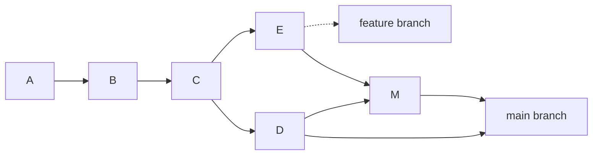
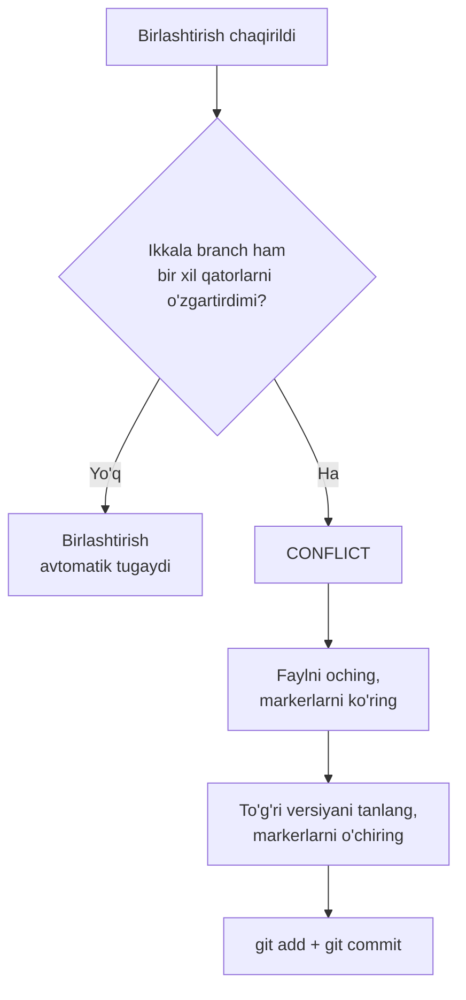

## Branchlar va birlashtirish

> **O'tgan dars bilan bog'liqlik:** siz commitlar yozishni va tarixni o'qishni bilasiz. Lekin real ish deyarli hech qachon bitta chiziqda bormaydi. Bugun Gitning asosiy «super qobiliyati» — **branchlarni** o'zlashtiramiz: loyihaning bir nechta versiyasini parallel olib borishni va ularni birlashtirishni o'rganamiz.

---

## Dars maqsadi

Branch nima ekanini tushunish, branch yaratish va almashtirishni, birlashtirishni va — eng muhimi — yangi boshlovchilar eng ko'p qo'rqadigan birlashtirish konfliktlarini xotirjam hal qilishni o'rganish.

## Dars oxirida nimani o'rganasiz

- Branch nima ekanini va nima uchun jamoa ishining asosiy vositasi ekanini tushuntirish.
- Branchlar yaratish (`git branch`, `git switch -c`) va ular orasida almashtirish.
- Joriy holat `HEAD` markeri bilan qayerdaligini tushunish.
- `git merge` bilan branchlarni birlashtirish.
- Birlashtirish konfliktlarini tanib olish, hal qilish va oldini olish.

---

## Dars vaqti

| Blok | Mazmun |
| --- | --- |
| 1. Branch nima | «Parallel olamlar» taqqoslash |
| 2. Branch yaratish va almashtirish | `git branch`, `git switch`, `HEAD`, `git merge --ff` |
| 3. Birlashtirish: fast-forward va haqiqiy | Birlashtirish qachon commit yaratadi, qachon yo'q |
| 4. Birlashtirish konfliktlari | Nima, qanday o'qiladi, qanday hal qilinadi |
| 5. Mini-vazifa | Branchni mustaqil yaratish va birlashtirish |
| 6. Branchlarni o'chirish | `git branch -d` |
| 7. Xulosalar va amaliy vazifa | Mustahkamlash |

---

## 1-blok. Branch nima

**Oddiy qilib aytganda:** jamoa loyiha ustida ishlaganda bir vaqtda bir nechta vazifa ketadi — kimdir aloqa formasini qo'shyapti, kimdir menyudagi xatoni tuzatyapti, kimdir yangi dizayn bilan tajriba qilyapti. Agar hamma bitta umumiy oqimga commit qilsa — o'zgarishlar aralashib, bir-biriga xalaqit beradi.

**Branch** — bu mustaqil rivojlanish liniyasi. 1-darsdagi «snapshot» g'oyasini eslasak: bitta zanjir o'rniga daraxt paydo bo'ladi. Asosiy branch (`master` / `main`) — tana; har bir vazifa ostidan o'z branchi — «novdasi» o'sib chiqadi, uni keyin tanaga qayta ulash mumkin.

**Taqqoslash:** siz kitob yozyapsiz. Asosiy matn (tana) butun qoladi, har bir bobning qoralamasini vaqtincha alohida qog'ozga yozasiz (branch). Bob tayyor bo'lib, ma'qullangach — uni asosiy matnga qayta yopishtirasiz. Qoralamaga to'g'ri kelmasa — shunchaki tashlab yuborasiz, asosiy matnga tegmasdan.



Bunday o'qiladi: `A→B→C` commitlari — hamma uchun umumiy. `C` dan ikki branch tarqaldi: `D` (asosiy) va `E` (feature-branch). Keyin ular `M` da birlashdi.

**Branchlar nima uchun muhim:**

- bir vaqtda bir nechta vazifani olib borish, mavjud kodni buzmagan holda;
- tajriba muvaffaqiyatsiz bo'lsa, har bir branchni o'chirib tashlash mumkin;
- jamoa har kim o'z branchida ishlab, keyin natijalarni birlashtiradi.

---

## 2-blok. Branch yaratish va almashtirish

Yangi o'quv repozitoriysida mashq qilamiz (`practice-3.sh` skripti uni avtomatik yaratadi). Kichkina sayt poydevorini qilamiz:

```bash
mkdir lesson-3 && cd lesson-3
git init
echo "<h1>Home</h1>" > index.html
git add index.html
git commit -m "feat: add home page"
```

### Mavjud branchlarni ko'rish

```bash
git branch
```

Git `* master`ni ko'rsatadi — yulduzcha o'zingiz turgan branchni belgilaydi. Eski repozitoriyalarda branch `master`, yangilarida `main` deb ataladi (bu nomlash konvensiyasi, tub farq emas).

### Branch yaratish

Aytaylik, aloqa sahifasi qo'shish kerak, lekin bosh sahifani buzmasdan:

```bash
git branch feature/contact
```

Yangi branch joriy holatdan yaratildi. Tekshiring: `git branch` — endi ikkita, lekin yulduzcha baribir `master`da (branch yaratish unga **o'tkazmaydi**).

### Yangi branchga o'tish

```bash
git switch feature/contact
```

Endi `git branch` yulduzchani `feature/contact` yonida ko'rsatadi. Bu branchda qanaqa commitlar borligini tekshiring:

```bash
git log --oneline
```

Xuddi shu `feat: add home page` commitini ko'rasiz — branch biz turgan joydan boshlandi.

> Eski buyruqqa o'rganganlar uchun: `git checkout feature/contact` ham xuddi shunday ishlaydi. `switch` — yangi va xavfsizroq buyruq. Qulayida bir vaqtda **yaratib va o'tib** olish mumkin: `git switch -c feature/contact`.

### Branchda ishlash

Aloqa sahifasini qo'shing:

```bash
echo "<h1>Contact</h1>" > contact.html
git add contact.html
git commit -m "feat: add contact page"
```

### `HEAD` nima

**`HEAD` — hozir qayerda turganingizni ko'rsatadigan marker.** `git status`da "On branch feature/contact" qatorini ko'rsangiz — bu `HEAD` shu branchga ishora qilmoqda. Deyarli barcha Git buyruqlari `HEAD`ga nisbatan ishlaydi: ya'ni `HEAD` — sizning tarixdagi «joriy pozitsiyangiz».

```bash
git status   # Chiqish boshi: On branch feature/contact
```

---

### Yangi boshlovchilarning ko'p uchraydigan xatolari

| Xato | Qanday tuzatish |
| --- | --- |
| Branch yaratgach o'tishni unutish | `git branch <nom>` faqat yaratadi, `git switch <nom>` sizni unga o'tkazadi |
| O'tmasdan «branchda ishlab», hamma commitni `master`ga quyish | Avval `git status`ni tekshiring — birinchi qatorda joriy branch ko'rsatiladi |
| Yangi vazifani asosiy branchda «tezroq bo'lsin» deb qilish | Shu maqsadda branchlar bor — asosiy branch barqaror versiya bo'lib qolishi kerak |
| Branch yaratishdan qo'rqish («ular juda ko'p bo'ladi») | Branchlar arzon — har vazifaga bittadan, bu normal |

---

## 3-blok. Birlashtirish: Fast-Forward va haqiqiy

Aloqa sahifasi tayyor. Uni asosiy branchga qaytarish vaqti.

### Orqaga o'tib, birlashtiring

```bash
git switch master
git merge feature/contact
```

Bu stsenariyda Git javob beradi:

```text
Updating a1b2c3d..d4e5f6a
Fast-forward
```

**Fast-forward birlashtirish.** Biz `feature/contact`da ishlayotganimizda asosiy branchda bitta ham yangi commit paydo bo'lmadi — shuning uchun Git shunchaki `master`ni feature-branchning uchiga «surdi». Ikkala branch endi bitta commitga ishora qiladi. Yangi commit yaratilmaydi — bu eng oddiy holat.

Tekshiring: `git log --oneline` — tarix chiziqli, ikkala commit joyida.

### Endi — haqiqiy birlashtirish

*Ikkala* branch oldinga siljigan holatni modellashtiramiz. `master`da davom etamiz:

```bash
echo "<footer>Footer</footer>" >> index.html
git add index.html
git commit -m "feat: add footer to home"
```

Endi `feature/contact`da (o'tishni unutmang):

```bash
git switch feature/contact
echo "<h1>Contact</h1><p>Write to us.</p>" > contact.html
git add contact.html
git commit -m "feat: extend contact page"
```

`master` va `feature/contact` **tarqaldi** — har birida boshqasida yo'q commit bor. Yana birlashtiramiz:

```bash
git switch master
git merge feature/contact
```

Git *merge-commit* xabari uchun matn muharririni ochadi (odatda standart qiymatni saqlash kifoya). Natijada yangi **merge-commit** paydo bo'ladi:

```text
Merge made by the 'ort' strategy.
```

Uni `git log --oneline --graph` bilan o'qiymiz:

```text
*   b7c8d9e (HEAD -> master) Merge branch 'feature/contact'
|\
| * d4e5f6a (feature/contact) feat: extend contact page
* | c3d4e5f feat: add footer to home
|/
* a1b2c3d feat: add home page
```

`--graph` opiyasi branchlarni chiziqlar bilan chizadi. Ko'rinib turibdi: branchlar `a1b2c3d` commitidan tarqaldi, har biri o'z yo'lidan ketdi, keyin birlashdi.

**Qaysi branchni qaysi tomonga birlashtirish kerak?** Har doim o'zgarishlarni *qabul qiladigan* branchga birlashtiriladi — ya'ni o'sha branchda turib, `git merge <boshqasi>` chaqirasiz.

---

## 4-blok. Birlashtirish konfliktlari

Qo'rqinchli joy. Keling, konfliktni halol yaratamiz — va nima qilishni tushunamiz.

Ikkala branchda bitta qatorning turli versiyasini o'rnatamiz:

```bash
git switch master
echo "<p>Version from master</p>" > page.html
git add page.html
git commit -m "feat: write page on master"

git switch feature/contact
echo "<p>Version from feature</p>" > page.html
git add page.html
git commit -m "feat: write page on feature"
```

Birlashtirish — Git rad etadi:

```bash
git switch master
git merge feature/contact
```

```text
Auto-merging page.html
CONFLICT (content): Merge conflict in page.html
Automatic merge failed; fix conflicts and then commit the result.
```

**Bu fojia emas, oddiy ish holati.** Git qaysi versiya to'g'ri ekanini hal qila olmadi: ikkala branch ham bitta qatorni o'zgartirdi. U birlashtirishni to'xtatdi va qaror qilishni sizga taklif qildi.

### Konfliktni o'qing

`page.html` faylini oching — konflikt markerlarini ko'rasiz:

```text
<<<<<<< HEAD
<p>Version from master</p>
=======
<p>Version from feature</p>
>>>>>>> feature/contact
```

- `<<<<<<< HEAD` — «bizning» versiya boshi (o'zimiz **turgan** branch);
- `=======` — versiyalar ajratgichi;
- `>>>>>>> feature/contact` — «ularning» versiya oxiri (birlashtirayotgan branch).

### Konfliktni hal qiling

**Qo'lda to'g'ri versiyani tanlang** — markerlarni o'chirib, kerakli matnni qoldiring. Masalan, ikkalasini birlashtiring:

```text
<p>Version from master</p>
<p>Version from feature</p>
```

So'ng Gitga konflikt hal qilinganini aytib, commit qiling:

```bash
git add page.html
git commit -m "merge: resolve conflict in page.html"
```

Tayyor. Konflikt hal qilindi.

### Konfliktlardan qanday qochish mumkin

- O'z branchlaringizda ishlang, umumiy asosiy branchda emas.
- O'zgarishlarni mayda qilib, tez-tez birlashtiring.
- Birlashtirishdan oldin branchingizni asosiy bilan sinxronlang (9-darsda qilamiz, `git pull --rebase`).



---

## Mini-vazifa

`lesson-3` repozitoriysida, qaramasdan:

1. `master`dan `feature/news` branchini yarating va unga o'ting.
2. `news.html` faylini qo'shib, commitingiz.
3. `master`ga o'tib, `feature/news`ni birlashtiring.

**Yechim:**

```bash
git switch -c feature/news
echo "<h1>News</h1>" > news.html
git add news.html
git commit -m "feat: add news page"
git switch master
git merge feature/news
```

---

## 6-blok. Branchlarni o'chirish

Muvaffaqiyatli birlashtirishdan keyin ishchi branch odatda o'chiriladi — tarix birlashtirishda qoladi.

```bash
git branch -d feature/news
```

Git ogohlantirish bilan rad etadi, agar branchda **birlashtirilmagan** commitlar bo'lsa (u ma'lumotlaringizni himoya qiladi). Ishonchingiz komil bo'lsa:

```bash
git branch -D feature/news
```

**Xavfsiz vs xavfli:** `-d` birlashtirilmagan ishni o'chirishni rad etadi, `-D` baribir o'chiradi. Har doim avval `-d` sinang.

Yakuniy ro'yxatni ko'ring:

```bash
git branch
```

---

### Yangi boshlovchilarning ko'p uchraydigan xatolari

| Xato | Qanday tuzatish |
| --- | --- |
| `CONFLICT`dan qo'rqib, loyihani «toza varaqdan boshlash uchun» qayta yaratish | Konfliktlar normal; markerlar qayerda hal qilishni to'g'ridan-to'g'ri ko'rsatadi |
| Konfliktning noto'g'ri qismini tahrirlash («begona» versiyani o'qimay o'chirish) | Ikkala branchni ham o'qing; haqiqat odatda ularning kombinatsiyasida |
| Odatga aylangan `-D` | `-d` birlashtirilmagan ishni himoya qiladi — majburiy o'chirish faqat ishonchingiz komil bo'lsa |
| Commit qilingan faylda konflikt markerlarini qoldirish | Hal qilgach faylni qayta tekshiring: `<<<<<<<`, `=======`, `>>>>>>>` bilan boshlanadigan qatorlar bo'lmasligi kerak |
| Noto'g'ri branchga birlashtirish | Siz *qabul qiluvchi* branchda turib, `git merge <beruvchi>` chaqirasiz |

---

## Dars xulosalari

Bugun siz quyidagilarni o'rgandingiz:

- **Branch** — mustaqil rivojlanish liniyasi; asosiysi `master`/`main`.
- `git branch <nom>` yaratadi, `git switch <nom>` o'tkazadi, `git switch -c <nom>` yaratib o'tkazadi.
- **`HEAD`** sizning tarixdagi joriy pozitsiyangizni ko'rsatadi.
- `git merge` branchni joriy branchga birlashtiradi; tarqalgan tarixda **merge-commit** yaratiladi.
- **Birlashtirish konfliktlari** — ikkala branch bir xil qatorlarni o'zgartirganda; siz qo'lda hal qilib, commit qilasiz.
- O'chirish — `git branch -d` (xavfsiz) va `git branch -D` (majburiy).

---

## Amaliy vazifa

O'quv repozitoriysida butun dars ssenariysini takrorlang:

1. `index.html` yarating, commitingiz.
2. `feature/contact` yarating, o'ting, `contact.html` qo'shing, commitingiz.
3. `master`ga o'tib, birlashtiring — fast-forwardni kuzating.
4. Konflikt yarating: bitta faylni ikkala branchda o'zgartiring, birlashtirib, qo'lda hal qiling.
5. Birlashtirilgan branchni `git branch -d` bilan o'chiring.

`practice-3.sh` skripti bu ssenariyni noldan qayta yaratadi:

---

[Keyingi dars: O'zgarishlarni bekor qilish →](../../Lesson-4/uz/O'zgarishlarni%20bekor%20qilish.md)