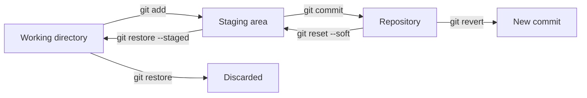

## Undoing Changes

> **Connection with the previous lesson:** you already know how to commit and merge. Today we learn the reverse side — how to safely undo what was done: discard accidental edits, take files out of the staging area, cancel commits, and keep unfinished work "in a drawer".

---

## Lesson Goal

Understand Git's undo commands and, just as importantly, the safety model behind them — so that "undo" never turns into "lose everything."

## What You Will Learn by the End of the Lesson

- See changes before doing anything with `git diff`.
- Discard uncommitted edits in the working directory with `git restore`.
- Unstage a file with `git restore --staged`.
- Cancel commits with `git reset` (soft/mixed/hard) and, safely, `git revert`.
- Save unfinished work "in a drawer" with `git stash` and take it back out with `git stash pop`.

---

## Lesson Timeline

| Block | Content |
| --- | --- |
| 1. The safety principle | How "undo" works in Git, command reference table |
| 2. `git diff` | Looking at changes before deciding |
| 3. Discarding unstaged changes | `git restore <file>` |
| 4. Unstaging a file | `git restore --staged <file>` |
| 5. Canceling commits | `git reset` and `git revert` |
| 6. `git stash` | Putting unfinished work "in a drawer" |
| 7. Mini-task | Apply the whole set of undo commands |
| 8. Summary and practice | Reinforcement |

---

## Block 1. The Safety Principle

**In simple terms:** every branch of Git has its own rule "once committed — it's already in the repository." That's what makes Git so reliable: it's hard to lose *something finally*. The main task of "undo" commands is to move changes from one place to another, not to destroy them.

There are only three places a change can be, and each has its own "undo":

| Where the change is | Command | What happens |
| --- | --- | --- |
| Working directory (not yet `git add`) | `git restore <file>` | Edits are discarded, file returns to the last snapshot |
| Staging area (already `git add`, not yet `git commit`) | `git restore --staged <file>` | File returns to the working directory without edits lost |
| Repository (committed) | `git revert` or `git reset` | A new undo commit (safe) or moving `HEAD` (risky) |
| Unfinished work, "in a drawer" | `git stash` | Saving and restoring without committing |



Read the diagram right-to-left: each "undo" command moves a change one step back — and only `git restore` for the working directory fully throws it away.

**Golden rule:** before deleting anything, at least once run `git diff` (block 2) or `git status`. Git shows exactly what will be affected.

---

### Common Beginner Mistakes

| Error | How to Fix |
| --- | --- |
| Using `git rm` thinking it's "undo for a file" | `git rm` *deletes* a file; to roll back an accidental edit use `git restore` |
| Doing `git reset --hard` out of habit and losing work | `--hard` destroys uncommitted changes — use it only when you really don't need them |
| Confusing `revert` and `reset` | `revert` creates a new commit (safe), `reset` moves history (dangerous if shared) |
| Not running `git status` before undo | One status check saves hours of explanation which changes are at risk |

---

## Block 2. `git diff`: Look Before You Undo

`git diff` shows the difference between the working directory and the current snapshot — that is, what you've changed but haven't staged yet.

```bash
git diff
```

Output for a modified file:

```text
diff --git a/index.html b/index.html
index 34b7f2a..a1cb29e 100644
--- a/index.html
+++ b/index.html
@@ -1 +1,2 @@
 <h1>Home</h1>
+<p>New paragraph</p>
```

Decode:

- `--- a/index.html` / `+++ b/index.html` — old and new version;
- lines starting with `-` — removed lines;
- lines starting with `+` — added lines (our new paragraph);
- `@@ -1 +1,2 @@` — where in the file this hunk is.

Useful variants:

```bash
git diff                 # working directory vs snapshot
git diff --staged        # staging area vs snapshot (what will enter the commit)
git diff --stat          # just a summary: which files and how many lines
```

**The habit of the professional:** decide to undo? First `git diff` — you'll see exactly what's at stake.

---

## Block 3. Discarding Unstaged Changes: `git restore`

Let's create a working repository and mess something up on purpose:

```bash
mkdir lesson-4 && cd lesson-4
git init
echo "Line 1" > notes.txt
git add notes.txt
git commit -m "feat: add notes"

echo "Line 2 (accidental change)" >> notes.txt
git status
```

`notes.txt` shows "modified" but not staged. We need to discard the edit — return the file to the state of the last commit:

```bash
git restore notes.txt
cat notes.txt    # only "Line 1" — the accidental change is gone
```

`git restore` takes a snapshot from the repository and returns it to the working directory. **Caution:** edits that weren't committed and weren't staged are destroyed. If you want to keep them — first copy them somewhere, or use `git stash` (block 6).

You can restore several files or an entire folder:

```bash
git restore .            # discard all unstaged changes
git restore src/         # discard everything in the src folder
```

---

## Block 4. Unstaging a File: `git restore --staged`

The reverse situation: you already did `git add`, but at the last moment changed your mind — you don't want this file in the commit.

```bash
echo "Secret draft" > draft.txt
git add draft.txt
git status    # draft.txt — staged
```

Take it out of the staging area:

```bash
git restore --staged draft.txt
git status    # draft.txt — untracked again, the text is safe
```

**Important:** `--staged` takes the file out of the staging area **without touching its contents** — the changes remain in the working directory.

**Alternative from old habits:** `git rm --cached <file>` does the same. `restore --staged` is the newer, clearer command.

---

## Block 5. Canceling Commits: `git reset` and `git revert`

The most "dangerous-looking" part. Two tools have different purposes — memorize this table once and reuse it:

| Task | Command | Result |
| --- | --- | --- |
| Cancel the last commit, keep changes **staged** | `git reset --soft HEAD~1` | Files remain in the staging area |
| Cancel the last commit, keep changes in the working directory | `git reset HEAD~1` (or `--mixed`) | Files remain uncommitted |
| Cancel the last commit and changes entirely | `git reset --hard HEAD~1` | Both commit and changes disappear |
| Cancel a commit while preserving history | `git revert <hash>` | A new commit appears doing the opposite |

### `git reset` — moving `HEAD`

`git reset` moves the `HEAD` marker to an older commit. All commits "above" it are no longer referenced — but their content remains in the working directory (depending on the mode).

Let's practice on a fresh repository:

```bash
git reset --soft HEAD~1     # last commit canceled, changes staged
git status                  # "Changes to be committed"
```

- `--soft` — moves `HEAD`, everything stays in the staging area;
- `--mixed` (default) — moves `HEAD`, changes go back to the working directory;
- `--hard` — moves `HEAD` and throws away all uncommitted changes. **It's impossible to get them back** (if they weren't pushed anywhere).

**Attention:** `git reset` must not be used on commits that were already **pushed** and shared with a team — you'll "rewrite history," and colleagues' repositories will start diverging. For published commits — the next command.

### `git revert` — safe cancellation with history

`git revert <hash>` creates a *new* commit that does the opposite of the rolled-back one. History remains intact — it's as if you "made a mistake and corrected it," which is fine to push.

```bash
git log --oneline              # take note of the commit to cancel
git revert a1b2c3d             # new "undo commit"
git log --oneline             # the old commit is there AND the new one
```

**Analogy:** `reset` is like erasing a note in a notebook (fine if no one read it yet), `revert` is like writing a correction below it (necessary when the notebook has been handed out to everyone).

---

### Common Beginner Mistakes

| Error | How to Fix |
| --- | --- |
| `git reset --hard` on a shared branch | It rewrites history; for published commits use `git revert` |
| Expecting `reset` to "delete files from history" | `reset` moves `HEAD`; the commits themselves remain in `.git` for a while (more in lesson 8) |
| Thinking `revert` will remove the "bad" commit from the log | It stays — a new commit appears instead |
| `git reset HEAD~2` meaning "cancel two commits" — but the index of `HEAD~2` confuses | `HEAD~N` — count "commits above the current position", so `~1` — the last one |

---

## Block 6. `git stash`: Unfinished Work "In a Drawer"

Situation: you're editing two files, and you urgently need to switch to another task. But you can't switch — Git complains about uncommitted changes. Option: commit half-finished work (ugly), or put it "in a drawer":

```bash
git stash push -m "in-progress: contact form"
```

`git stash` saves your uncommitted changes in a special store and **cleans the working directory** — you can now switch branches freely. The list of "drawers":

```bash
git stash list
```

To get the work back:

```bash
git stash pop     # take the latest and delete the record from the list
```

If you need it back without deleting the record:

```bash
git stash apply   # same, but keep the "drawer"
git stash drop    # then delete it explicitly
```

**Analogy:** `stash` is putting papers in a desk drawer — tidy desktop for a new task, papers are safe. `pop` — taking them back out.

---

## Block 7. Mini-Task

In the `lesson-4` repository, without peeking:

1. Modify `notes.txt` (add a line), then discard the change with `git restore`.
2. Create `todo.txt`, stage it, then unstage it.
3. Commit a change, then cancel the commit with `git revert`.
4. Make a mess and put it away with `git stash`, then get it back with `stash pop`.

**Solution:**

```bash
echo "extra" >> notes.txt && git restore notes.txt
echo "buy milk" > todo.txt && git add todo.txt && git restore --staged todo.txt
echo "done" >> notes.txt && git add notes.txt && git commit -m "docs: update notes"
git revert HEAD --no-edit
git stash push -m "draft" && git stash pop
```

---

## Lesson Summary

Today you learned:

- Undo in Git mostly **moves** a change back one step — only `git restore` of the working directory destroys it.
- `git diff` shows what will be affected before any action.
- `git restore <file>` discards unstaged edits; `git restore --staged <file>` unstages.
- `git reset` moves `HEAD` (soft/mixed/hard), `git revert` creates an undo commit and is the safe choice for published work.
- `git stash` saves unfinished work and allows changing tasks freely.

---

## Practice

In a training repository:

1. Make a deliberately "broken" edit and return it back with `git restore` — see with `git diff` first.
2. Add a file, unstage it, and make sure the contents survived.
3. Make three commits and then: `reset --soft HEAD~1`, `reset HEAD~1`, and revert the most recent one.
4. Stash your work, switch branches, come back and `stash pop` it.
5. **Impractical exercise:** never do `git reset --hard` on the course repository while it contains uncommitted work.

Run `practice-4.sh` to go through the entire undo scenario automatically:

---

[Next lesson: GitHub and Remote Repositories →](../../Lesson-5/en/GitHub%20and%20Remote%20Repositories.md)