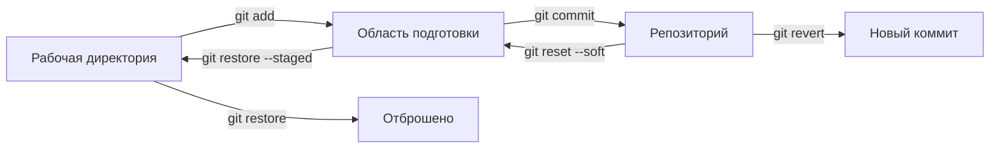

## Отмена изменений

> **Связь с прошлым уроком:** вы уже умеете коммитить и сливать ветки. Сегодня изучаем обратную сторону — как безопасно отменять сделанное: выбрасывать случайные правки, убирать файлы из области подготовки, отменять коммиты и держать незаконченную работу «в ящике».

---

## Цель урока

Разобраться в командах отмены Git и, что не менее важно, в модели безопасности за ними — чтобы «отмена» никогда не превращалась в «потерял всё».

## Чему вы научитесь к концу урока

- Видеть изменения до всяких действий командой `git diff`.
- Отбрасывать незакоммиченные правки в рабочей директории командой `git restore`.
- Убирать файл из области подготовки командой `git restore --staged`.
- Отменять коммиты командой `git reset` (soft/mixed/hard) и безопасно — командой `git revert`.
- Прятать незаконченную работу «в ящик» командой `git stash` и доставать её обратно командой `git stash pop`.

---

## Хронометраж урока

| Блок | Содержание |
| --- | --- |
| 1. Принцип безопасности | Как устроена «отмена» в Git, таблица-шпаргалка |
| 2. `git diff` | Смотрим на изменения до решения |
| 3. Отбрасывание незакоммиченных правок | `git restore <файл>` |
| 4. Убираем файл из подготовки | `git restore --staged <файл>` |
| 5. Отмена коммитов | `git reset` и `git revert` |
| 6. `git stash` | Незаконченная работа «в ящике» |
| 7. Мини-задание | Применить весь набор команд отмены |
| 8. Итоги и практическое задание | Закрепление |

---

## Блок 1. Принцип безопасности

**Простыми словами:** в каждой ветке Git действует своё правило «один раз закоммитил — он уже в репозитории». Именно поэтому Git так надёжен: что-то *окончательно* потерять сложно. Главная задача команд «отмены» — перенести изменение из одного места в другое, а не уничтожить его.

Мест, где может находится изменение, всего три — и у каждого своя «отмена»:

| Где изменение | Команда | Что произойдёт |
| --- | --- | --- |
| Рабочая директория (ещё без `git add`) | `git restore <файл>` | Правки отбрасываются, файл возвращается к последнему снимку |
| Область подготовки (уже `git add`, ещё без `git commit`) | `git restore --staged <файл>` | Файл возвращается в рабочую директорию, правки не теряются |
| Репозиторий (закоммичено) | `git revert` или `git reset` | Новый коммит-отмена (безопасно) или сдвиг `HEAD` (рискованно) |
| Незаконченная работа, «в ящике» | `git stash` | Сохранение и возврат без коммита |



Читаем диаграмму справа налево: каждая команда «отмены» возвращает изменение на один шаг назад — и только `git restore` для рабочей директории выбрасывает его окончательно.

**Золотое правило:** перед любым удалением хотя бы раз выполните `git diff` (блок 2) или `git status`. Git показывает, что именно будет затронуто.

---

### Частые ошибки новичков

| Ошибка | Как исправить |
| --- | --- |
| Использовать `git rm`, думая, что это «отмена для файла» | `git rm` *удаляет* файл; чтобы откатить случайную правку, используйте `git restore` |
| По привычке делать `git reset --hard` и терять работу | `--hard` уничтожает незакоммиченные изменения — используйте только когда они действительно не нужны |
| Путать `revert` и `reset` | `revert` создаёт новый коммит (безопасно), `reset` сдвигает историю (опасно при общей работе) |
| Не выполнять `git status` перед отменой | Одна проверка статуса экономит часы объяснений, какие изменения под угрозой |

---

## Блок 2. `git diff`: посмотри, прежде чем отменять

`git diff` показывает разницу между рабочей директорией и текущим снимком — то есть что вы изменили, но ещё не подготовили.

```bash
git diff
```

Вывод для изменённого файла:

```text
diff --git a/index.html b/index.html
index 34b7f2a..a1cb29e 100644
--- a/index.html
+++ b/index.html
@@ -1 +1,2 @@
 <h1>Home</h1>
+<p>New paragraph</p>
```

Расшифровываем:

- `--- a/index.html` / `+++ b/index.html` — старая и новая версии;
- строки, начинающиеся с `-` — удалённые строки;
- строки, начинающиеся с `+` — добавленные строки (наш новый абзац);
- `@@ -1 +1,2 @@` — где в файле находится этот фрагмент.

Полезные варианты:

```bash
git diff                 # рабочая директория и снимок
git diff --staged        # область подготовки и снимок (что войдёт в коммит)
git diff --stat          # только сводка: какие файлы и сколько строк
```

**Привычка профессионала:** решили отменить? Сначала `git diff` — увидите, что именно на кону.

---

## Блок 3. Отбрасывание незакоммиченных правок: `git restore`

Создадим рабочий репозиторий и намеренно что-нибудь испортим:

```bash
mkdir lesson-4 && cd lesson-4
git init
echo "Line 1" > notes.txt
git add notes.txt
git commit -m "feat: add notes"

echo "Line 2 (accidental change)" >> notes.txt
git status
```

`notes.txt` показывает "modified", но не staged. Нужно отбросить правку — вернуть файл к состоянию последнего коммита:

```bash
git restore notes.txt
cat notes.txt    # останется только "Line 1" — случайное изменение исчезло
```

`git restore` берёт снимок из репозитория и возвращает его в рабочую директорию. **Внимание:** правки, которые не были закоммичены и не были в области подготовки, уничтожаются. Хотите их сохранить — сначала скопируйте куда-нибудь или используйте `git stash` (блок 6).

Можно восстановить несколько файлов или всю папку:

```bash
git restore .            # отбросить все незакоммиченные правки
git restore src/         # всё в папке src
```

---

## Блок 4. Убираем файл из подготовки: `git restore --staged`

Обратная ситуация: вы уже сделали `git add`, но в последний момент передумали — не хотите этот файл в коммите.

```bash
echo "Secret draft" > draft.txt
git add draft.txt
git status    # draft.txt — staged
```

Убираем его из области подготовки:

```bash
git restore --staged draft.txt
git status    # draft.txt — снова untracked, текст на месте
```

**Важно:** `--staged` убирает файл из области подготовки **не трогая его содержимое** — изменения остаются в рабочей директории.

**Альтернатива из старых привычек:** `git rm --cached <файл>` делает то же самое. `restore --staged` — более новая и наглядная команда.

---

## Блок 5. Отмена коммитов: `git reset` и `git revert`

Самая «страшная» часть. У двух инструментов разные назначения — запомните эту таблицу один раз и пользуйтесь всю жизнь:

| Задача | Команда | Результат |
| --- | --- | --- |
| Отменить последний коммит, изменения оставить **в области подготовки** | `git reset --soft HEAD~1` | Файлы остаются staged |
| Отменить последний коммит, изменения оставить в рабочей директории | `git reset HEAD~1` (или `--mixed`) | Файлы остаются не закоммиченными |
| Отменить коммит и изменения полностью | `git reset --hard HEAD~1` | Исчезают и коммит, и изменения |
| Отменить коммит, сохранив историю | `git revert <хэш>` | Появляется новый коммит, делающий обратное |

### `git reset` — сдвиг `HEAD`

`git reset` перемещает маркер `HEAD` на более старый коммит. Все коммиты «выше» больше не ссылаются ни на что, но их содержимое остаётся в рабочей директории (зависит от режима).

Потренируемся на свежем репозитории:

```bash
git reset --soft HEAD~1     # последний коммит отменён, изменения staged
git status                  # "Changes to be committed"
```

- `--soft` — сдвигает `HEAD`, всё остаётся в области подготовки;
- `--mixed` (по умолчанию) — сдвигает `HEAD`, изменения возвращаются в рабочую директорию;
- `--hard` — сдвигает `HEAD` и выбрасывает все незакоммиченные изменения. **Вернуть их невозможно** (если они никуда не были запушены).

**Внимание:** `git reset` нельзя применять к коммитам, которые уже **запушены** и расшарены с командой — вы «перепишете историю», и репозитории коллег начнут расходиться. Для опубликованных коммитов — следующая команда.

### `git revert` — безопасная отмена с историей

`git revert <хэш>` создаёт *новый* коммит, который делает обратное откатываемому. История остаётся целой — как будто вы «ошиблись и исправились», а это спокойно можно пушить.

```bash
git log --oneline              # запомните коммит для отмены
git revert a1b2c3d             # новый "коммит-отмена"
git log --oneline             # старый коммит на месте, и новый тоже
```

**Аналогия:** `reset` — это стереть запись в тетради (нормально, если её ещё никто не читал), `revert` — дописать строку «неверно» ниже (необходимо, когда тетради раздали всем).

---

### Частые ошибки новичков

| Ошибка | Как исправить |
| --- | --- |
| `git reset --hard` на общей ветке | Это переписывание истории; для опубликованных коммитов используйте `git revert` |
| Ждать, что `reset` «сотрёт файлы из истории» | `reset` сдвигает `HEAD`; сами коммиты ещё лежат в `.git` какое-то время (подробнее в уроке 8) |
| Думать, что `revert` «уберёт плохой коммит из лога» | Он остаётся — вместо него появляется новый коммит |
| `git reset HEAD~2` в смысле «отменить два коммита», но путать индекс `HEAD~2` | `HEAD~N` — отсчёт «коммитов над текущей позицией», значит `~1` — последний |

---

## Блок 6. `git stash`: незаконченная работа «в ящике»

Ситуация: вы правите два файла, но срочно нужно переключиться на другую задачу. А переключиться нельзя — Git ругается на незакоммиченные изменения. Варианты: закоммитить полусделанную работу (некрасиво) или положить её «в ящик»:

```bash
git stash push -m "in-progress: contact form"
```

`git stash` сохраняет ваши незакоммиченные изменения в специальное хранилище и **очищает рабочую директорию** — теперь можно свободно переключать ветки. Список «ящиков»:

```bash
git stash list
```

Чтобы достать работу обратно:

```bash
git stash pop     # достать последнюю и удалить запись из списка
```

Нужно достать, не удаляя запись:

```bash
git stash apply   # то же самое, но «ящик» остаётся
git stash drop    # затем удалить его явно
```

**Аналогия:** `stash` — сложить бумаги в ящик стола: чистый стол для новой задачи, бумаги в безопасности. `pop` — достать их обратно.

---

## Мини-задание

В репозитории `lesson-4`, не подглядывая:

1. Измените `notes.txt` (добавьте строку), затем отбросьте изменение через `git restore`.
2. Создайте `todo.txt`, подготовьте, затем уберите из области подготовки.
3. Закоммитьте изменение, затем отмените коммит через `git revert`.
4. Наведите беспорядок и спрячьте его через `git stash`, затем верните через `stash pop`.

**Решение:**

```bash
echo "extra" >> notes.txt && git restore notes.txt
echo "buy milk" > todo.txt && git add todo.txt && git restore --staged todo.txt
echo "done" >> notes.txt && git add notes.txt && git commit -m "docs: update notes"
git revert HEAD --no-edit
git stash push -m "draft" && git stash pop
```

---

## Итоги урока

Сегодня вы узнали:

- Отмена в Git в основном **перемещает** изменение на шаг назад — уничтожает его только `git restore` рабочей директории.
- `git diff` показывает, что будет затронуто, перед любым действием.
- `git restore <файл>` отбрасывает незакоммиченные правки; `git restore --staged <файл>` убирает из подготовки.
- `git reset` сдвигает `HEAD` (soft/mixed/hard), `git revert` создаёт коммит-отмену и безопасен для опубликованной работы.
- `git stash` прячет незаконченную работу и позволяет свободно менять задачи.

---

## Практика

В учебном репозитории:

1. Сделайте намеренно «сломанную» правку и верните её через `git restore` — предварительно посмотрев `git diff`.
2. Добавьте файл, уберите его из подготовки и убедитесь, что содержимое уцелело.
3. Сделайте три коммита и затем: `reset --soft HEAD~1`, `reset HEAD~1`, и revert последнего.
4. Спрячьте работу `stash`, переключите ветку, вернитесь и достаньте её через `stash pop`.
5. **Практическое предостережение:** никогда не делайте `git reset --hard` на репозитории курса, пока в нём есть незакоммиченная работа.

Запустите `practice-4.sh`, чтобы пройти весь сценарий отмены автоматически:

---

[Следующий урок: GitHub и удалённые репозитории →](../../Lesson-5/ru/GitHub%20и%20удалённые%20репозитории.md)