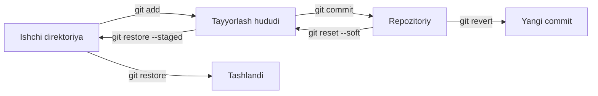

## O'zgarishlarni bekor qilish

> **O'tgan dars bilan bog'liqlik:** siz commit qilishni va branchlarni birlashtirishni bilasiz. Bugun teskari tomonni o'rganamiz: qilingan ishni xavfsiz bekor qilish — tasodifiy tahrirlarni tashlash, fayllarni tayyorlash hududidan chiqarish, commitlarni bekor qilish va tugallanmagan ishni «shkafda» saqlash.

---

## Dars maqsadi

Gitning bekor qilish buyruqlarini va ular ortidagi xavfsizlik modelini tushunish — «bekor qilish» hech qachon «hammasini yo'qotish»ga aylanmasin.

## Dars oxirida nimani o'rganasiz

- Harakatlardan oldin `git diff` bilan o'zgarishlarni ko'rish.
- Ishchi direktoriiyadagi commit qilinmagan tahrirlarni `git restore` bilan bekor qilish.
- Faylni `git restore --staged` bilan tayyorlash hududidan chiqarish.
- Commitlarni `git reset` (soft/mixed/hard) va xavfsiz `git revert` bilan bekor qilish.
- Tugallanmagan ishni `git stash` bilan «shkafga» solib, `git stash pop` bilan qaytarish.

---

## Dars vaqti

| Blok | Mazmun |
| --- | --- |
| 1. Xavfsizlik tamoyili | Gitda «bekor qilish» qanday ishlaydi, shpargalka-jadval |
| 2. `git diff` | Qaror oldidan o'zgarishlarni ko'rish |
| 3. Tayyorlanmagan tahrirlarni tashlash | `git restore <fayl>` |
| 4. Faylni tayyorlashdan chiqarish | `git restore --staged <fayl>` |
| 5. Commitlarni bekor qilish | `git reset` va `git revert` |
| 6. `git stash` | Tugallanmagan ish «shkafda» |
| 7. Mini-vazifa | Bekor qilish buyruqlarining to'liq to'plamini qo'llash |
| 8. Xulosalar va amaliy vazifa | Mustahkamlash |

---

## 1-blok. Xavfsizlik tamoyili

**Oddiy qilib aytganda:** Gitning har bir tarmog'ida «bir marta commit qildim — u endi repozitoriyda» qoidasi ishlaydi. Shuning uchun Git shunchalik ishonchli: biror narsani *butunlay* yo'qotish qiyin. «Bekor qilish» buyruqlarining asosiy vazifasi — o'zgarishni yo'q qilish emas, balki bir joydan ikkinchisiga ko'chirish.

O'zgarish bo'lishi mumkin bo'lgan joy uchta — har birining o'z «bekor qilishi» bor:

| O'zgarish qayerda | Buyruq | Nima bo'ladi |
| --- | --- | --- |
| Ishchi direktoriya (hali `git add` qilinmagan) | `git restore <fayl>` | Tahrirlar bekor qilinadi, fayl oxirgi snapshotga qaytadi |
| Tayyorlash hududi (allaqachon `git add`, hali `git commit`siz) | `git restore --staged <fayl>` | Fayl ishchi direktoriyaga qaytadi, tahrirlar yo'qolmaydi |
| Repozitoriy (commit qilingan) | `git revert` yoki `git reset` | Yangi bekor qilish commiti (xavfsiz) yoki `HEAD` siljishi (xavfli) |
| Tugallanmagan ish, «shkafda» | `git stash` | Commit qilmasdan saqlash va qaytarish |



Diagrammani o'ngdan chapga o'qing: har bir «bekor qilish» buyrug'i o'zgarishni bir qadam orqaga qaytaradi — va faqat ishchi direktoriya uchun `git restore` uni butunlay tashlab yuboradi.

**Oltin qoida:** har qanday o'chirishdan oldin kamida bir marta `git diff` (2-blok) yoki `git status` bajarib ko'ring. Git nima ta'sirlanishini aniq ko'rsatadi.

---

### Yangi boshlovchilarning ko'p uchraydigan xatolari

| Xato | Qanday tuzatish |
| --- | --- |
| `git rm`ni «fayl uchun bekor qilish» deb ishlatish | `git rm` *o'chiradi*; tasodifiy tahrirni qaytarish uchun `git restore` ishlating |
| Odat bo'yicha `git reset --hard` qilib ishni yo'qotish | `--hard` commit qilinmagan o'zgarishlarni yo'q qiladi — faqat chindan kerak bo'lmasa ishlating |
| `revert` va `reset`ni aralashtirish | `revert` yangi commit yaratadi (xavfsiz), `reset` tarixni siljitadi (umumiy ishda xavfli) |
| Bekor qilishdan oldin `git status` bajarishmaslik | Bitta status tekshiruvi qaysi o'zgarishlar xavf ostidaligini tushuntirish uchun soatlab vaqt tejaydi |

---

## 2-blok. `git diff`: bekor qilishdan oldin qarang

`git diff` ishchi direktoriya va joriy snapshot orasidagi farqni ko'rsatadi — ya'ni nima o'zgartirganingizni, lekin hali tayyorlamaganingizni.

```bash
git diff
```

O'zgargan fayl uchun chiqish:

```text
diff --git a/index.html b/index.html
index 34b7f2a..a1cb29e 100644
--- a/index.html
+++ b/index.html
@@ -1 +1,2 @@
 <h1>Home</h1>
+<p>New paragraph</p>
```

Tahlil qilamiz:

- `--- a/index.html` / `+++ b/index.html` — eski va yangi versiya;
- `-` bilan boshlanadigan qatorlar — o'chirilgan qatorlar;
- `+` bilan boshlanadigan qatorlar — qo'shilgan qatorlar (bizning yangi paragraf);
- `@@ -1 +1,2 @@` — faylda bu bo'lak qayerda ekanini bildiradi.

Foydali variantlar:

```bash
git diff                 # ishchi direktoriya va snapshot
git diff --staged        # tayyorlash hududi va snapshot (commitga nima kiradi)
git diff --stat          # faqat xulosa: qaysi fayllar va nechta qator
```

**Professionallarning odati:** bekor qilishga qaror qildingizmi? Avval `git diff` — nima xavf ostida ekanini ko'rasiz.

---

## 3-blok. Tayyorlanmagan tahrirlarni tashlash: `git restore`

Ishchi repozitoriy yaratib, ataylab biror narsani buzamiz:

```bash
mkdir lesson-4 && cd lesson-4
git init
echo "Line 1" > notes.txt
git add notes.txt
git commit -m "feat: add notes"

echo "Line 2 (accidental change)" >> notes.txt
git status
```

`notes.txt` "modified" ko'rsatadi, lekin staged emas. Tahrirni bekor qilish — faylni oxirgi commit holatiga qaytarish kerak:

```bash
git restore notes.txt
cat notes.txt    # faqat "Line 1" qoladi — tasodifiy o'zgarish ketdi
```

`git restore` repozitoriydan snapshot olib, ishchi direktoriyaga qaytaradi. **Diqqat:** commit qilinmagan va tayyorlash hududida bo'lmagan tahrirlar yo'q qilinadi. Saqlamoqchi bo'lsangiz — avval biror joyga nusxalang yoki `git stash` ishlating (6-blok).

Bir nechta fayl yoki butun papkani tiklash mumkin:

```bash
git restore .            # barcha tayyorlanmagan tahrirlarni tashlash
git restore src/         # src papkasidagi hamma narsa
```

---

## 4-blok. Faylni tayyorlashdan chiqarish: `git restore --staged`

Teskari holat: `git add` qildingiz, lekin oxirgi daqiqada fikringizni o'zgartirdingiz — bu faylni commitda ko'rishni xohlamaysiz.

```bash
echo "Secret draft" > draft.txt
git add draft.txt
git status    # draft.txt — staged
```

Tayyorlash hududidan chiqaramiz:

```bash
git restore --staged draft.txt
git status    # draft.txt — yana untracked, matn joyida
```

**Muhim:** `--staged` faylni tayyorlash hududidan **mazmuniga tegmasdan** chiqaradi — o'zgarishlar ishchi direktoriyada qoladi.

**Eski odatdagi muqobil:** `git rm --cached <fayl>` ham xuddi shunday. `restore --staged` — yangi va aniqroq buyruq.

---

## 5-blok. Commitlarni bekor qilish: `git reset` va `git revert`

Eng «qo'rqinchli» qism. Ikkala vositaning vazifasi har xil — bu jadvalni bir marta yodlab, umr bo'yi ishlating:

| Vazifa | Buyruq | Natija |
| --- | --- | --- |
| Oxirgi commitni bekor qilish, o'zgarishlarni **tayyorlashda** qoldirish | `git reset --soft HEAD~1` | Fayllar staged qoladi |
| Oxirgi commitni bekor qilish, o'zgarishlarni ishchi direktoriyada qoldirish | `git reset HEAD~1` (yoki `--mixed`) | Fayllar commit qilinmagan qoladi |
| Commitni va o'zgarishlarni butunlay bekor qilish | `git reset --hard HEAD~1` | Commit ham, o'zgarishlar ham yo'qoladi |
| Commitni bekor qilish, tarixni saqlash | `git revert <xes> ` | Teskarisini qiladigan yangi commit paydo bo'ladi |

### `git reset` — `HEAD` siljitish

`git reset` `HEAD` markerini eski commitga o'tkazadi. Uning «ustidagi» commitlar endi hech narsaga ishora qilmaydi, lekin mazmuni ishchi direktoriyada qoladi (rejimga qarab).

Yangi repozitoriyda mashq qilamiz:

```bash
git reset --soft HEAD~1     # oxirgi commit bekor qilindi, o'zgarishlar staged
git status                  # "Changes to be committed"
```

- `--soft` — `HEAD`ni siljitadi, hamma narsa tayyorlash hududida qoladi;
- `--mixed` (standart) — `HEAD`ni siljitadi, o'zgarishlar ishchi direktoriyaga qaytadi;
- `--hard` — `HEAD`ni siljitadi va barcha commit qilinmagan o'zgarishlarni tashlaydi. **Ularni qaytarish imkonsiz** (biror joyga push qilinmagan bo'lsa).

**Diqqat:** `git reset`ni allaqachon **push** qilingan va jamoa bilan ulashilgan commitlarga qo'llash mumkin emas — siz «tarixni qayta yozasiz», hamkasblar repozitoriyalari taraqa boshlaydi. Nashr qilingan commitlar uchun — keyingi buyruq.

### `git revert` — tarix bilan xavfsiz bekor qilish

`git revert <xes>` bekor qilinayotganning teskarisini qiladigan *yangi* commit yaratadi. Tarix butun qoladi — go'yo «xato qildim va tuzatdim», buni push qilsa bo'ladi.

```bash
git log --oneline              # bekor qilinadigan commitni eslab qoling
git revert a1b2c3d             # yangi "bekor qilish commiti"
git log --oneline             # eski commit joyida, yangisi ham bor
```

**Taqqoslash:** `reset` — daftardagi yozuvni o'chirish (hali hech kim o'qimagan bo'lsa yaxshi), `revert` — uning tagiga «xato» deb yozish (daftarni hammaga tarqatib bo'lganda zarur).

---

### Yangi boshlovchilarning ko'p uchraydigan xatolari

| Xato | Qanday tuzatish |
| --- | --- |
| Umumiy branchda `git reset --hard` | Bu tarixni qayta yozish; nashr qilingan commitlar uchun `git revert` ishlating |
| `reset` «fayllarni tarixdan o'chirib tashlaydi» deb kutish | `reset` `HEAD`ni siljitadi; commitlarning o'zi `.git`da bir muddat turadi (8-darsda) |
| `revert` «yomon commitni logdan olib tashlaydi» deb o'ylash | U qoladi — uning o'rniga yangi commit paydo bo'ladi |
| `git reset HEAD~2`ni «ikki commitni bekor qilish» deb, `HEAD~2` indeksini adashtirish | `HEAD~N` — «joriy pozitsiyadan yuqoridagi commitlar» hisobi, demak `~1` — oxirgisi |

---

## 6-blok. `git stash`: tugallanmagan ish «shkafda»

Holat: siz ikkita faylni tahrirlayapsiz, lekin shoshilinch boshqa vazifaga o'tishingiz kerak. O'tish mumkin emas — Git commit qilinmagan o'zgarishlar sabab xafa bo'ladi. Variantlar: yarim bajarilgan ishni commitingiz (chirkin) yoki «shkafga» solib qo'yasiz:

```bash
git stash push -m "in-progress: contact form"
```

`git stash` commit qilinmagan o'zgarishlaringizni maxsus maxzanda saqlab, **ishchi direktoriyani tozalaydi** — endi branchlarni erkin almashtirish mumkin. «Shkaflar» ro'yxati:

```bash
git stash list
```

Ishni qaytarish:

```bash
git stash pop     # oxirgisini chiqarib, ro'yxatdan o'chirish
```

Ro'yxatdan o'chirmasdan kerak bo'lsa:

```bash
git stash apply   # o'zi ham shunday, lekin «shkaf» qoladi
git stash drop    # keyin aniq o'chirish
```

**Taqqoslash:** `stash` — qog'ozlarni stol shkafiga solish: yangi vazifa uchun toza stol, qog'ozlar xavfsiz. `pop` — ularni qaytarib olish.

---

## Mini-vazifa

`lesson-4` repozitoriysida, qaramasdan:

1. `notes.txt`ni o'zgartiring (qator qo'shing), keyin `git restore` bilan bekor qiling.
2. `todo.txt` yarating, tayyorlang, so'ng tayyorlash hududidan chiqaring.
3. O'zgarishni commitingiz, keyin `git revert` bilan bekor qiling.
4. Tartibsizlik soling va `git stash` bilan yashiring, keyin `stash pop` bilan qaytaring.

**Yechim:**

```bash
echo "extra" >> notes.txt && git restore notes.txt
echo "buy milk" > todo.txt && git add todo.txt && git restore --staged todo.txt
echo "done" >> notes.txt && git add notes.txt && git commit -m "docs: update notes"
git revert HEAD --no-edit
git stash push -m "draft" && git stash pop
```

---

## Dars xulosalari

Bugun siz quyidagilarni o'rgandingiz:

- Gitdagi bekor qilish asosan o'zgarishni **bir qadam orqaga suradi** — uni faqat ishchi direktoriyaning `git restore`i yo'q qiladi.
- `git diff` har qanday harakatdan oldin nima ta'sirlanishini ko'rsatadi.
- `git restore <fayl>` tayyorlanmagan tahrirlarni bekor qiladi; `git restore --staged <fayl>` tayyorlashdan chiqaradi.
- `git reset` `HEAD`ni siljitadi (soft/mixed/hard), `git revert` bekor qilish commiti yaratadi va nashr qilingan ish uchun xavfsiz.
- `git stash` tugallanmagan ishni yashiradi va vazifalarni erkin almashtirishga imkon beradi.

---

## Amaliy vazifa

O'quv repozitoriysida:

1. Ataylab «buzilgan» tahrir qiling va `git restore` bilan qaytaring — avval `git diff`ni ko'rib.
2. Fayl qo'shing, tayyorlashdan chiqaring va mazmuni omon qolganiga ishonch hosil qiling.
3. Uchta commit qiling, so'ng: `reset --soft HEAD~1`, `reset HEAD~1` va oxirgisini `revert` qiling.
4. Ishni `stash` bilan yashiring, branch almashtiring, qaytib `stash pop` bilan chiqaring.
5. **Amaliy ogohlantirish:** kurs repozitoriysida commit qilinmagan ish bor paytda `git reset --hard` qilmang.

`practice-4.sh`ni ishga tushiring — butun bekor qilish ssenariysini avtomatik o'tadi:

---

[Keyingi dars: GitHub va masofaviy repozitoriyalar →](../../Lesson-5/uz/GitHub%20va%20masofaviy%20repozitoriyalar.md)