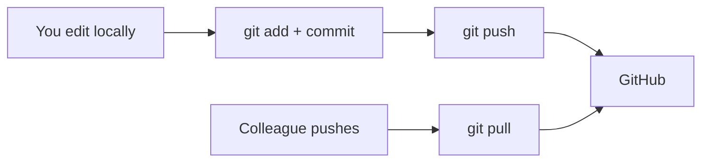

## GitHub and Remote Repositories

> **Connection with the previous lesson:** so far everything happened on your computer. Time to go online: today we register on GitHub, create the first remote repository, and learn the two main commands of remote work — `git push` (send) and `git pull` (receive).

---

## Lesson Goal

Understand what a remote repository is, learn to connect a local repository to GitHub and exchange commits with it, so that your project can be stored in the cloud and shared with anyone.

## What You Will Learn by the End of the Lesson

- Create an account and a repository on GitHub.
- Clone an existing project with `git clone`.
- Connect a local repository to a remote one with `git remote add origin`.
- Send commits to GitHub with `git push`.
- Receive updates with `git pull`.
- Understand the difference between HTTPS and SSH connection methods.

---

## Lesson Timeline

| Block | Content |
| --- | --- |
| 1. GitHub and the first repository | Account, "New repository" page fields |
| 2. `git clone` | Getting a ready project to your computer |
| 3. The remote connection: `origin` | `git remote -v`, `git remote add origin` |
| 4. `git push` | Sending commits to GitHub |
| 5. HTTPS or SSH | The two connection methods |
| 6. `git pull` | Receiving changes |
| 7. Mini-task | Push the course repository |
| 8. Summary and practice | Reinforcement |

---

## Block 1. GitHub and the First Repository

We already know from lesson 1: Git is the tool, GitHub is the platform. Today we link them together.

### Step 1. Register

Go to [github.com](https://github.com) and click **Sign up**. The steps are usual: email, password, username, confirm. After registration you'll land on your profile.

> **Tip on the username:** in practice, the profile name turns into a public identifier — like `you/portfolio` in repository addresses. Pick a username that looks professional.

### Step 2. Create a repository

Click the **"+"** icon (top right, next to your avatar) → **New repository**. Fill in the fields:

| Field | What to enter | Recommendation |
| --- | --- | --- |
| **Repository name** | e.g. `my-portfolio` | Short, in Latin letters, hyphens instead of spaces |
| **Description** | e.g. "My first GitHub project" | Optional but useful |
| **Public / Private** | visibility | `Public` makes the repo visible to everyone (portfolio). `Private` — only to you and invited people |
| **Add a README / .gitignore / license** | checkbox | Usually **empty** if you already have a repo locally and want to link it |

Click **Create repository**. GitHub will show a screen with tips — we'll use its commands in blocks 3–4.

---

### Common Beginner Mistakes

| Error | How to Fix |
| --- | --- |
| Creating a repository "with README" and then failing to connect the local one | If the remote already has commits (README), the push needs extra steps — easier to create an empty repo first |
| Making a public repository out of private work | Double-check the visibility switch; a private repo is always safer for learning |
| Writing the repository name with spaces or caps | GitHub converts/forbids some characters; Latin lowercase and hyphen work everywhere |
| Expecting the repository to appear "with files" | An empty repo has no files — you fill it via `push` |

---

## Block 2. `git clone`: Getting a Ready Project

At some point you'll want to work with someone else's public repository — copy it locally:

```bash
git clone https://github.com/Saydullayev017/Git.git
```

`git clone` does several things at once:

- creates a folder named after the repository (`Git`);
- copies all files into it;
- copies the entire history (all commits);
- **automatically** sets up the remote connection named `origin`.

Go into the folder to check:

```bash
cd Git
git remote -v    # origins already configured
git log --oneline
```

**In simple terms:** `clone` is "copy someone's project's history to your computer in one command." You can even clone your own repository — if it already exists on GitHub.

> **Distinction:** on GitHub, `git clone https://github.com/user/repo.git` copies the repo to your computer; **no authorization needed** for public repositories — view and copy are open to everyone.

---

## Block 3. The Remote Connection: `origin`

**A remote** is a link between your local repository and some remote one — in our case, a specific repository on GitHub.

### The standard name `origin`

`origin` is the **traditionally accepted name** for the first and main remote. It's not a technical requirement — just a convention, meaning "the place this project comes from." You'll hear this word constantly: "push to origin", "origin/main".

### Connecting your local repository

Let's say you have the local `my-first-repo` from lesson 1 and an empty repository on GitHub (`my-first-repo`). Connect them:

```bash
cd my-first-repo
git remote add origin https://github.com/<your-username>/my-first-repo.git
```

Check that the remote is registered:

```bash
git remote -v
```

You'll see two lines (fetch and push) with the same address.

It's also useful to know which branches the remote has. Our local repo still doesn't know the remote's branches exist — the `-u` flag fixes that in block 4.

---

### Common Beginner Mistakes

| Error | How to Fix |
| --- | --- |
| Typing the wrong repository URL | Redo it: `git remote set-url origin <correct-URL>` |
| Adding a remote in the wrong folder | A remote belongs to a specific repository folder; run the command from inside it |
| Confusing `clone` and `remote add` | `clone` copies + connects in one go; `remote add` only adds the link to an existing folder |
| Searching "the origin folder" in the repository | Origin is not a folder — it's a record in git config with the remote address |

---

## Block 4. `git push`: Sending Commits

Now send the master branch from the local repository to GitHub. The first time, tell Git the correspondence using the `-u` flag ("upstream"):

```bash
git push -u origin master
```

Git will ask for authorization (username and password/token — about this in block 5), then:

```text
Enumerating objects: 3, done.
...
To https://github.com/<your-username>/my-first-repo.git
 * [new branch]      master -> master
Branch 'master' set up to track remote branch 'master' from 'origin'.
```

On GitHub the page will now show your files and commits. **The first push is the most important** — after it, every subsequent one is shorter:

```bash
git push
```

**About the `-u` flag:** it records the "default remote branch" correspondence so Git doesn't have to repeat `origin master` every time. This is exactly why `git clone` is so convenient — the correspondence is set up automatically.

---

## Block 5. HTTPS or SSH

At the moment of authorization you'll face a choice of how GitHub "recognizes" you. Two main methods:

### HTTPS (address like `https://github.com/...`)

- **How it works:** you authorize either with a password + login, or — more correctly — with a **personal access token** (a special "passphrase" generated in GitHub settings: *Settings → Developer settings → Personal access tokens*).
- **Pros:** works everywhere, easiest for beginners.
- **Cons:** you need to enter a name and token periodically (or store them in a helper).

### SSH (address like `git@github.com:user/repo.git`)

- **How it works:** you generate a **key pair** on your computer once (`ssh-keygen`), add the public key to GitHub (*Settings → SSH and GPG keys*). After that, no password is ever requested again.
- **Pros:** the most convenient and secure way for daily work.
- **Cons:** one-time setup requires a few commands.

**Recommendation for this course:** start with **HTTPS** to keep moving; if you plan to work with Git regularly, set up SSH in lesson 9 practice.

> **Note for 2024+:** GitHub no longer accepts your browser password for Git operations over HTTPS — be sure to create a Personal access token and use it instead.

---

### Common Beginner Mistakes

| Error | How to Fix |
| --- | --- |
| Entering a regular GitHub password during `push` over HTTPS | Since 2021, Git asks for a token, not a password — create one in settings |
| Forgetting `-u` on the first push and getting "no upstream" | Either add `-u` the first time, or use `git branch --set-upstream-to=origin/master master` |
| Trying to push and getting an error "rejected" (remote has newer commits) | Pull your changes first — the remote needs to be synced (block 6) |
| Storing the token in the repo files | Tokens and passwords must not be committed — they're in `.gitignore` territory (lesson 7) |

---

## Block 6. `git pull`: Receiving Changes

Real projects change from the server side too — a colleague pushed a new feature, or you accepted a "Pull Request" on GitHub (lesson 6). To receive changes:

```bash
git pull
```

Under the hood, `git pull` = `git fetch` (download the remote history) + `git merge` (merge it into the current branch). If you now continue working locally and someone has changed the same place on GitHub — the same **conflict** rules as in lesson 3 apply.

**The classic workflow of a developer:**



---

## Block 7. Mini-Task

Create your first full round trip — from zero:

1. Create an empty repository on GitHub called `hello-remote`.
2. Locally, in a new folder, initialize Git, add `hello.txt`, commit.
3. Add the remote with `git remote add origin <URL>`.
4. Push to `master` with `-u`.
5. On GitHub, refresh and make sure the file and commit are there. Then run `git pull` and see "Already up to date."

**Solution:**

```bash
mkdir hello-remote && cd hello-remote
git init
echo "Hello, GitHub!" > hello.txt
git add hello.txt
git commit -m "feat: add hello"
git remote add origin https://github.com/<username>/hello-remote.git
git push -u origin master
git pull
```

---

## Lesson Summary

Today you learned:

- **GitHub** stores repositories in the cloud: create, share, collaborate.
- **`git clone`** copies a ready project with full history and automatically configures `origin`.
- **`git remote add origin <URL>`** connects a local repository to a remote one.
- **`git push`** / **`git pull`** send and receive commits.
- HTTPS (token) and SSH (key pair) are the two authorization methods.

---

## Practice

1. Register on GitHub and create a public repository `my-first-repo`.
2. Connect your local repository from lessons 1–4 and push it with `git push -u origin master`.
3. Create a Personal access token in GitHub settings and try pushing again via HTTPS.
4. Clone some public repository (for example, the course's own HTML repo), find how many commits it has with `git log --oneline | wc -l`.
5. Make a change in the cloned repo locally — and practice pulling it back with `git fetch origin` and `git pull`.

For work without internet, `practice-5.sh` simulates a remote using a local "bare" repository — same `push`/`pull` flow:

---

[Next lesson: Pull Requests and Teamwork →](../../Lesson-6/en/Pull%20Requests%20and%20Teamwork.md)