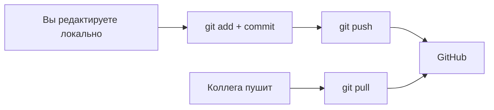

## GitHub и удалённые репозитории

> **Связь с прошлым уроком:** до сих пор всё происходило на вашем компьютере. Время выходить в интернет: сегодня регистрируемся на GitHub, создаём первый удалённый репозиторий и учим две главные команды удалённой работы — `git push` (отправить) и `git pull` (получить).

---

## Цель урока

Понять, что такое удалённый репозиторий, научиться связывать локальный репозиторий с GitHub и обмениваться коммитами, чтобы ваш проект можно было хранить в облаке и показывать кому угодно.

## Чему вы научитесь к концу урока

- Создавать аккаунт и репозиторий на GitHub.
- Клонировать существующий проект командой `git clone`.
- Связывать локальный репозиторий с удалённым командой `git remote add origin`.
- Отправлять коммиты на GitHub командой `git push`.
- Получать обновления командой `git pull`.
- Понимать разницу способов подключения HTTPS и SSH.

---

## Хронометраж урока

| Блок | Содержание |
| --- | --- |
| 1. GitHub и первый репозиторий | Аккаунт, поля страницы "New repository" |
| 2. `git clone` | Получаем готовый проект на компьютер |
| 3. Удалённое подключение: `origin` | `git remote -v`, `git remote add origin` |
| 4. `git push` | Отправка коммитов на GitHub |
| 5. HTTPS или SSH | Два способа подключения |
| 6. `git pull` | Получение изменений |
| 7. Мини-задание | Запушьте репозиторий курса |
| 8. Итоги и практическое задание | Закрепление |

---

## Блок 1. GitHub и первый репозиторий

Мы уже знаем из урока 1: Git — это инструмент, GitHub — платформа. Сегодня связываем их.

### Шаг 1. Регистрация

Зайдите на [github.com](https://github.com) и нажмите **Sign up**. Шаги обычные: почта, пароль, имя пользователя, подтверждение. После регистрации вы попадёте в свой профиль.

> **Совет про имя пользователя:** на практике имя профиля превращается в публичный идентификатор — например, `you/portfolio` в адресах репозиториев. Выбирайте имя, которое выглядит профессионально.

### Шаг 2. Создание репозитория

Нажмите на иконку **"+"** (вверху справа, рядом с аватаром) → **New repository**. Заполните поля:

| Поле | Что вводить | Рекомендация |
| --- | --- | --- |
| **Repository name** | например `my-portfolio` | Короткое, латиницей, дефисы вместо пробелов |
| **Description** | например "Мой первый проект на GitHub" | Необязательно, но полезно |
| **Public / Private** | видимость | `Public` — репозиторий виден всем (портфолио). `Private` — только вам и приглашённым |
| **Add a README / .gitignore / license** | галочки | Обычно **пусто**, если у вас уже есть локальный репозиторий, который вы хотите связать |

Нажмите **Create repository**. GitHub покажет экран с подсказками — его команды мы возьмём в блоках 3–4.

---

### Частые ошибки новичков

| Ошибка | Как исправить |
| --- | --- |
| Создать репозиторий «с README» и потом не суметь связать локальный | Если на удалении уже есть коммиты (README), push потребует дополнительных шагов — проще создать пустой репозиторий |
| Сделать публичным репозиторий с личной работой | Перепроверьте переключатель видимости; для учёбы приватный репозиторий всегда безопаснее |
| Писать имя репозитория с пробелами и заглавными | GitHub преобразует/запрещает часть символов; латиница в нижнем регистре и дефис работают везде |
| Ждать, что репозиторий «сам появится с файлами» | Пустой репозиторий без файлов — вы наполняете его через `push` |

---

## Блок 2. `git clone`: получаем готовый проект

Рано или поздно вы захотите поработать с чужим публичным репозиторием — скопировать его к себе:

```bash
git clone https://github.com/Saydullayev017/Git.git
```

`git clone` делает сразу несколько вещей:

- создаёт папку с именем репозитория (`Git`);
- копирует в неё все файлы;
- копирует всю историю (все коммиты);
- **автоматически** настраивает удалённое подключение с именем `origin`.

Зайдите в папку и проверьте:

```bash
cd Git
git remote -v    # origin уже настроен
git log --oneline
```

**Простыми словами:** `clone` — это «скопировать историю чужого проекта к себе одной командой». Можно клонировать и свой репозиторий — если он уже есть на GitHub.

> **Различение:** на GitHub команда `git clone https://github.com/user/repo.git` копирует репозиторий к вам на компьютер; **авторизация не нужна** для публичных репозиториев — посмотреть и скопировать может каждый.

---

## Блок 3. Удалённое подключение: `origin`

**Удалённый репозиторий (remote)** — это связь между вашим локальным репозиторием и каким-то удалённым — в нашем случае, конкретным репозиторием на GitHub.

### Стандартное имя `origin`

`origin` — это **традиционно принятое имя** для первого и главного remote. Это не техническое требование — просто конвенция, означающая «то место, откуда этот проект родом». Вы будете постоянно слышать это слово: «запушь в origin», «origin/main».

### Связываем локальный репозиторий

Допустим, у вас есть локальный `my-first-repo` из урока 1 и пустой репозиторий на GitHub (`my-first-repo`). Связываем:

```bash
cd my-first-repo
git remote add origin https://github.com/<your-username>/my-first-repo.git
```

Проверьте, что remote зарегистрирован:

```bash
git remote -v
```

Вы увидите две строки (fetch и push) с одним адресом.

Полезно также знать, какие ветки есть на удалённом. Наш локальный репозиторий пока не знает о ветках удалённого — это исправит флаг `-u` в блоке 4.

---

### Частые ошибки новичков

| Ошибка | Как исправить |
| --- | --- |
| Набрать адрес репозитория с ошибкой | Перепишите: `git remote set-url origin <правильный-URL>` |
| Добавить remote не в той папке | Remote относится к конкретной папке репозитория; выполняйте команду изнутри неё |
| Путать `clone` и `remote add` | `clone` копирует и подключает за раз; `remote add` только добавляет ссылку в существующую папку |
| Искать «папку origin» в репозитории | Origin — не папка, а запись в git config с адресом удалённого репозитория |

---

## Блок 4. `git push`: отправляем коммиты

Теперь отправим ветку `master` из локального репозитория на GitHub. Первый раз — с флагом `-u` («upstream»), обозначающим связь веток:

```bash
git push -u origin master
```

Git запросит авторизацию (имя и пароль/токен — об этом в блоке 5), затем:

```text
Enumerating objects: 3, done.
...
To https://github.com/<your-username>/my-first-repo.git
 * [new branch]      master -> master
Branch 'master' set up to track remote branch 'master' from 'origin'.
```

На GitHub на странице появятся ваши файлы и коммиты. **Первый push — самый важный** — после него каждая следующая отправка короче:

```bash
git push
```

**Про флаг `-u`:** он записывает «соответствие по умолчанию» веток, чтобы Git не пришлось каждый раз повторять `origin master`. Именно поэтому `git clone` так удобен — соответствие настраивается автоматически.

---

## Блок 5. HTTPS или SSH

В момент авторизации вы встретите выбор того, как GitHub вас «узнаёт». Два основных способа:

### HTTPS (адрес вида `https://github.com/...`)

- **Как работает:** авторизация либо логин+пароль, либо — правильно — **personal access token** (специальная «кодовая фраза», генерируемая в настройках GitHub: *Settings → Developer settings → Personal access tokens*).
- **Плюсы:** работает везде, проще всего для новичков.
- **Минусы:** периодически нужно вводить имя и токен (или хранить их в хелпере).

### SSH (адрес вида `git@github.com:user/repo.git`)

- **Как работает:** вы один раз генерируете **пару ключей** на компьютере (`ssh-keygen`), добавляете публичный ключ на GitHub (*Settings → SSH and GPG keys*). После этого пароль больше никогда не запрашивается.
- **Плюсы:** самый удобный и безопасный способ для ежедневной работы.
- **Минусы:** разовая настройка требует нескольких команд.

**Рекомендация для курса:** начните с **HTTPS**, чтобы не останавливаться; если планируете работать с Git постоянно — настройте SSH в практике урока 9.

> **Заметка про 2024+:** GitHub больше не принимает ваш обычный браузерный пароль для Git-операций по HTTPS — обязательно создайте Personal access token и используйте его.

---

### Частые ошибки новичков

| Ошибка | Как исправить |
| --- | --- |
| Вводить обычный пароль GitHub при `push` через HTTPS | С 2021 года Git просит токен, а не пароль — создайте его в настройках |
| Забыть `-u` при первом push и получить "no upstream" | Либо добавьте `-u` в первый раз, либо выполните `git branch --set-upstream-to=origin/master master` |
| Пытаться запушить и получить ошибку "rejected" (на удалении более новые коммиты) | Сначала подтяните изменения — удалённый репозиторий нужно синхронизировать (блок 6) |
| Хранить токен в файлах репозитория | Токены и пароли нельзя коммитить — это территория `.gitignore` (урок 7) |

---

## Блок 6. `git pull`: получаем изменения

Реальные проекты меняются и со стороны сервера — коллега запушен новую функцию, или вы приняли на GitHub какой-то "Pull Request" (урок 6). Чтобы получить изменения:

```bash
git pull
```

Под капотом `git pull` = `git fetch` (скачать удалённую историю) + `git merge` (влить её в текущую ветку). Если после этого вы продолжаете работать локально, а кто-то на GitHub изменил то же самое место — действуют те же правила **конфликтов**, что и в уроке 3.

**Классический рабочий цикл разработчика:**



---

## Мини-задание

Совершите первый полный цикл — с нуля:

1. Создайте на GitHub пустой репозиторий с именем `hello-remote`.
2. Локально в новой папке инициализируйте Git, добавьте `hello.txt`, закоммитьте.
3. Добавьте remote командой `git remote add origin <URL>`.
4. Запушьте в `master` с флагом `-u`.
5. На GitHub обновите страницу и убедитесь, что файл и коммит на месте. Затем выполните `git pull` и увидите "Already up to date."

**Решение:**

```bash
mkdir hello-remote && cd hello-remote
git init
echo "Hello, GitHub!" > hello.txt
git add hello.txt
git commit -m "feat: add hello"
git remote add origin https://github.com/<username>/hello-remote.git
git push -u origin master
git pull
```

---

## Итоги урока

Сегодня вы узнали:

- **GitHub** хранит репозитории в облаке: создавайте, делитесь, работайте вместе.
- **`git clone`** копирует готовый проект со всей историей и автоматически настраивает `origin`.
- **`git remote add origin <URL>`** связывает локальный репозиторий с удалённым.
- **`git push`** / **`git pull`** отправляют и получают коммиты.
- HTTPS (токен) и SSH (пара ключей) — два способа авторизации.

---

## Практика

1. Зарегистрируйтесь на GitHub и создайте публичный репозиторий `my-first-repo`.
2. Свяжите с ним ваш локальный репозиторий из уроков 1–4 и запушьте через `git push -u origin master`.
3. В настройках GitHub создайте Personal access token и попробуйте запушить ещё раз по HTTPS.
4. Склонируйте какой-нибудь публичный репозиторий (например, HTML-курс), посчитайте, сколько в нём коммитов: `git log --oneline | wc -l`.
5. Внесите в склонированном репозитории изменение локально — и потренируйтесь подтягивать его обратно через `git fetch origin` и `git pull`.

Чтобы тренироваться без доступа в интернет, `practice-5.sh` имитирует удалённый репозиторий локальным «bare»-репозиторием — тот же сценарий `push`/`pull`:

---

[Следующий урок: Pull Request и командная работа →](../../Lesson-6/ru/Pull%20Request%20и%20командная%20работа.md)