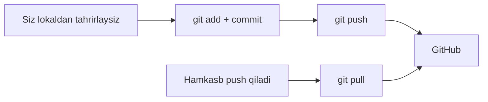

## GitHub va masofaviy repozitoriyalar

> **O'tgan dars bilan bog'liqlik:** hozirgacha hamma narsa kompyuteringizda bo'ldi. Internetga chiqish vaqti: bugun GitHubda ro'yxatdan o'tamiz, birinchi masofaviy repozitoriy yaratamiz va masofaviy ishning ikkita asosiy buyrug'ini o'rganamiz — `git push` (jo'natish) va `git pull` (qabul qilish).

---

## Dars maqsadi

Masofaviy repozitoriy nima ekanini tushunish, lokal repozitoriyani GitHubga ulashni va commitlar almashishni o'rganish, shunda loyihangizni bulutda saqlab, istalgan kishiga ko'rsatish mumkin bo'lsin.

## Dars oxirida nimani o'rganasiz

- GitHubda akkaunt va repozitoriy yaratish.
- Mavjud loyihani `git clone` bilan nusxalash.
- Lokal repozitoriyani `git remote add origin` bilan masofaviysiga ulash.
- `git push` bilan commitlarni GitHubga jo'natish.
- `git pull` bilan yangilanishlarni olish.
- HTTPS va SSH ulanish usullarining farqini tushunish.

---

## Dars vaqti

| Blok | Mazmun |
| --- | --- |
| 1. GitHub va birinchi repozitoriy | Akkaunt, "New repository" sahifasi maydonlari |
| 2. `git clone` | Tayyor loyihani kompyuterga olish |
| 3. Masofaviy ulanish: `origin` | `git remote -v`, `git remote add origin` |
| 4. `git push` | Commitlarni GitHubga jo'natish |
| 5. HTTPS yoki SSH | Ikki ulanish usuli |
| 6. `git pull` | O'zgarishlarni olish |
| 7. Mini-vazifa | Kurs repozitoriysini push qilish |
| 8. Xulosalar va amaliy vazifa | Mustahkamlash |

---

## 1-blok. GitHub va birinchi repozitoriy

1-darsdan bilamiz: Git — vosita, GitHub — platforma. Bugun ularni bog'laymiz.

### 1-qadam. Ro'yxatdan o'tish

[github.com](https://github.com) ga kiring va **Sign up** tugmasini bosing. Qadamlar odatiy: pochta, parol, foydalanuvchi nomi, tasdiqlash. Ro'yxatdan o'tgach profilingizga tushasiz.

> **Foydalanuvchi nomi haqida maslahat:** amalda profil nomi jamoat identifikatoriga aylanadi — masalan, repozitoriy manzillarida `you/portfolio`. Professional ko'rinadigan nom tanlang.

### 2-qadam. Repozitoriy yaratish

**"+"** belgisini bosing (tepada o'ngda, avatar yonida) → **New repository**. Maydonlarni to'ldiring:

| Maydon | Nima yozish | Tavsiya |
| --- | --- | --- |
| **Repository name** | masalan `my-portfolio` | Qisqa, lotincha, probel o'rniga defis |
| **Description** | masalan "GitHubdagi birinchi loyiham" | Majburiy emas, lekin foydali |
| **Public / Private** | ko'rinish | `Public` — repozitoriy hammaga ko'rinadi (portfolio). `Private` — faqat sizga va taklif qilinganlarga |
| **Add a README / .gitignore / license** | katakchalar | Odatda **bo'sh**, agar ulash istalgan lokal repozitoriy bo'lsa |

**Create repository** tugmasini bosing. GitHub maslahatlar bilan ekran ko'rsatadi — uning buyruqlarini 3–4-bloklarda olamiz.

---

### Yangi boshlovchilarning ko'p uchraydigan xatolari

| Xato | Qanday tuzatish |
| --- | --- |
| «README bilan» repozitoriy yaratib, keyin lokaldikini ulay olmaslik | Masofada commitlar bo'lsa (README), push qo'shimcha qadam talab qiladi — bo'sh repozitoriy yaratish osonroq |
| Shaxsiy ish bilan repozitoriyni public qilish | Ko'rinish kalitini tekshiring; o'qish uchun private har doim xavfsizroq |
| Repozitoriy nomini probel va katta harflar bilan yozish | GitHub ba'zi belgilarni o'zgartiradi/taqiqlaydi; kichik lotin harflari va defis hamma joyda ishlaydi |
| Repozitoriy «fayllar bilan o'zi paydo bo'ladi» deb kutish | Bo'sh repozitoriyda fayllar yo'q — siz ularni `push` orqali to'ldirasiz |

---

## 2-blok. `git clone`: tayyor loyihani olish

Ertami-kechmi boshqa birovning jamoat repozitoriysi bilan ishlashni xohlaysiz — uni o'zingizga nusxalash:

```bash
git clone https://github.com/Saydullayev017/Git.git
```

`git clone` birdaniga bir nechta ish qiladi:

- repozitoriy nomi bilan papka yaratadi (`Git`);
- unga barcha fayllarni nusxalaydi;
- butun tarixni (barcha commitlarni) nusxalaydi;
- **avtomatik** `origin` nomli masofaviy ulanishni sozlaydi.

Papkaga kirib tekshiring:

```bash
cd Git
git remote -v    # origin allaqachon sozlangan
git log --oneline
```

**Oddiy qilib:** `clone` — «birovning loyihasi tarixini bitta buyruq bilan o'zingizga nusxalash». O'z repozitoriyingizni ham klonlash mumkin — agar u GitHubda bo'lsa.

> **Farqlash:** GitHubda `git clone https://github.com/user/repo.git` buyrug'i repozitoriyni kompyuteringizga nusxalaydi; **avtorizatsiya kerak emas** jamoat repozitoriyalari uchun — ko'rish va nusxalash hammaga ochiq.

---

## 3-blok. Masofaviy ulanish: `origin`

**Masofaviy repozitoriy (remote)** — fedagil lokal repozitoriy va biror masofaviy o'rtasidagi bog'lanish — bizning holatda, GitHubdagi aniq repozitoriy.

### Standart nom `origin`

`origin` — **an'anaviy qabul qilingan nom** birinchi va asosiy remote uchun. Bu texnik talab emas — shunchaki konvensiya, «bu loyiha qayerdan kelgan joy» ma'nosida. Bu so'zni doim eshitasiz: «push into origin», «origin/main».

### Lokal repozitoriyni ulash

Aytaylik, 1-darsdagi lokal `my-first-repo` bor va GitHubda bo'sh repozitoriy (`my-first-repo`). Ulaymiz:

```bash
cd my-first-repo
git remote add origin https://github.com/<your-username>/my-first-repo.git
```

Remote ro'yxatga olinganini tekshiring:

```bash
git remote -v
```

Bitta manzil bilan ikkita qator ko'rasiz (fetch va push).

Masofaviy qaysi branchlar borligini bilish ham foydali. Lokal repozitoriy masofaviy branchlarini hali bilmaydi — buni 4-blokdagi `-u` bayrog'i tuzatadi.

---

### Yangi boshlovchilarning ko'p uchraydigan xatolari

| Xato | Qanday tuzatish |
| --- | --- |
| Repozitoriy manzilini xato yozish | Qayta yozing: `git remote set-url origin <to'g'ri URL>` |
| Remote ni noto'g'ri papkada qo'shish | Remote aniq repozitoriy papkasiga tegishli; buyruqni uning ichida bajaring |
| `clone` va `remote add`ni aralashtirish | `clone` nusxalab + ulaydi birdan; `remote add` faqat mavjud papkaga havola qo'shadi |
| Repozitoriyda «origin papkasini» qidirish | Origin — papka emas, masofaviy manzil yozilgan git config yozuvi |

---

## 4-blok. `git push`: commitlarni jo'natish

Endi `master` branchini lokal repozitoriydan GitHubga jo'natamiz. Birinchi marta — `-u` («upstream») bayrog'i bilan, branchlar bog'lanishini belgilab:

```bash
git push -u origin master
```

Git avtorizatsiya so'raydi (nom va parol/token — bu haqda 5-blokda), so'ng:

```text
Enumerating objects: 3, done.
...
To https://github.com/<your-username>/my-first-repo.git
 * [new branch]      master -> master
Branch 'master' set up to track remote branch 'master' from 'origin'.
```

GitHub sahifasida fayllaringiz va commitlaringiz paydo bo'ladi. **Birinchi push — eng muhimi** — undan keyin har bir keyingi jo'natma qisqaroq:

```bash
git push
```

**`-u` bayrog'i haqida:** u branchlarning «standart mosligini» yozadi, Gitga har safar `origin master` takrorlash shart bo'lmaydi. Aynan shuning uchun `git clone` qulay — moslik avtomatik sozlanadi.

---

## 5-blok. HTTPS yoki SSH

Avtorizatsiya paytida GitHub sizni qanday «tanishi» tanloviga duch keladi. Ikkita asosiy usul:

### HTTPS (manzil `https://github.com/...` ko'rinishida)

- **Qanday ishlaydi:** login+parol yoki — to'g'risi — **personal access token** (GitHub sozlamalarida generatsiya qilinadigan maxsus «kod ibora»: *Settings → Developer settings → Personal access tokens*).
- **Afzalliklari:** hamma joyda ishlaydi, yangi boshlovchilar uchun eng oson.
- **Kamchiliklari:** vaqti-vaqti bilan nom va token kiritish kerak (yoki ularni helperda saqlash).

### SSH (manzil `git@github.com:user/repo.git` ko'rinishida)

- **Qanday ishlaydi:** kompyuterda bir marta **kalitlar juftini** generatsiya qilasiz (`ssh-keygen`), GitHubga jamoat kalitini qo'shasiz (*Settings → SSH and GPG keys*). Shundan keyin parol qayta so'ralmaydi.
- **Afzalliklari:** kundalik ish uchun eng qulay va xavfsiz usul.
- **Kamchiliklari:** bir martalik sozlash bir nechta buyruq talab qiladi.

**Kurs uchun tavsiya:** harakatni to'xtatmaslik uchun **HTTPS**dan boshlang; muntazam Git ishlashni rejalashtirsangiz — 9-dars amaliyotida SSH sozlang.

> **2024+ haqida eslatma:** GitHub HTTPS bo'yicha Git amaliyotlari uchun oddiy brauzer parolingizni qabul qilmaydi — albatta Personal access token yarating va undan foydalaning.

---

### Yangi boshlovchilarning ko'p uchraydigan xatolari

| Xato | Qanday tuzatish |
| --- | --- |
| HTTPS orqali `push`da oddiy GitHub parolini kiritish | 2021-yildan Git parol emas, token so'raydi — uni sozlamalarda yarating |
| Birinchi pushda `-u`ni unutib "no upstream" olish | Birinchi marta `-u` qo'shing yoki `git branch --set-upstream-to=origin/master master` bajaring |
| Push qilmoqchi bo'lib "rejected" xatosini olish (masofada yangiroq commitlar bor) | Avval o'zgarishlarni torting — masofaviy repozitoriyni sinxronlash kerak (6-blok) |
| Tokeni repozitoriy fayllarida saqlash | Token va parollarni commit qilib bo'lmaydi — bu `.gitignore` hududi (7-dars) |

---

## 6-blok. `git pull`: o'zgarishlarni olish

Haqiqiy loyihalar server tomondan ham o'zgaradi — hamkasb yangi funksiya push qildi yoki GitHubda "Pull Request" (6-dars) qabul qildingiz. O'zgarishlarni olish:

```bash
git pull
```

Ichkarida `git pull` = `git fetch` (masofaviy tarixni yuklab olish) + `git merge` (uni joriy branchga qo'shish). Agar keyin lokaldan ishni davom ettirsangiz, kimdir GitHubda aynan o'sha joyni o'zgartirgan bo'lsa — 3-darsdagi **konflikt** qoidalari ishlaydi.

**Dasturchining klassik ish sikli:**



---

## Mini-vazifa

Birinchi to'liq siklni bajaring — noldan:

1. GitHubda `hello-remote` nomli bo'sh repozitoriy yarating.
2. Lokalda yangi papkada Gitni boshlang, `hello.txt` qo'shing, commitingiz.
3. `git remote add origin <URL>` bilan remote qo'shing.
4. `-u` bilan `master`ga push qiling.
5. GitHubda sahifani yangilab, fayl va commit borligiga ishonch hosil qiling. So'ng `git pull` bajaring — "Already up to date"ni ko'rasiz.

**Yechim:**

```bash
mkdir hello-remote && cd hello-remote
git init
echo "Hello, GitHub!" > hello.txt
git add hello.txt
git commit -m "feat: add hello"
git remote add origin https://github.com/<username>/hello-remote.git
git push -u origin master
git pull
```

---

## Dars xulosalari

Bugun siz quyidagilarni o'rgandingiz:

- **GitHub** repozitoriyalarni bulutda saqlaydi: yarating, ulashing, birga ishlang.
- **`git clone`** to'liq tarix bilan tayyor loyihani nusxalab, `origin`ni avtomatik sozlaydi.
- **`git remote add origin <URL>`** lokal repozitoriyni masofaviysiga bog'laydi.
- **`git push`** / **`git pull`** commitlarni jo'natadi va qabul qiladi.
- HTTPS (token) va SSH (kalitlar jufti) — ikkita avtorizatsiya usuli.

---

## Amaliy vazifa

1. GitHubda ro'yxatdan o'ting va `my-first-repo` nomli jamoat repozitoriy yarating.
2. Unga 1–4-darslardagi lokal repozitoriyingizni ulab, `git push -u origin master` bilan push qiling.
3. GitHub sozlamalarida Personal access token yarating va HTTPS orqali yana push qilib ko'ring.
4. Biror jamoat repozitoriyni klonlang (masalan, HTML kursini), commitlar sonini hisoblang: `git log --oneline | wc -l`.
5. Klonlangan repozitoriyda lokaldan o'zgartirish kiriting — va `git fetch origin` plus `git pull` orqali uni qaytarishni mashq qiling.

Internetga chiqish imkoni bo'lmasa, `practice-5.sh` masofaviy repozitoriyni lokal «bare»-repozitoriy bilan simulyatsiya qiladi — o'sha `push`/`pull` ssenariysi:

---

[Keyingi dars: Pull Request va jamoa ishi →](../../Lesson-6/uz/Pull%20Request%20va%20jamoa%20ishi.md)