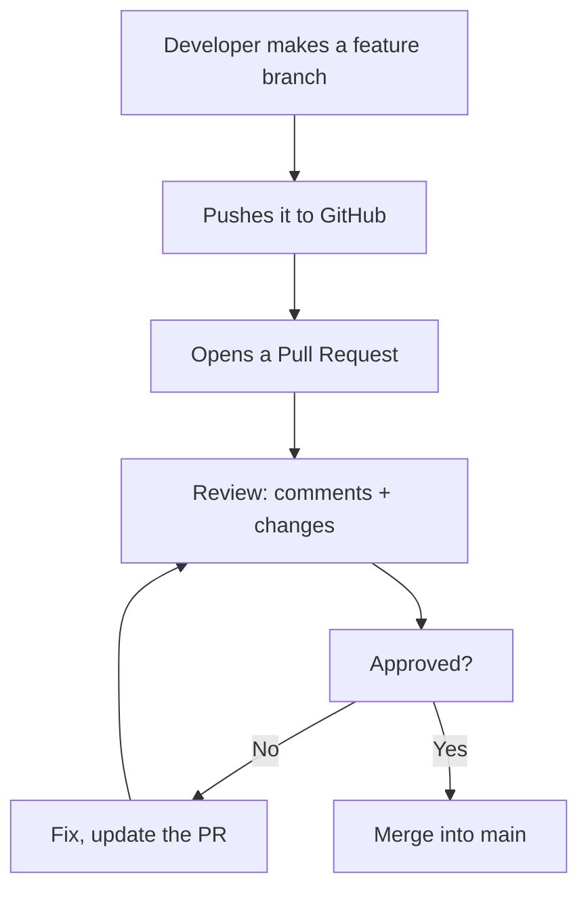
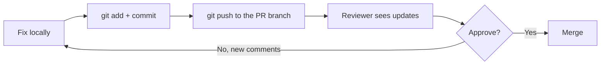

## Pull Requests and Teamwork

> **Connection with the previous lesson:** you can already push and pull — you can work with a shared repository solo. Today we learn the main mechanism of *team* work on GitHub — the **Pull Request**: how several developers contribute to one project without breaking each other's work.

---

## Lesson Goal

Understand the full team workflow on GitHub: fork, branch, Push Request, review, merge — so you can contribute to other people's projects and work in a team without fear.

## What You Will Learn by the End of the Lesson

- Explain why code is changed through Pull Requests, not by direct commits to the main branch.
- Use the fork workflow: fork → clone → new branch.
- Make a Pull Request on GitHub and describe it properly.
- Understand the review process: comments, requested changes, approvals.
- Merge a Pull Request and delete the now-unneeded branch.
- Distinguish `git fetch` and `git pull`.

---

## Lesson Timeline

| Block | Content |
| --- | --- |
| 1. Why Pull Requests | The "safety gate" versus direct editing |
| 2. Fork workflow | fork → clone → branch |
| 3. Pushing a branch and opening a PR | Feature branch to your fork, PR to the main repo |
| 4. The review | Comments, requested changes, approvals |
| 5. Merging and cleanup | Merge, delete branch, sync |
| 6. `git fetch` vs `git pull` | Downloading history without a merge |
| 7. Mini-task | Walk the team flow |
| 8. Summary and practice | Reinforcement |

---

## Block 1. Why Pull Requests

**In simple terms:** imagine a magazine. You don't come to the editor and start rewriting articles in the printed issue — you bring a text, the editor reads it, suggests edits, approves, and only then prints. A **Pull Request (PR)** is exactly that: your "article," which a person (or team) reviews and accepts before it gets into the main code.

### Why not just push into `main` directly?

On small solo projects, pushing straight to `main` is acceptable. But as soon as there is more than one developer, it breaks down:

- **No control** — changes go into the code with no one checking quality;
- **Breakage risk** — a bug lands in the main branch, every colleague's next `git pull` grabs it;
- **No discussion** — nobody understood *why* the code changed;
- **Tests disappear** — CI (automatic checks) don't run on untested edits.

A Pull Request solves all this: the changes live on a branch, are reviewed, checked, and only then merged.



---

### Common Beginner Mistakes

| Error | How to Fix |
| --- | --- |
| Committing directly to `main` in a team project | Teams protect `main` via branch rules — changes come only through PRs |
| "Disappearing" if a PR got comments | Comments on a PR = normal review; fix, push to the same branch, and the PR updates automatically |
| Opening a PR from the main branch of a fork | Make a separate feature branch so the PR is clean |
| Expecting a PR to merge itself | A PR is a proposal; it needs approval and a merge |

---

## Block 2. Fork Workflow

To change someone else's GitHub project, you need your own **copy** — that's a **fork**.

### Step 1. Fork

On the GitHub page of a project you like, press the **Fork** button (top right). GitHub creates a copy of the whole repository **in your account**. This copy is yours — you can push to it as you like.

### Step 2. Clone your fork

```bash
git clone https://github.com/<your-username>/<repo>.git
cd <repo>
```

### Step 3. Add the original as a second remote

A nice move: add the original repository as `upstream` so you can pull fresh changes from it (we'll use it in block 5):

```bash
git remote add upstream https://github.com/<original-owner>/<repo>.git
git remote -v
```

You'll see two remotes: `origin` (your fork) and `upstream` (the original).

### Step 4. Make a feature branch

Never do PR work on the main branch:

```bash
git switch -c feature/improve-readme
```

The rule of thumb: **one task — one branch — one PR**.

---

### Common Beginner Mistakes

| Error | How to Fix |
| --- | --- |
| Cloning the original instead of your fork | You can't push to the original — clone your own fork |
| Forgetting to add `upstream` | Without it, your fork won't know about the original's updates |
| Working on `main` of the fork | PRs from `main` are messy; always create a branch |
| Confusing `origin` and `upstream` | `origin` — your fork, `upstream` — the original project |

---

## Block 3. Pushing a Branch and Opening a PR

### Push the feature branch

Commit changes on the branch and push it to **your fork**:

```bash
git add README.md
git commit -m "docs: improve readme"
git push -u origin feature/improve-readme
```

GitHub will output a link — usually it's a direct suggestion to create a Pull Request, because you pushed a *new* branch.

### Open the PR

On GitHub, on the repository page you'll see a yellow panel: *"feature/improve-readme had recent pushes"* → **Compare & pull request**. Click it.

Fill the PR:

| Field | What to write |
| --- | --- |
| **base** | the branch you want to *merge into* — usually `main` of the original repository |
| **compare** | your branch (`feature/improve-readme`) |
| **Title** | short summary, e.g. `docs: improve readme` (same style as commit messages) |
| **Description** | what was changed and why; screenshots if useful |

Press **Create pull request**.

**Now the PR is a place for conversation:** code review in comments, discussion, and fixes all happen here.

---

### Common Beginner Mistakes

| Error | How to Fix |
| --- | --- |
| Pushing without `-u` and then not finding the branch | The first push of a branch wants `-u origin <branch>` |
| Choosing the wrong `base` | Check that base = the branch you want to merge *into*, compare = yours |
| Leaving the PR description empty | A good description is half the review — explain what and why |
| Creating a PR and going silent | The maintainers can't guess your intent; be ready to answer comments |

---

## Block 4. The Review

**Review** is reading and discussing someone else's code before merging. GitHub gives it shape: inline comments on specific lines, a general conversation, and a verdict.

### Comment styles

| Verdict | Meaning |
| --- | --- |
| Comment | Just a remark or question — no obstacle to merging |
| Approve | Everything fine — the PR can be merged |
| Request changes | Something needs fixing — merge blocked |

### Responding to review

The usual loop:

1. You got comments → fix the code on the local feature branch.
2. Commit and push: `git push` — **the PR updates automatically** (same branch).
3. Reply to the comments so the reviewer knows what changed.

You see how everything works together: the branch is long-lived, the PR is the window to it, and every push refreshes what the reviewer sees.



---

## Block 5. Merging and Cleanup

Approved the PR? The maintainer (or the author, if they have rights) presses **Merge pull request**. GitHub offers three merge types:

| Type | History result | When |
| --- | --- | --- |
| **Create a merge commit** | A "< >" merge is recorded | Keeping the full branch history |
| **Squash and merge** | All PR commits collapse into one | Clean linear history |
| **Rebase and merge** | Commits are replayed onto the base | Clean history with preserved commits |

For learning, **Squash and merge** is the most common choice — neat and tidy.

After merging, GitHub usually offers to **Delete branch** — click it: on the project the branch is no longer needed.

### Syncing your fork

Your fork now lags behind the original: the PR became part of `upstream`. Get it locally:

```bash
git switch master
git pull upstream master      # pull fresh changes from the original
git push origin master        # sync your fork on GitHub too
```

**This is the complete team loop:** fork → branch → push → PR → review → merge → sync.

---

## Block 6. `git fetch` vs `git pull`

You've already met `git pull`. Now the distinction that matters for teamwork:

- **`git fetch`** — downloads the remote history but **does nothing** with the working directory. Branches and changes arrive as `origin/branch-name`, which you can inspect.
- **`git pull`** — `fetch` + immediately `merge` into the current branch.

When is `fetch` useful? When you want to safely look at changes before merging them:

```bash
git fetch origin
git log origin/master --oneline    # what's new on the remote, without changing anything
git diff master origin/master      # what exactly differs
```

**Analogy:** `fetch` is bringing the mail to your door (you decide when to open it), `pull` is bringing it and immediately opening every letter.

---

## Block 7. Mini-Task

Walk the whole team flow on a training pair of repositories (the `practice-6.sh` script does it locally — without GitHub):

1. Create a feature branch from `main`.
2. Add and commit changes.
3. "Push" to the remote (in the script — a local bare repo), open "PR" conceptually.
4. Pull the same branch into a second local copy — this is how the reviewer sees your changes.
5. Merge the feature branch into `main` locally, and sync both copies.

**Solution:**

```bash
git switch -c feature/welcome
echo "Hello from PR" > welcome.txt
git add welcome.txt
git commit -m "feat: add welcome"
git push -u origin feature/welcome
# reviewer side:
git fetch origin
git switch feature/welcome
git switch main
git merge feature/welcome
git push origin main
```

---

## Lesson Summary

Today you learned:

- **Pull Request** is the "editor's desk": changes on a branch, review, approval, merge.
- Team workflow: **fork → clone → branch → push → PR → review → merge → sync**.
- Review lives on comments: approve, comment, request changes.
- After merging, delete the branch and sync the fork via `upstream`.
- `git fetch` downloads history without merging; `git pull` fetches *and* merges.

---

## Practice

On GitHub with a real repository (or locally with `practice-6.sh`):

1. Fork any public course repository (e.g., the HTML one).
2. Clone your fork, add `upstream` pointing to the original.
3. Make a branch, add the file `my-notes.md`, commit, push.
4. Open a real Pull Request to the original with a description.
5. If comments arrive — fix, push to the same branch, reply in the PR.
6. After merging (real or simulated), sync the fork: `git pull upstream main` + `git push origin main`.

Local simulation — the `practice-6.sh` script:

---

[Next lesson: .gitignore and Project Hygiene →](../../Lesson-7/en/.gitignore%20and%20Project%20Hygiene.md)