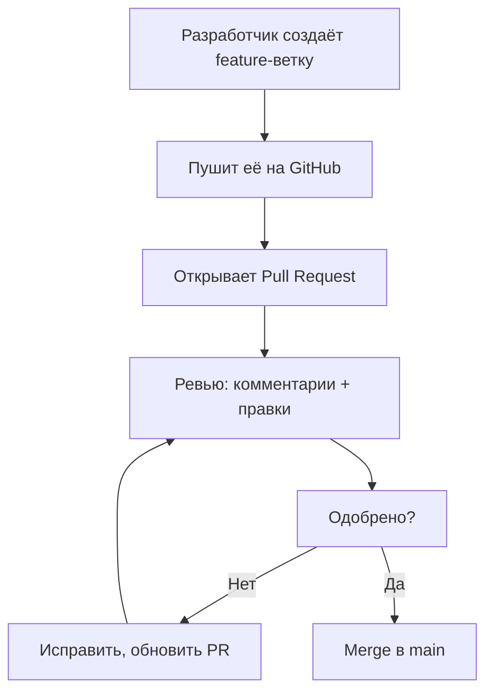
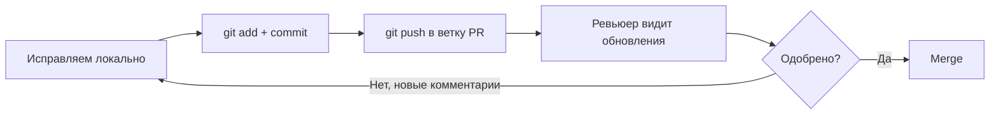

## Pull Request и командная работа

> **Связь с прошлым уроком:** вы уже умеете пушить и тянуть — можете работать с общим репозиторием в одиночку. Сегодня учим главный механизм *командной* работы на GitHub — **Pull Request**: как несколько разработчиков вносят изменения в один проект, не ломая работу друг друга.

---

## Цель урока

Понять полный командный цикл на GitHub: fork, ветка, Pull Request, ревью, слияние — чтобы уметь вносить вклад в чужие проекты и работать в команде без страха.

## Чему вы научитесь к концу урока

- Объяснять, почему код меняют через Pull Request, а не прямыми коммитами в основную ветку.
- Пользоваться fork-сценарием: fork → clone → новая ветка.
- Создавать Pull Request на GitHub и правильно его описывать.
- Понимать процесс ревью: комментарии, "запрошены изменения", одобрение.
- Сливать Pull Request и удалять ставшую ненужной ветку.
- Различать `git fetch` и `git pull`.

---

## Хронометраж урока

| Блок | Содержание |
| --- | --- |
| 1. Зачем Pull Request | «Контрольная точка» против правки напрямую |
| 2. Fork-сценарий | fork → clone → ветка |
| 3. Пуш ветки и создание PR | Feature-ветка в свой форк, PR в основной репозиторий |
| 4. Ревью | Комментарии, запрошенные изменения, одобрение |
| 5. Слияние и уборка | Merge, удаление ветки, синхронизация |
| 6. `git fetch` vs `git pull` | Скачивание истории без слияния |
| 7. Мини-задание | Пройдите командный цикл |
| 8. Итоги и практическое задание | Закрепление |

---

## Блок 1. Зачем Pull Request

**Простыми словами:** представьте журнал. Вы не приходите к редактору и не переписываете статьи прямо в печатном номере — вы приносите текст, редактор его читает, предлагает правки, одобряет, и только потом печатает. **Pull Request (PR)** — ровно это: ваш «текст», который человек (или команда) проверяет и принимает перед тем, как он попадает в основную ветку.

### Почему нельзя просто пушить в `main` напрямую?

На маленьких соло-проектах пуш прямо в `main` допустим. Но как только разработчиков становится больше — всё ломается:

- **Нет контроля** — изменения уходят в код без проверки качества;
- **Риск поломки** — баг попадает в основную ветку, и каждый коллега при следующем `git pull` его подтягивает;
- **Нет обсуждения** — никто не понял, *зачем* изменился код;
- **Пропадают проверки** — CI (автоматические проверки) не работают на неотредактированные изменения.

Pull Request решает всё это: изменения живут на ветке, проверяются, обсуждаются и только потом сливаются.



---

### Частые ошибки новичков

| Ошибка | Как исправить |
| --- | --- |
| Коммитить напрямую в `main` в командном проекте | Команды защищают `main` правилами веток — изменения приходят только через PR |
| «Пропасть», если PR получил комментарии | Комментарии в PR = обычное ревью; исправьте, запушите в ту же ветку — PR обновится автоматически |
| Открывать PR из основной ветки форка | Сделайте отдельную feature-ветку, чтобы PR был чистым |
| Ждать, что PR «сам себя смержит» | PR — это предложение; ему нужно одобрение и слияние |

---

## Блок 2. Fork-сценарий

Чтобы изменить чужой проект на GitHub, нужна ваша собственная **копия** — это и есть **fork**.

### Шаг 1. Fork

На странице GitHub проекта, который вам нравится, нажмите кнопку **Fork** (вверху справа). GitHub создаст копию всего репозитория **в вашем аккаунте**. Эта копия ваша — можете пушить в неё как угодно.

### Шаг 2. Клонируйте свой форк

```bash
git clone https://github.com/<your-username>/<repo>.git
cd <repo>
```

### Шаг 3. Добавьте оригинал вторым remote

Красивый ход: добавьте оригинальный репозиторий под именем `upstream`, чтобы подтягивать из него свежие изменения (используем в блоке 5):

```bash
git remote add upstream https://github.com/<original-owner>/<repo>.git
git remote -v
```

Вы увидите два remote: `origin` (ваш форк) и `upstream` (оригинал).

### Шаг 4. Сделайте feature-ветку

Работу для PR никогда не ведут на основной ветке:

```bash
git switch -c feature/improve-readme
```

Правило на всю жизнь: **одна задача — одна ветка — один PR**.

---

### Частые ошибки новичков

| Ошибка | Как исправить |
| --- | --- |
| Клонировать оригинал вместо своего форка | В оригинал вы запушить не можете — клонируйте свой форк |
| Забыть добавить `upstream` | Без него ваш форк ничего не знает об обновлениях оригинала |
| Работать на `main` форка | PR из `main` грязный; всегда создавайте ветку |
| Путать `origin` и `upstream` | `origin` — ваш форк, `upstream` — проект-оригинал |

---

## Блок 3. Пуш ветки и создание PR

### Запушьте feature-ветку

Закоммитьте изменения на ветке и запушьте её в **свой форк**:

```bash
git add README.md
git commit -m "docs: improve readme"
git push -u origin feature/improve-readme
```

GitHub выведет ссылку — обычно это прямое предложение создать Pull Request, потому что вы запушли *новую* ветку.

### Откройте PR

На GitHub на странице репозитория появится жёлтая панель: *"feature/improve-readme had recent pushes"* → **Compare & pull request**. Кликните.

Заполняем PR:

| Поле | Что писать |
| --- | --- |
| **base** | ветка, *в* которую сливаем — обычно `main` оригинального репозитория |
| **compare** | ваша ветка (`feature/improve-readme`) |
| **Title** | краткая сводка, например `docs: improve readme` (тот же стиль, что у коммитов) |
| **Description** | что изменилось и зачем; скриншоты, если полезно |

Нажмите **Create pull request**.

**Теперь PR — место для разговора:** ревью кода в комментариях, обсуждение и правки — всё здесь.

---

### Частые ошибки новичков

| Ошибка | Как исправить |
| --- | --- |
| Пушить без `-u` и потом не найти ветку | Первый пуш ветки требует `-u origin <ветка>` |
| Выбрать неверный `base` | Проверяйте: base = ветка, *в* которую сливаем; compare = ваша |
| Оставить описание PR пустым | Хорошее описание — половина ревью: объясните «что» и «зачем» |
| Создать PR и замолчать | Мейнтейнеры не угадают ваши намерения; будьте готовы отвечать на комментарии |

---

## Блок 4. Ревью

**Ревью** — это чтение и обсуждение чужого кода перед слиянием. GitHub придаёт этому форму: инлайн-комментарии к конкретным строкам, общий разговор и вердикт.

### Виды комментариев

| Вердикт | Значение |
| --- | --- |
| Comment | Просто замечание или вопрос — не мешает слиянию |
| Approve | Всё в порядке — PR можно сливать |
| Request changes | Что-то нужно исправить — слияние заблокировано |

### Ответ на ревью

Обычный цикл:

1. Пришли комментарии → исправьте код на локальной feature-ветке.
2. Закоммитьте и запушите: `git push` — **PR обновится автоматически** (та же ветка).
3. Ответьте на комментарии, чтобы ревьюер знал, что изменилось.

Видите, как всё работает вместе: ветка живёт долго, PR — окно в неё, и каждый пуш обновляет то, что видит ревьюер.



---

## Блок 5. Слияние и уборка

PR одобрен? Мейнтейнер (или автор, если есть права) жмёт **Merge pull request**. GitHub предлагает три типа слияния:

| Тип | Как выглядит история | Когда |
| --- | --- | --- |
| **Create a merge commit** | Записывается «<>»-слияние | Когда важно сохранить всю историю ветки |
| **Squash and merge** | Все коммиты PR схлопываются в один | Чистая линейная история |
| **Rebase and merge** | Коммиты перекладываются на основную ветку | Чистая история с сохранением коммитов |

Для обучения чаще всего выбирают **Squash and merge** — аккуратно и опрятно.

После слияния GitHub обычно предлагает **Delete branch** — кликайте: на проекте ветка больше не нужна.

### Синхронизация форка

Ваш форк теперь отстаёт от оригинала: PR стал частью `upstream`. Получаем локально:

```bash
git switch master
git pull upstream master      # подтянуть свежие изменения из оригинала
git push origin master        # синхронизировать и ваш форк на GitHub
```

**Это полный командный цикл:** fork → ветка → push → PR → ревью → merge → синхронизация.

---

## Блок 6. `git fetch` vs `git pull`

`git pull` вы уже знаете. Теперь различие, важное для командной работы:

- **`git fetch`** — скачивает удалённую историю, но **ничего не делает** с рабочей директорией. Ветки и изменения приходят как `origin/имя-ветки`, их можно рассматривать.
- **`git pull`** — `fetch` + сразу `merge` в текущую ветку.

Когда полезен `fetch`? Когда хочется безопасно посмотреть изменения до их слияния:

```bash
git fetch origin
git log origin/master --oneline    # что нового на удалённом, ничего не меняя
git diff master origin/master      # что именно отличается
```

**Аналогия:** `fetch` — принести почту к двери (вы решаете, когда вскрывать), `pull` — принести и сразу вскрыть каждое письмо.

---

## Мини-задание

Пройдите весь командный цикл на учебной паре репозиториев (скрипт `practice-6.sh` делает это локально — без GitHub):

1. Создайте feature-ветку от `main`.
2. Добавьте и закоммитьте изменения.
3. «Запушьте» на удалённый (в скрипте — локальный bare-репозиторий), «откройте PR» концептуально.
4. Подтяните ту же ветку во вторую локальную копию — так ревьюер видит ваши изменения.
5. Слейте feature-ветку в `main` локально и синхронизируйте обе копии.

**Решение:**

```bash
git switch -c feature/welcome
echo "Hello from PR" > welcome.txt
git add welcome.txt
git commit -m "feat: add welcome"
git push -u origin feature/welcome
# сторона ревьюера:
git fetch origin
git switch feature/welcome
git switch main
git merge feature/welcome
git push origin main
```

---

## Итоги урока

Сегодня вы узнали:

- **Pull Request** — это «стол редактора»: изменения на ветке, ревью, одобрение, слияние.
- Командный цикл: **fork → clone → ветка → push → PR → ревью → merge → синхронизация**.
- Ревью живёт в комментариях: approve, comment, request changes.
- После слияния ветку удаляют, а форк синхронизируют через `upstream`.
- `git fetch` скачивает историю без слияния; `git pull` скачивает *и* сливает.

---

## Практика

На GitHub с реальным репозиторием (или локально со `practice-6.sh`):

1. Форкните любой публичный репозиторий курса (например, HTML).
2. Клонируйте свой форк, добавьте `upstream` на оригинал.
3. Сделайте ветку, добавьте файл `my-notes.md`, закоммитьте, запушьте.
4. Откройте настоящий Pull Request в оригинал с описанием.
5. Если пришли комментарии — исправьте, запушите в ту же ветку, ответьте в PR.
6. После слияния (реального или в симуляции) синхронизируйте форк: `git pull upstream main` + `git push origin main`.

Локальная симуляция — скрипт `practice-6.sh`:

---

[Следующий урок: .gitignore и гигиена проекта →](../../Lesson-7/ru/.gitignore%20и%20гигиена%20проекта.md)