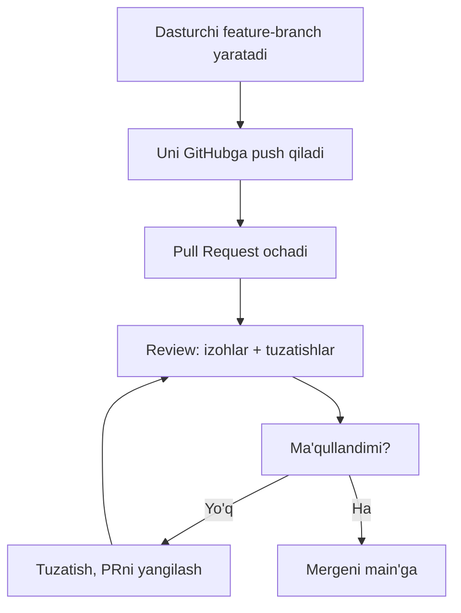
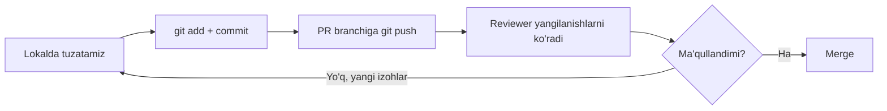

## Pull Request va jamoa ishi

> **O'tgan dars bilan bog'liqlik:** siz push va pull qilishni bilasiz — umumiy repozitoriy bilan yolg'iz ishlay olasiz. Bugun GitHubdagi *jamoaviy* ishning asosiy mexanizmini — **Pull Request**ni o'rganamiz: bir nechta dasturchi bitta loyihaga qanday o'zgarish kiritib, bir-birining ishini buzmasligi.

---

## Dars maqsadi

GitHubdagi to'liq jamoaviy siklni tushunish: fork, branch, Pull Request, review, birlashtirish — boshqa odamlarning loyihalariga hissa qo'shish va jamoada qo'rqmasdan ishlash.

## Dars oxirida nimani o'rganasiz

- Kod nima uchun Pull Request orqali o'zgartirilishini, asosiy branchga to'g'ridan-to'g'ri commit emasligini tushuntirish.
- Fork-ssenariyidan foydalanish: fork → clone → yangi branch.
- GitHubda Pull Request yaratish va uni to'g'ri ta'riflash.
- Review jarayonini tushunish: izohlar, «o'zgartirish so'ralgan», ma'qullash.
- Pull Requestni birlashtirish va keraksiz bo'lib qolgan branchni o'chirish.
- `git fetch` va `git pull`ni farqlash.

---

## Dars vaqti

| Blok | Mazmun |
| --- | --- |
| 1. Nima uchun Pull Request | «Nazorat nuqtasi» to'g'ridan-to'g'ri tahrirdan |
| 2. Fork-ssenariy | fork → clone → branch |
| 3. Branchni push qilish va PR ochish | O'z forkinga feature-branch, asosiy repozitoriysiga PR |
| 4. Review | Izohlar, so'ralgan o'zgarishlar, ma'qullash |
| 5. Birlashtirish va tozalash | Merge, branchni o'chirish, sinxronlash |
| 6. `git fetch` vs `git pull` | Birlashtirmasdan tarixni yuklab olish |
| 7. Mini-vazifa | Jamoa siklini o'ting |
| 8. Xulosalar va amaliy vazifa | Mustahkamlash |

---

## 1-blok. Nima uchun Pull Request

**Oddiy qilib aytganda:** jurnalni tasavvur qiling. Siz muharrirga kelib, chop etilgan nashrda maqolalarni qayta yozib bo'lmaydi — matn olib kelasiz, muharrir o'qiydi, tuzatishlar taklif qiladi, ma'qullaydi va faqat keyin chop etadi. **Pull Request (PR)** — aynan shu: sizning «matningiz», uni asosiy branchga tushishdan oldin inson (yoki jamoa) tekshirib qabul qiladi.

### Nega `main`ga to'g'ridan-to'g'ri push qilib bo'lmaydi?

Kichik solo loyihalarda to'g'ridan-to'g'ri `main`ga push qilish mumkin. Ammo dasturchilar ko'payishi bilan hammasi buziladi:

- **Nazorat yo'q** — o'zgarishlar sifatni tekshirmasdan kodga tushadi;
- **Buzilish xavfi** — xato asosiy branchga tushib, har bir hamkasbning keyingi `git pull`iga kiradi;
- **Muhokama yo'q** — hech kim kod*ning* *nima uchun* o'zgarganini tushunmaydi;
- **Tekshiruvlar yo'qoladi** — CI (avtomatik tekshiruvlar) sinovdan o'tmagan tahrirlarda ishlamaydi.

Pull Request bularning hammasini hal qiladi: o'zgarishlar branchda yashaydi, tekshiriladi, muhokama qilinadi va faqat keyin birlashadi.



---

### Yangi boshlovchilarning ko'p uchraydigan xatolari

| Xato | Qanday tuzatish |
| --- | --- |
| Jamoa loyihasida to'g'ridan-to'g'ri `main`ga commit | Jamoalar `main`ni branch qoidalari bilan himoya qiladi — o'zgarishlar faqat PR orqali keladi |
| PR izohlar olgach «g'oyib bo'lish» | PRdagi izohlar oddiy review; tuzating, o'sha branchga push qiling — PR avtomatik yangilanadi |
| Forkning asosiy branchidan PR ochish | Alohida feature-branch qiling, PR toza bo'ladi |
| PR «o'zi o'zini merge qiladi» deb kutish | PR — taklif; unga ma'qullash va birlashtirish kerak |

---

## 2-blok. Fork-ssenariy

Boshqa birovning GitHub loyihasini o'zgartirish uchun o'zingizning **nusxangiz** kerak — bu **fork**.

### 1-qadam. Fork

Yaxshi ko'rgan loyihaning GitHub sahifasida **Fork** tugmasini bosing (tepadagi o'ngda). GitHub butun repozitoriyning nusxasini **sizning akkauntingizda** yaratadi. Bu nusxa sizniki — unga xohlagancha push qilishingiz mumkin.

### 2-qadam. Forkingizni klonlang

```bash
git clone https://github.com/<your-username>/<repo>.git
cd <repo>
```

### 3-qadam. Aslini ikkinchi remote qilib qo'shing

Chiroyli harakat: asl repozitoriyni `upstream` nomi bilan qo'shing, undan yangi o'zgarishlarni tortib olish uchun (5-blokda ishlatamiz):

```bash
git remote add upstream https://github.com/<original-owner>/<repo>.git
git remote -v
```

Ikkita remote ko'rasiz: `origin` (forkingiz) va `upstream` (asl).

### 4-qadam. Feature-branch yarating

PR ishi hech qachon asosiy branchda bajarilmaydi:

```bash
git switch -c feature/improve-readme
```

Umrbod qoida: **bitta vazifa — bitta branch — bitta PR**.

---

### Yangi boshlovchilarning ko'p uchraydigan xatolari

| Xato | Qanday tuzatish |
| --- | --- |
| Aslini emas, forkni klonlash | Aslga push qilib bo'lmaydi — o'z forkingizni klonlang |
| `upstream` qo'shishni unutish | Unisiz forkingiz asl yangilanishlaridan bexabar |
| Fork `main`ida ishlash | `main`dan PR yopiq; har doim branch yarating |
| `origin` va `upstream`ni adashtirish | `origin` — forkingiz, `upstream` — asl loyiha |

---

## 3-blok. Branchni push qilish va PR ochish

### Feature-branchni push qiling

Branchda o'zgarishlarni commiting va uni **forkingizga** push qiling:

```bash
git add README.md
git commit -m "docs: improve readme"
git push -u origin feature/improve-readme
```

GitHub havola chiqaradi — odatda bu to'g'ridan-to'g'ri Pull Request yaratish taklifi, chunki siz *yangi* branchni push qildingiz.

### PRni oching

GitHubda repozitoriy sahifasida sariq panel ko'rinadi: *"feature/improve-readme had recent pushes"* → **Compare & pull request**. Bosing.

PRni to'ldiramiz:

| Maydon | Nima yozish |
| --- | --- |
| **base** | birlashtiriladigan branch — odatda asl repozitoriyning `main`i |
| **compare** | sizning branchingiz (`feature/improve-readme`) |
| **Title** | qisqa xulosa, masalan `docs: improve readme` (commitlar uslubida) |
| **Description** | nima o'zgargani va nima uchun; foydali bo'lsa skrinshotlar |

**Create pull request** tugmasini bosing.

**Endi PR suhbat joyi:** kod review izohlarida, muhokama va tuzatishlar — hammasi shu yerda.

---

### Yangi boshlovchilarning ko'p uchraydigan xatolari

| Xato | Qanday tuzatish |
| --- | --- |
| `-u`ssiz push qilib, branchni topa olmaslik | Branchning birinchi pushi `-u origin <branch>` ni xohlaydi |
| Noto'g'ri `base` tanlash | Tekshiring: base = birlashtiriladigan branch; compare = sizniki |
| PR tavsifini bo'sh qoldirish | Yaxshi tavsif — reviewning yarmi: «nima» va «nima uchun»ni tushuntiring |
| PR ochib, jim qolish | Maintainerlar fikringizni topa olmaydi; izohlarga javob berishga tayyor bo'ling |

---

## 4-blok. Review

**Review** — birlashtirishdan oldin boshqa odamning kodini o'qish va muhokama qilish. GitHub unga shakl beradi: aniq qatorlarga inline-izohlar, umumiy suhbat va xulosa.

### Izoh turlari

| Xulosa | Ma'nosi |
| --- | --- |
| Comment | Shunchaki mulohaza yoki savol — birlashtirishga to'sqinlik qilmaydi |
| Approve | Hammasi joyida — PRni birlashtirish mumkin |
| Request changes | Biror narsani tuzatish kerak — birlashtirish bloklangan |

### Reviewga javob

Odatdagi sikl:

1. Izohlar keldi → kodni lokal feature-branchda tuzating.
2. Commiting va push qiling: `git push` — **PR avtomatik yangilanadi** (o'sha branch).
3. Izohlarga javob bering, reviewer nima o'zgarganini bilishi uchun.

Hammasi qanday ishlayotganini ko'rasiz: branch uzoq yashaydi, PR — unga oyna, har push reviewer ko'radigan narsani yangilaydi.



---

## 5-blok. Birlashtirish va tozalash

PR ma'qullandi? Maintainer (yoki huquqi bor muallif) **Merge pull request** tugmasini bosadi. GitHub uch xil birlashtirish taklif qiladi:

| Tur | Tarix qanday ko'rinadi | Qachon |
| --- | --- | --- |
| **Create a merge commit** | «<>»-birlashuv yoziladi | Branch to'liq tarixini saqlash muhim bo'lsa |
| **Squash and merge** | PR ning barcha commitlari bittaga yig'iladi | Toza chiziqli tarix |
| **Rebase and merge** | Commitlar asosiy branchga ko'chiriladi | Commitlar saqlangan toza tarix |

O'qish uchun ko'pincha **Squash and merge** tanlanadi — chiroyli va tartib.

Birlashtirgach GitHub odatda **Delete branch** taklif qiladi — bosing: loyihada branch kerak emas.

### Forkni sinxronlash

Forkingiz endi asldan orqada: PR `upstream`ning bir qismi bo'ldi. Lokalda olamiz:

```bash
git switch master
git pull upstream master      # asldan yangi o'zgarishlarni torting
git push origin master        # GitHubdagi forkingizni ham sinxronlang
```

**Bu to'liq jamoa sikli:** fork → branch → push → PR → review → merge → sinxronlash.

---

## 6-blok. `git fetch` vs `git pull`

`git pull`ni bilasiz. Endi jamoa ishi uchun muhim farq:

- **`git fetch`** — masofaviy tarixni yuklab oladi, lekin ishchi direktoriya **bilan hech narsa qilmaydi**. Branch va o'zgarishlar `origin/branch-nom` sifatida keladi — ko'rish mumkin.
- **`git pull`** — `fetch` + darhol joriy branchga `merge`.

`fetch` qachon foydali? O'zgarishlarni birlashtirishdan oldin xavfsiz ko'rmoqchi bo'lsangiz:

```bash
git fetch origin
git log origin/master --oneline    # masofaviy yangiliklar, hech narsani o'zgartirmasdan
git diff master origin/master      # aynan nima farq qiladi
```

**Taqqoslash:** `fetch` — pochtani eshikka olib kelish (qachon ochishni siz hal qilasiz), `pull` — olib kelish va darhol har bir xatni ochish.

---

## Mini-vazifa

O'quv repozitoriy juftida butun jamoa siklini o'ting (`practice-6.sh` buni GitHub siz — lokaldan bajaradi):

1. `main`dan feature-branch yarating.
2. O'zgarishlarni qo'shib, commitingiz.
3. Masofaviyga «push» qiling (skriptda — lokal bare-repo), kontseptual «PR» oching.
4. O'sha branchni ikkinchi lokal nusxaga torting — reviewer o'zgarishlaringizni shunday ko'radi.
5. Feature-branchni `main`ga lokaldan birlashtirib, ikkala nusxani sinxronlang.

**Yechim:**

```bash
git switch -c feature/welcome
echo "Hello from PR" > welcome.txt
git add welcome.txt
git commit -m "feat: add welcome"
git push -u origin feature/welcome
# reviewer tomoni:
git fetch origin
git switch feature/welcome
git switch main
git merge feature/welcome
git push origin main
```

---

## Dars xulosalari

Bugun siz quyidagilarni o'rgandingiz:

- **Pull Request** — «muharrir stoli»: branchda o'zgarishlar, review, ma'qullash, birlashtirish.
- Jamoa sikli: **fork → clone → branch → push → PR → review → merge → sinxronlash**.
- Review izohlarda yashaydi: approve, comment, request changes.
- Birlashtirgach branch o'chiriladi, fork `upstream` orqali sinxronlanadi.
- `git fetch` birlashtirmasdan tarixni yuklab oladi; `git pull` yuklab *va* birlashtiradi.

---

## Amaliy vazifa

GitHubda real repozitoriy bilan (yoki lokaldan `practice-6.sh` bilan):

1. Kursning istalgan jamoat repozitoriysi (masalan, HTML)ni fork qiling.
2. Forkingizni klonlab, aslga `upstream` qo'shing.
3. Branch yarating, `my-notes.md` faylini qo'shing, commiting, push qiling.
4. Aslga tavsif bilan haqiqiy Pull Request oching.
5. Izohlar kelsa — tuzating, o'sha branchga push qiling, PRda javob bering.
6. Birlashtirishdan keyin (real yoki simulyatsiya) forkni sinxronlang: `git pull upstream main` + `git push origin main`.

Lokal simulyatsiya — `practice-6.sh` skripti:

---

[Keyingi dars: .gitignore va loyiha gigiyenasi →](../../Lesson-7/uz/.gitignore%20va%20loyiha%20gigiyenasi.md)