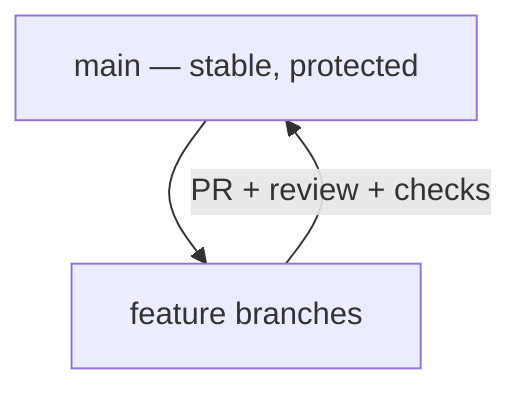
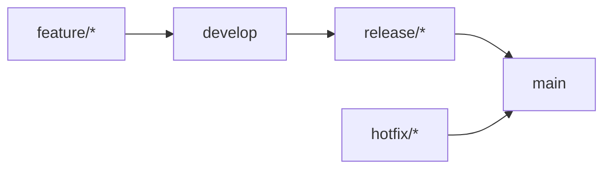
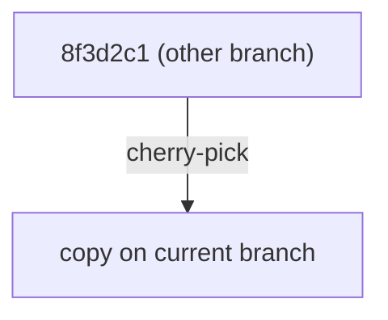

## Git Workflows

> **Connection with the previous lesson:** you can read history, tag versions, and publish releases. Now we collect everything into a system — the practice of organizing work in a team — the **workflows** developers actually use: GitHub Flow, GitFlow, and the commands that keep them alive (rebase, cherry-pick).

---

## Lesson Goal

Learn to choose an appropriate teamwork model and follow it: understand GitHub Flow as the modern default, know what GitFlow is, and safely use `rebase`, `pull --rebase`, and `cherry-pick` in everyday work.

## What You Will Learn by the End of the Lesson

- Explain what a repository workflow is and why it's needed.
- Use **GitHub Flow**: main + short feature branches + Pull Requests.
- Explain **GitFlow** and its branches: develop, feature, release, hotfix.
- Choose a workflow appropriate for the project's size.
- Understand `git rebase`, `git pull --rebase`, and `git cherry-pick`.
- Apply the golden rule of rebase: never rewrite **published** commits.

---

## Lesson Timeline

| Block | Content |
| --- | --- |
| 1. What is a workflow | Rules for a stable team repository |
| 2. GitHub Flow | The modern default: main + PR |
| 3. GitFlow | Classic with develop, release, hotfix |
| 4. Choosing a workflow | Solo → team → enterprise |
| 5. Rebase and friends | `rebase`, `pull --rebase`, `cherry-pick` |
| 6. The golden rule | Never rewrite published history |
| 7. Mini-task | Resolve the divergent branches |
| 8. Summary and practice | Reinforcement |

---

## Block 1. What Is a Workflow

**Workflow** — the agreed "traffic rules" of a repository: which branches exist, how changes get in, who reviews, and in what order. Without rules, chaos: everyone merges everything into everywhere, history turns into porridge, releases stall.

A workflow answers three questions:

1. **Where is the stable code?** (usually `main`)
2. **Where are changes born?** (feature branches, PRs)
3. **Who decides?** (reviewers, branch protection rules)

Formal rules in GitHub are enforced by **branch protection**: `main` can only receive changes through PR with reviews and passing checks — you literally can't push to it directly.



---

## Block 2. GitHub Flow

The workflow GitHub itself recommends — simple and fits 90% of projects:

1. **`main` is always releasable.**
2. New work starts with a **short-lived feature branch**: `feature/login-page`.
3. Changes come to `main` **only through Pull Requests** with review.
4. Merged features are quickly deployed (often straight to production).
5. Prefer **small, frequent** PRs over huge ones.

The loop for every task:

```bash
git switch -c feature/login-page   # from an up-to-date main
# ...work, commits...
git push -u origin feature/login-page
# open a PR, review, merge
git switch main
git pull                          # sync main
git branch -d feature/login-page  # cleanup
```

**Why it works:** short branches = small PRs = fast reviews = little conflict surface. The team always has a deployable `main`.

---

### Common Beginner Mistakes

| Error | How to Fix |
| --- | --- |
| Creating a branch from a stale `main` | Pull `main` first: `git switch main && git pull` |
| Long-lived feature branches | Workdays, not weeks — they drift from `main` and conflict |
| Giant "mega-PRs" | Break the task; small PRs get reviewed faster |
| Deleting the branch by hand everywhere | Use PR interface and `git branch -d` after merge |

---

## Block 3. GitFlow

**GitFlow** — the classic heavyweight model (by Vincent Driessen, 2010). Great for projects with **scheduled releases** and several parallel versions.

### Branches

| Branch | Purpose |
| --- | --- |
| `main` | Only released versions |
| `develop` | Accumulating changes for the next release |
| `feature/*` | New features; merged into `develop` |
| `release/*` | Preparing a release: fixes, version bump; merged into `main` and `develop` |
| `hotfix/*` | Urgent fixes directly from `main` to production |

### Lifecycle

1. Features merge into `develop`: `feature/* → develop`.
2. When enough changes — create `release/1.2.0`.
3. The release branch gets bugfixes, then merges **into `main` and `develop`**.
4. Urgent production bug → `hotfix/*` from `main`, merged into `main` and `develop`, tagged.



`main` is marked with tags (`v1.2.0`). **The gold: releases stay isolated on `main`, work in progress lives in `develop`.**

---

## Block 4. Choosing a Workflow

| Situation | Workflow |
| --- | --- |
| Solo or small team, frequent deployments | **GitHub Flow** |
| Released versions + long support of old ones | **GitFlow** |
| Only you, private repo | Any — even pushing to `main` directly |
| Big company, many teams, strict rules | GitFlow or its adaptations + protection rules |

**Recommendation:** for most projects start with **GitHub Flow** — it's enough. Move to GitFlow when there are real scheduled releases and versions to maintain in parallel.

---

## Block 5. Rebase, pull --rebase, cherry-pick

Three commands that make history beautiful.

### `git rebase` — move commits onto a new base

Say `feature` diverged from `main`, but `main` got new commits:

```text
Before:  main --- A --- B
              \
feature         C --- D

After:   main --- A --- B
                        \
feature                   C' --- D'
```

`git rebase main` takes your commits C, D and **replays** them on top of current `main`. History becomes linear — as if you'd started the branch later. Do this **locally, on unpushed commits**, before opening a PR.

### `git pull --rebase` 

The daily scenario: you push to a branch, meanwhile a colleague pushed a commit too. A plain `git pull` creates a merge commit; `git pull --rebase` replays your commits on top of the incoming ones — clean linear history:

```bash
git pull --rebase
```

### `git cherry-pick` — take one commit from anywhere

Need just one specific fix/feature commit from another branch? Pick it:

```bash
git cherry-pick 8f3d2c1
```

The commit is applied to the current branch as a new commit with the same message. Ideal for taking a hotfix to a release branch.



---

## Block 6. The Golden Rule of Rebase

**Never rebase commits that other people have already pulled/published.** Rebase rewrites commit hashes; if someone built work on top of yours, their history diverges and they get painful conflicts.

| Command | Locally, unpushed | Already published |
| --- | --- | --- |
| `rebase` | Yes — tidy the branch before the PR | **Never** |
| `pull --rebase` | Yes, everyday | Yes (it's your side) |
| `cherry-pick` | Yes | Yes — it creates new commits |

If history is already public — use `merge` for integration; rebasing public history is amateur territory.

---

## Block 7. Mini-Task

Divergence: `main` has commit B, your local `feature` has B + C (C is not pushed anywhere). Bring the branch up to date with `main` **via rebase**, keeping a linear history.

**Solution:**

```bash
git switch feature
git rebase main        # C is replayed on top of B
git log --oneline --graph   # linear: B then C
```

If a conflict appears during the rebase — resolve, then `git rebase --continue`. To bail out unsafely: `git rebase --abort`.

---

## Lesson Summary

Today you learned:

- **Workflow** — a repository's traffic rules: where stable code lives, where changes are born, who decides.
- **GitHub Flow** — main + short feature branches + quick PRs; the default for most projects.
- **GitFlow** — develop, release, hotfix; for scheduled releases and parallel versions.
- **`git rebase`** — replay commits onto a new base; **`git pull --rebase`** — daily safe sync; **`git cherry-pick`** — take one commit from another branch.
- **Golden rule** — never rebase published commits.

---

## Practice

Work out both integration styles on a training repository (`practice-9.sh`):

1. `feature` branch with 2 commits, then a commit added to `main`.
2. Compare the history with `merge` versus `rebase`: `git log --oneline --graph` after each.
3. Create a second branch with one commit and take just that commit to `main` with `git cherry-pick`.
4. Simulate a colleague committing to your branch and sync with `git pull --rebase`.

The `practice-9.sh` script walks through the whole scenario:

---

[Next lesson: Final Project — Publishing a Portfolio on GitHub Pages →](../../Lesson-10/en/Final%20Project%20—%20Publishing%20a%20Portfolio%20on%20GitHub%20Pages.md)