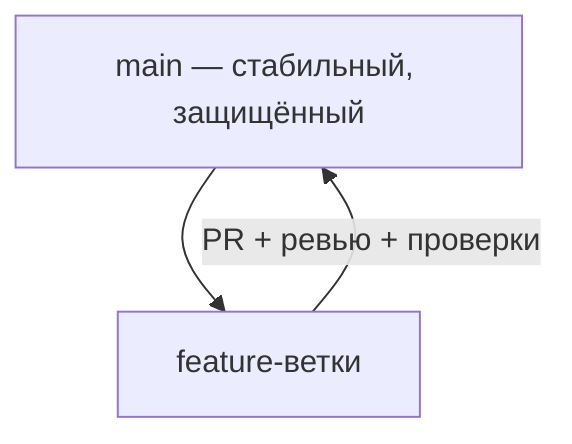
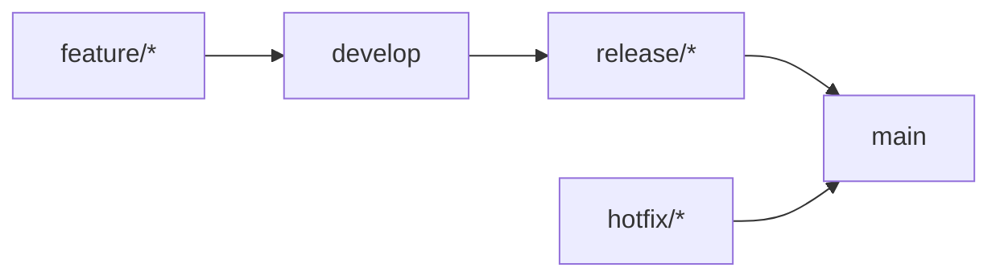
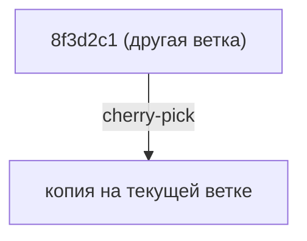

## Рабочие процессы Git (workflows)

> **Связь с прошлым уроком:** вы умеете читать историю, отмечать теги и публиковать релизы. Теперь собираем всё в систему — практику организации командной работы — **рабочие процессы**, которые реально используют разработчики: GitHub Flow, GitFlow и команды, поддерживающие их в жизни (rebase, cherry-pick).

---

## Цель урока

Научиться выбирать подходящую модель командной работы и следовать ей: понимать GitHub Flow как современный стандарт по умолчанию, знать, что такое GitFlow, и безопасно использовать `rebase`, `pull --rebase` и `cherry-pick` в повседневной работе.

## Чему вы научитесь к концу урока

- Объяснять, что такое workflow репозитория и зачем он нужен.
- Использовать **GitHub Flow**: main + короткие feature-ветки + Pull Requests.
- Объяснять **GitFlow** и его ветки: develop, feature, release, hotfix.
- Выбирать workflow соразмерно проекту.
- Понимать `git rebase`, `git pull --rebase` и `git cherry-pick`.
- Применять золотое правило rebase: никогда не переписывать **опубликованные** коммиты.

---

## Хронометраж урока

| Блок | Содержание |
| --- | --- |
| 1. Что такое workflow | Правила стабильного командного репозитория |
| 2. GitHub Flow | Современный стандарт: main + PR |
| 3. GitFlow | Классика с develop, release, hotfix |
| 4. Выбор workflow | Соло → команда → энтерпрайз |
| 5. Rebase и компания | `rebase`, `pull --rebase`, `cherry-pick` |
| 6. Золотое правило | Не переписывать опубликованную историю |
| 7. Мини-задание | Разрешить расходящиеся ветки |
| 8. Итоги и практическое задание | Закрепление |

---

## Блок 1. Что такое workflow

**Workflow** — согласованные «правила дорожного движения» репозитория: какие ветки существуют, как попадают изменения, кто ревьюит и в каком порядке. Без правил — хаос: все сливают всё во всё, история превращается в кашу, релизы стопорятся.

Workflow отвечает на три вопроса:

1. **Где стабильный код?** (обычно `main`)
2. **Где рождаются изменения?** (feature-ветки, PR)
3. **Кто решает?** (ревьюеры, правила защиты веток)

Формальные правила на GitHub закрепляют **защитой веток**: в `main` изменения попадают только через PR с ревью и прошедшими проверками — запуштить напрямую буквально нельзя.



---

## Блок 2. GitHub Flow

Workflow, который рекомендует сам GitHub, — простой и подходит 90% проектов:

1. **`main` всегда готов к релизу.**
2. Новая работа начинается с **недолгоживущей feature-ветки**: `feature/login-page`.
3. Изменения попадают в `main` **только через Pull Requests** с ревью.
4. Слитые фичи быстро выкатываются (часто сразу в продакшн).
5. Лучше **маленькие и частые** PR, чем огромные.

Цикл для каждой задачи:

```bash
git switch -c feature/login-page   # от актуального main
# ...работаем, коммиты...
git push -u origin feature/login-page
# открываем PR, ревью, merge
git switch main
git pull                          # синхронизируем main
git branch -d feature/login-page  # уборка
```

**Почему это работает:** короткие ветки = маленькие PR = быстрое ревью = мало конфликтов. У команды всегда «релизный» main.

---

### Частые ошибки новичков

| Ошибка | Как исправить |
| --- | --- |
| Создать ветку от устаревшего `main` | Сначала обновите: `git switch main && git pull` |
| Долгоживущие feature-ветки | Дни, а не недели — они уходят от `main` и конфликтуют |
| Гигантские «мега-PR» | Дробите задачу; маленькие PR ревьюют быстрее |
| Удалять ветку руками повсюду | Используйте интерфейс PR и `git branch -d` после merge |

---

## Блок 3. GitFlow

**GitFlow** — классическая тяжёлая модель (автор Vincent Driessen, 2010). Подходит проектам с **плановыми релизами** и несколькими параллельными версиями.

### Ветки

| Ветка | Назначение |
| --- | --- |
| `main` | Только выпущенные версии |
| `develop` | Накапливаются изменения для следующего релиза |
| `feature/*` | Новые фичи; сливаются в `develop` |
| `release/*` | Подготовка релиза: фиксы, подготовка версии; сливается в `main` и `develop` |
| `hotfix/*` | Срочные фиксы прямо из `main` в продакшн |

### Жизненный цикл

1. Фичи сливаются в `develop`: `feature/* → develop`.
2. Изменений достаточно — создаём `release/1.2.0`.
3. Релизная ветка получает фиксы и сливается **в `main` и `develop`**.
4. Срочный баг в проде → `hotfix/*` от `main`, сливается в `main` и `develop`, тег.



`main` отмечается тегами (`v1.2.0`). **Суть: релизы изолированы на `main`, работа — в `develop`.**

---

## Блок 4. Выбор workflow

| Ситуация | Workflow |
| --- | --- |
| Соло или маленькая команда, частые выкатки | **GitHub Flow** |
| Релизы по расписанию + длинная поддержка старых | **GitFlow** |
| Только вы, приватный репозиторий | Любой — хоть пуш напрямую в `main` |
| Большая компания, много команд, строгие правила | GitFlow или адаптации + защита веток |

**Рекомендация:** для большинства проектов начинайте с **GitHub Flow** — его достаточно. К GitFlow переходите, когда появятся реальные релизы по расписанию и версии, которые нужно поддерживать параллельно.

---

## Блок 5. Rebase, pull --rebase, cherry-pick

Три команды, которые делают историю красивой.

### `git rebase` — переносим коммиты на новую основу

Допустим, `feature` разошёлся с `main`, а у `main` появились новые коммиты:

```text
До:  main --- A --- B
              \
feature         C --- D

После:   main --- A --- B
                        \
feature                   C' --- D'
```

`git rebase main` берёт ваши коммиты C, D и **проигрывает их поверх** актуального `main`. История становится линейной — как будто вы начали ветку позже. Делайте это **локально, на незапушенных коммитах**, до открытия PR.

### `git pull --rebase`

Повседневный сценарий: вы пушите в ветку, а параллельно коллега запушил свой коммит. Обычный `git pull` создаст merge-коммит, а `git pull --rebase` проиграет ваши коммиты поверх пришедших — чистая линейная история:

```bash
git pull --rebase
```

### `git cherry-pick` — взять один коммит откуда угодно

Нужен конкретный фикс или коммит фичи с другой ветки? Заберите его:

```bash
git cherry-pick 8f3d2c1
```

Коммит применится к текущей ветке новым коммитом с тем же сообщением. Идеален, чтобы перенести hotfix в релизную ветку.



---

## Блок 6. Золотое правило rebase

**Никогда не делайте rebase коммитов, которые другие уже забрали или опубликовали.** Rebase переписывает хеши коммитов; если кто-то построил работу на ваших коммитах — его история разойдётся, и он получит мучительные конфликты.

| Команда | Локально, не запушено | Уже опубликовано |
| --- | --- | --- |
| `rebase` | Да — причешите ветку перед PR | **Никогда** |
| `pull --rebase` | Да, каждый день | Да (это ваша сторона) |
| `cherry-pick` | Да | Да — она создаёт новые коммиты |

История уже публичная — для интеграции используйте `merge`; переписывание публичной истории — удел новичков.

---

## Блок 7. Мини-задание

Расхождение: в `main` появился коммит B, у вашего локального `feature` есть B + C (C никуда не запушен). Обновите ветку до актуального `main` **через rebase**, сохранив линейную историю.

**Решение:**

```bash
git switch feature
git rebase main        # C проигрывается поверх B
git log --oneline --graph   # линейно: B, затем C
```

Если при rebase возник конфликт — разрешите и продолжите `git rebase --continue`. Сдаться невредимым: `git rebase --abort`.

---

## Итоги урока

Сегодня вы узнали:

- **Workflow** — правила дорожного движения репозитория: где живёт стабильный код, где рождаются изменения, кто решает.
- **GitHub Flow** — main + короткие feature-ветки + быстрые PR; стандарт для большинства проектов.
- **GitFlow** — develop, release, hotfix; для релизов по расписанию и параллельных версий.
- **`git rebase`** — проигрывание коммитов на новую основу; **`git pull --rebase`** — ежедневная безопасная синхронизация; **`git cherry-pick`** — взять один коммит с другой ветки.
- **Золотое правило** — никогда не переписывайте опубликованные коммиты.

---

## Практика

Отработайте оба стиля интеграции на учебном репозитории (`practice-9.sh`):

1. Создайте `feature`-ветку с 2 коммитами, затем добавьте коммит в `main`.
2. Сравните историю через `merge` и через `rebase`: `git log --oneline --graph` после каждого.
3. Создайте вторую ветку с одним коммитом и заберите именно его в `main` через `git cherry-pick`.
4. Сымитируйте коммит коллеги в вашу ветку и синхронизируйтесь через `git pull --rebase`.

Скрипт `practice-9.sh` проводит через весь сценарий:

---

[Следующий урок: Итоговый проект — публикация портфолио на GitHub Pages →](../../Lesson-10/ru/Итоговый%20проект%20—%20публикация%20портфолио%20на%20GitHub%20Pages.md)