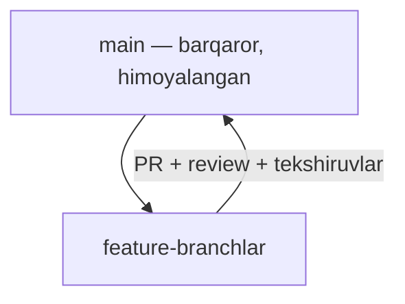
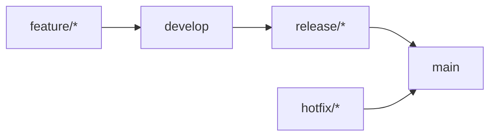
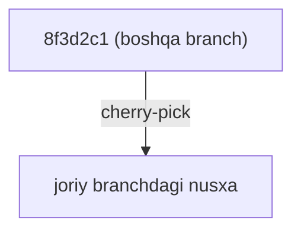

## Git ish jarayonlari (workflows)

> **O'tgan dars bilan bog'liqlik:** tarixni o'qish, teglar qo'yish va relizlarni nashr qilishni bilasiz. Endi hammasini tizimga yig'amiz — jamoa ishini tashkil etish amaliyotini — dasturchilar haqiqatan ishlatadigan **ish jarayonlarini**: GitHub Flow, GitFlow va ularni jonli ushlab turuvchi buyruqlar (rebase, cherry-pick).

---

## Dars maqsadi

Mos jamoa ish modelini tanlash va unga amal qilishni o'rganish: GitHub Flow zamonaviy standart sifatida, GitFlow nima ekanini, hamda `rebase`, `pull --rebase` va `cherry-pick`ni kundalik ishda xavfsiz ishlatish.

## Dars oxirida nimani o'rganasiz

- Repozitoriy workflow nima va nima uchun kerakligini tushuntirish.
- **GitHub Flow**ni ishlatish: main + qisqa feature-branchlar + Pull Requests.
- **GitFlow** va uning branchlarini tushuntirish: develop, feature, release, hotfix.
- Loyiha kattaligiga mos workflow tanlash.
- `git rebase`, `git pull --rebase` va `git cherry-pick`ni tushunish.
- Rebase oltin qoidasini qo'llash: **nashr qilingan** commitlarni hech qachon qayta yozmang.

---

## Dars vaqti

| Blok | Mazmun |
| --- | --- |
| 1. Workflow nima | Barqaror jamoa repozitoriy qoidalari |
| 2. GitHub Flow | Zamonaviy standart: main + PR |
| 3. GitFlow | develop, release, hotfix bilan klassika |
| 4. Workflow tanlash | Solo → jamoa → katta kompaniya |
| 5. Rebase va do'stlari | `rebase`, `pull --rebase`, `cherry-pick` |
| 6. Oltin qoida | Nashr etilgan tarixni qayta yozmang |
| 7. Mini-vazifa | Tarqoq branchlarni hal qilish |
| 8. Xulosalar va amaliy vazifa | Mustahkamlash |

---

## 1-blok. Workflow nima

**Workflow** — repozitoriyning kelishilgan «yo'l harakati qoidalari»: qanday branchlar bor, o'zgarishlar qanday kiradi, kim review qiladi va qanday tartibda. Qoidalarsiz — tartibsizlik: hamma hamma narsani hamma joyga birlashtiradi, tarix bo'tqaga aylanadi, relizlar tiqiladi.

Workflow uchta savolga javob beradi:

1. **Barqaror kod qayerda?** (odatda `main`)
2. **O'zgarishlar qayerda tug'iladi?** (feature-branchlar, PRlar)
3. **Kim hal qiladi?** (reviewerlar, branch himoyasi qoidalari)

GitHubda rasmiy qoidalar **branch himoyasi** bilan mustahkamlanadi: `main`ga o'zgarishlar faqat review va tekshiruvlardan o'tgan PR orqali kiradi — to'g'ridan-to'g'ri push qilish mumkin emas.



---

## 2-blok. GitHub Flow

GitHubning o'zi tavsiya qiladigan workflow — sodda va loyihalarning 90%iga mos:

1. **`main` har doim relizga tayyor.**
2. Yangi ish **qisqa umrli feature-branchda** boshlanadi: `feature/login-page`.
3. O'zgarishlar `main`ga **faqat Pull Requests** orqali, review bilan kiradi.
4. Birlashgan fichыs tez chiqariladi (ko'pincha darhol productionga).
5. Yirik PRlardan ko'ra **kichik va tez-tez** bo'lganlari yaxshi.

Har bir vazifa uchun sikl:

```bash
git switch -c feature/login-page   # yangi maindan
# ...ish, commitlar...
git push -u origin feature/login-page
# PR ochamiz, review, merge
git switch main
git pull                          # mainni sinxronlaymiz
git branch -d feature/login-page  # tozalash
```

**Nega ishlaydi:** qisqa branchlar = kichik PRlar = tez review = kam konflikt. Jamoada har doim relizga tayyor `main`.

---

### Yangi boshlovchilarning ko'p uchraydigan xatolari

| Xato | Qanday tuzatish |
| --- | --- |
| Eskirgan `main`dan branch yaratish | Avval yangilang: `git switch main && git pull` |
| Uzoq umrli feature-branchlar | Kunlar, haftalar emas — `main`dan uzoqlashib, konfliktga tushadi |
| Gigant «mega-PR»lar | Vazifani bo'ling; kichik PRlar tez review qilinadi |
| Branchni hamma yerda qo'lda o'chirish | PR interfeysi va merge'dan keyin `git branch -d` ishlating |

---

## 3-blok. GitFlow

**GitFlow** — klassik og'ir model (muallif Vincent Driessen, 2010). **Rejalashtirilgan relizlar** va bir nechta parallel versiyaga ega loyihalarga mos.

### Branchlar

| Branch | Maqsadi |
| --- | --- |
| `main` | Faqat chiqarilgan versiyalar |
| `develop` | Keyingi reliz uchun o'zgarishlar yig'iladi |
| `feature/*` | Yangi fichыs; `develop`ga birlashadi |
| `release/*` | Reliz tayyorgarligi: fixlar, versiya qadami; `main` va `develop`ga birlashadi |
| `hotfix/*` | To'g'ridan-to'g'ri `main`dan productionga shoshilinch fixlar |

### Hayot sikli

1. Fichыs `develop`ga birlashadi: `feature/* → develop`.
2. O'zgarishlar yetarli — `release/1.2.0` yaratamiz.
3. Reliz branchi fixlar olib, **`main` va `develop`ga** birlashadi.
4. Produkdagi shoshilinch xato → `main`dan `hotfix/*`, `main` va `develop`ga birlashadi, teg.



`main` teglar bilan belgilanadi (`v1.2.0`). **Asos: relizlar `main`da izolyatsiya qilingan, ish — `develop`da.**

---

## 4-blok. Workflow tanlash

| Vaziyat | Workflow |
| --- | --- |
| Solo yoki kichik jamoa, tez-tez chiqarish | **GitHub Flow** |
| Rejalashtirilgan relizlar + eskilarni uzoq qo'llab-quvvatlash | **GitFlow** |
| Faqat siz, xususiy repozitoriy | Ixtiyoriy — hatto `main`ga to'g'ridan-to'g'ri push |
| Katta kompaniya, ko'p jamoa, qat'iy qoidalar | GitFlow yoki moslashuvlar + branch himoyasi |

**Tavsiya:** ko'pchilik loyiha uchun **GitFlow** emas, **GitHub Flow** bilan boshlang — yetarli. GitFlowinga real rejalashtirilgan relizlar va parallel qo'llab-quvvatlanadigan versiyalar paydo bo'lganda o'ting.

---

## 5-blok. Rebase, pull --rebase, cherry-pick

Tarixni chiroyli qiladigan uchta buyruq.

### `git rebase` — commitlarni yangi asosga ko'chirish

Aytaylik, `feature` `main`dan ajralib, `main`ga yangi commitlar keldi:

```text
Oldin:  main --- A --- B
              \
feature         C --- D

Keyin:   main --- A --- B
                        \
feature                   C' --- D'
```

`git rebase main` sizning C, D commitlarini olib, ularni hozirgi `main` **ustiga qayta ijro** qiladi. Tarix chiziqli bo'ladi — go'yo branchni kechroq boshlagandek. Buni **lokalda, push qilinmagan commitlarda**, PR ochishdan oldin qiling.

### `git pull --rebase`

Kundalik stsenariy: branchga push qilasiz, parallel hamkasb ham o'z commitini push qildi. Oddiy `git pull` merge-commit yaratadi, `git pull --rebase` esa sizning commitlaringizni kelganlar ustida qayta ijro qiladi — toza chiziqli tarix:

```bash
git pull --rebase
```

### `git cherry-pick` — istalgan joydan bitta commit olish

Boshqa branchdan aniq bitta fix yoki fichыs commiti kerakmi? Oling:

```bash
git cherry-pick 8f3d2c1
```

Commit joriy branchga xuddi o'sha xabar bilan yangi commit sifatida qo'llanadi. Hotfixni reliz branchga ko'chirish uchun ideal.



---

## 6-blok. Rebase oltin qoidasi

**Boshqalar allaqachon olgan yoki nashr qilgan commitlarga rebase qilmang.** Rebase commit xeshlarini qayta yozadi; kimdir ishingiz ustiga ish qurgan bo'lsa — uning tarixi tarqalib, alamli konfliktlarga uchraydi.

| Buyruq | Lokal, push qilinmagan | Allaqachon nashr qilingan |
| --- | --- | --- |
| `rebase` | Ha — PRdan oldin branchni tartibga keltiring | **Hech qachon** |
| `pull --rebase` | Ha, har kuni | Ha (bu sizning tomoningiz) |
| `cherry-pick` | Ha | Ha — u yangi commitlar yaratadi |

Tarix allaqachon ommaviy bo'lsa — integratsiya uchun `merge` ishlating; ommaviy tarixni qayta yozish yangi boshlovchilar ko'p yo'l qo'yadigan ishdir.

---

## Mini-vazifa

Tarqalish: `main`da commit B paydo bo'ldi, sizning lokal `feature`da B + C bor (C hech qayerga push qilinmagan). Branchni hozirgi `main`ga **rebase orqali** yetkazib, chiziqli tarixni saqlang.

**Yechim:**

```bash
git switch feature
git rebase main        # C B ustida qayta ijro qilinadi
git log --oneline --graph   # chiziqli: B, keyin C
```

Rebase paytida konflikt chiqsa — hal qiling va `git rebase --continue` bilan davom eting. Zararsiz voz kechish: `git rebase --abort`.

---

## Dars xulosalari

Bugun siz quyidagilarni o'rgandingiz:

- **Workflow** — repozitoriy yo'l harakati qoidalari: barqaror kod qayerda, o'zgarishlar qayerda tug'iladi, kim hal qiladi.
- **GitHub Flow** — main + qisqa feature-branchlar + tez PRlar; ko'pchilik loyiha uchun standart.
- **GitFlow** — develop, release, hotfix; rejalashtirilgan relizlar va parallel versiyalar uchun.
- **`git rebase`** — commitlarni yangi asosda qayta ijro qilish; **`git pull --rebase`** — kundalik xavfsiz sinxronlash; **`git cherry-pick`** — boshqa branchdan bitta commit olish.
- **Oltin qoida** — nashr etilgan commitlarni hech qachon qayta yozmang.

---

## Amaliy vazifa

O'quv repozitoriysida integratsiyaning ikkala uslubini ishlab chiqing (`practice-9.sh`):

1. 2 commitli `feature`-branch yarating, keyin `main`ga commit qo'shing.
2. `merge` va `rebase` orqali tarixni solishtiring: har biridan keyin `git log --oneline --graph`.
3. Bitta commitli ikkinchi branch yarating va uni aynan `git cherry-pick` bilan `main`ga oling.
4. Hamkasbingiz sizning branchingizga qo'shgan commitini simulyatsiya qilib, `git pull --rebase` bilan sinxronlaning.

`practice-9.sh` skripti butun stsenariydan o'tkazadi:

---

[Keyingi dars: Yakuniy loyiha — portfolioni GitHub Pages'ga nashr etish →](../../Lesson-10/uz/Yakuniy%20loyiha%20—%20portfolioni%20GitHub%20Pages'ga%20nashr%20etish.md)